#实战——和平精英外挂破解

##案例介绍
外挂对于游戏党来说已经不是什么新鲜事，你只需要支付一些钱就能体验到“极致”的游戏体验。那么对于不愿花钱的我来说当然是破解他了

##破解必备
###需要掌握的基本知识
有汇编语言基础、有破解的基础（按钮事件）、会熟练使用OD（OllyDbg）。

###需要具备的工具
Windows（7或10）系统的电脑、OD(OllyDbg)破解工具、PCHunter进程查看器

##破解步骤
###第一步
打开需要破解的外挂并输入账号密码（这里我们使用的是才注册的账号和密码，当然也可以不注册但是破解的步骤会多一点）

从下图我们已经知晓当我们输入正确的账号和密码时点击登陆按钮会出现账号过期的提示，那么我的就可以设计破解思路：由于点击登陆才会出现过期提示，那么外挂程序肯定是通过点击登陆按钮后经过某种方式来判断我们的账号是否充值，所以我们可以在点击按钮时让程序停止下来，然后进行动态调试。所以需要使用到破解软件时常用的按钮事件。

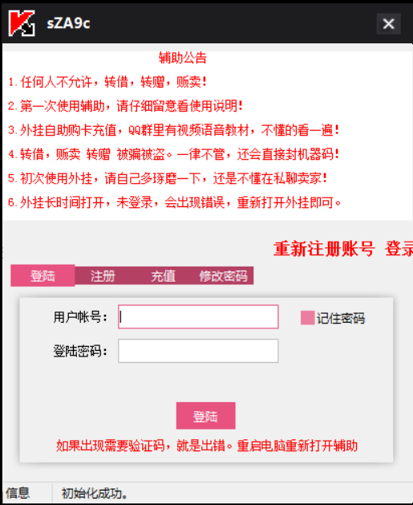

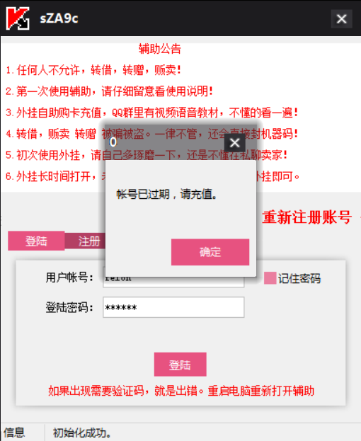

###第二步
我们开始破解外挂前的一些必须步骤，首先我们关掉外挂并重新打开，接着打开PCHunter软件，并使用PCHunter查看外挂进程再右键查看外挂进程的定时器，如果定时器存在一定要移除定时器。 

###第三步
打开破解工具OD，点击左上角文件附加打开的外挂进程，接着看下图点击“e”按钮之后双击与程序同名的行进入易语言体。

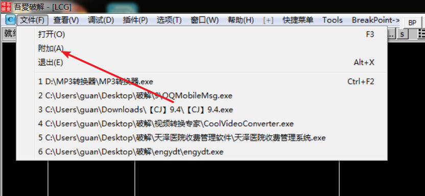

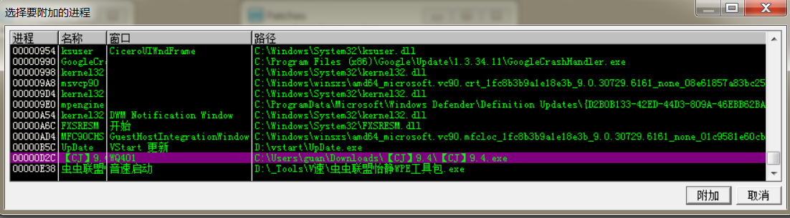

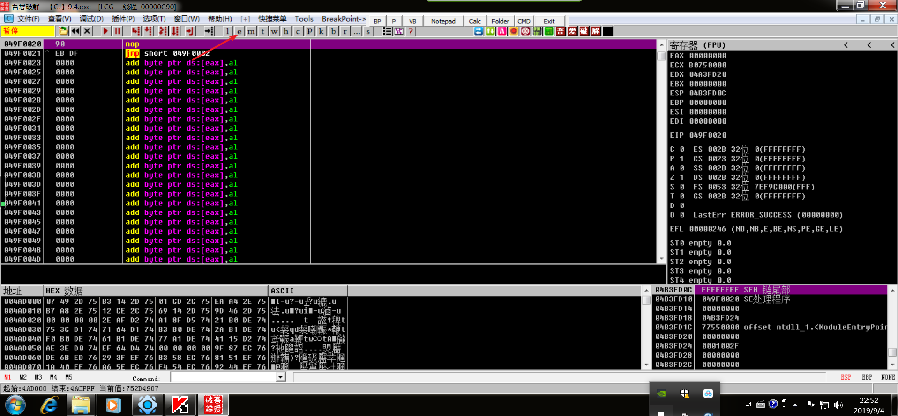

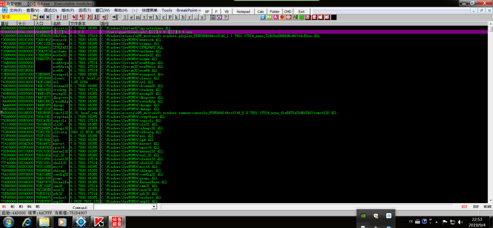

###第四步
实现外挂破解的设计思路到达易语言体使用按钮事件下断点（反汇编窗口右键查找二进制字符串输入命令FF55FC5F5E），接下来在OD中F9运行程序，正常输入账号和密码点击登陆，由于我们在按钮事件下了断点，所以程序会停止在登陆按钮这里但不会出现提示。所以我们可以开始查找判断是否充值的语句。

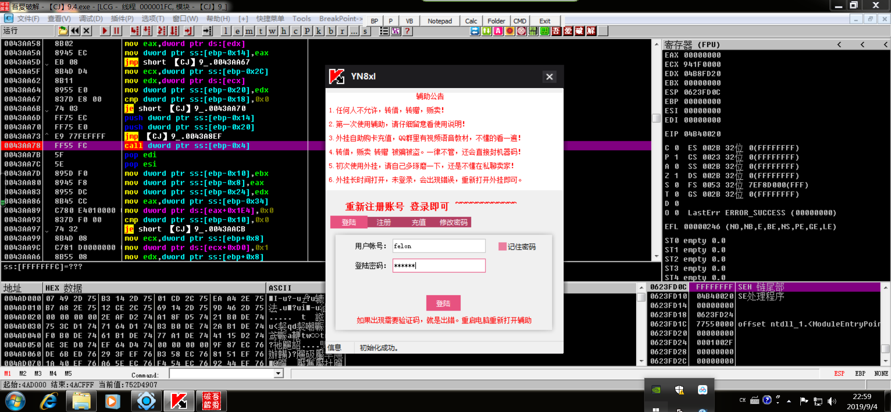

###第五步
第五步使用F7进入按钮事件的call里面，单步F8查找我们输入的账号密码。通过使用F8单步调试可以看到堆栈窗口出现了我们输入的账号密码。

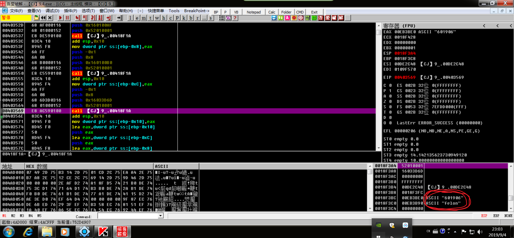

test对比函数，test  ebx，ebx可以看到寄存器窗口ebx寄存器，这句汇编语言的意思是比较账户名是否存在。然后我们继续单步调试。

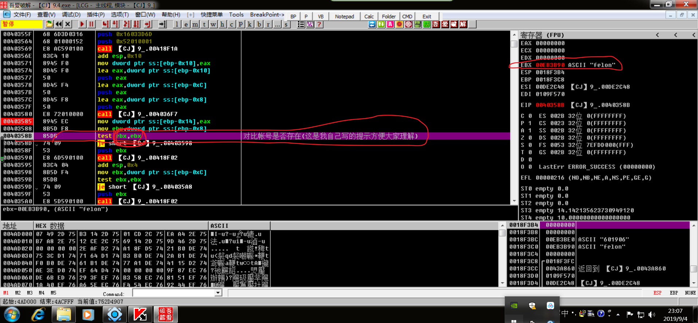

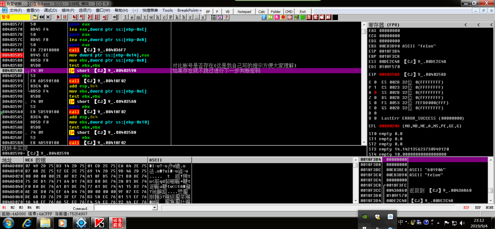

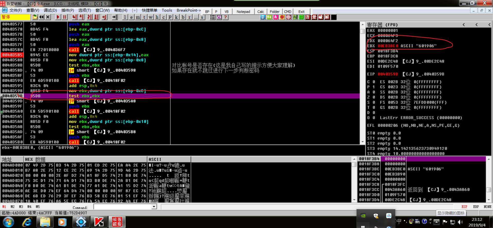

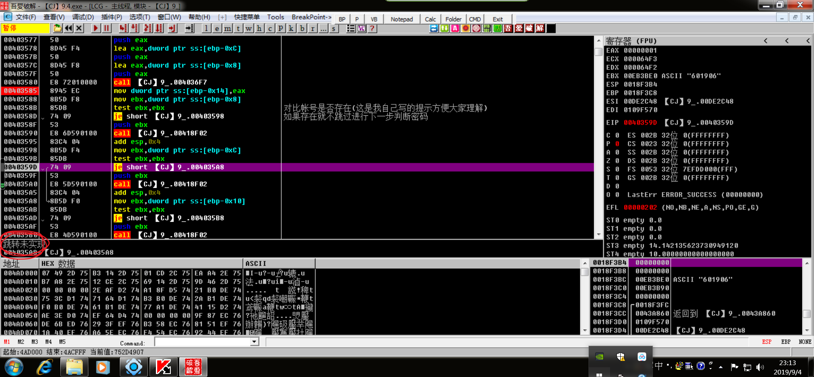

###重点来了！重点来了！重点来了！
重要的跳转到了，因为我们是没有充值的账号，所以图中红圈圈起来的跳转实现了。那么我们是怎么看出来的呢？下图二中红色箭头指向的选中区域是标志性的易语言窗体，而这个窗体很有可能就是外挂登陆成功后的窗口，所以我们就要使这个跳转不实现，让程序进入外挂的功能窗口，因此我们反汇编窗口右键使用二进制nop掉跳转语句使跳转不实现。此时我们再F9运行程序出现提示已经可以正常使用。

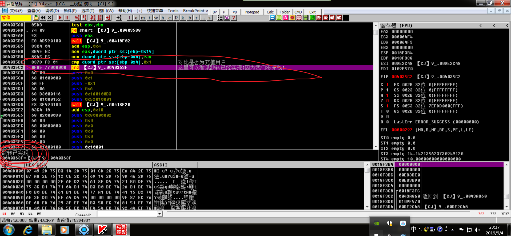

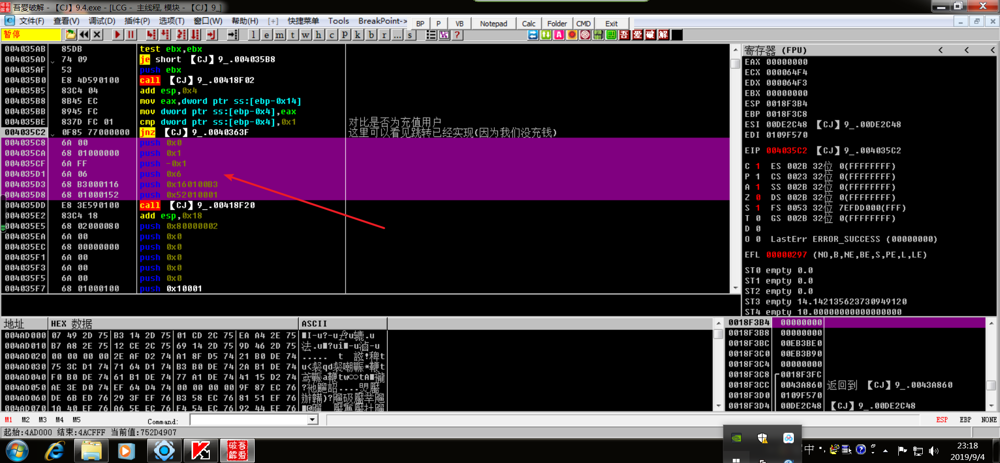

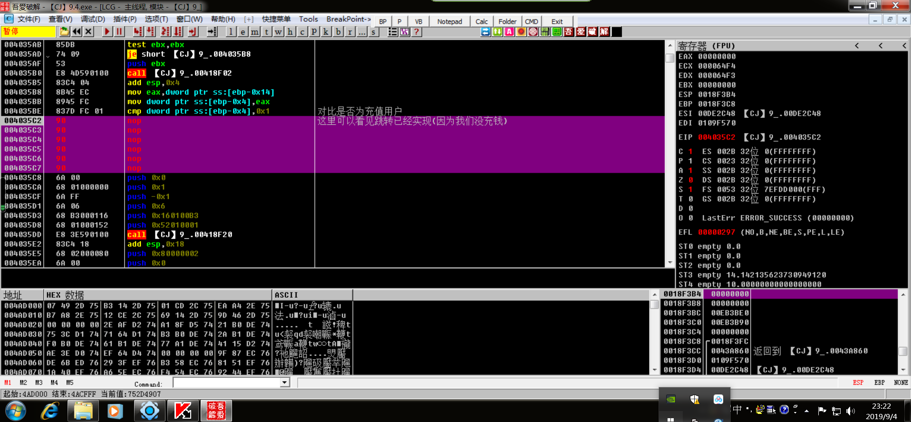

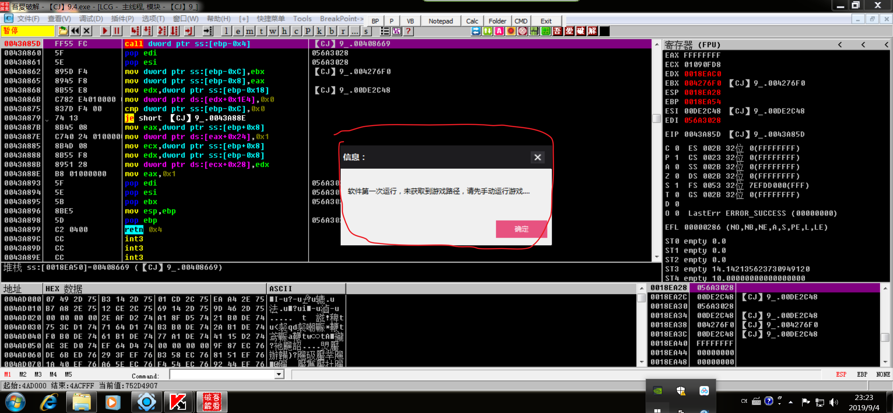

外挂破解成功，但是为了方便我们以后使用，我们可以将更改的外挂保存起来。最后附上外挂的功能窗口。

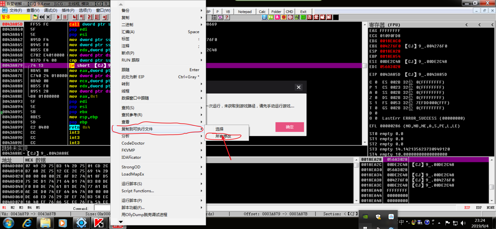

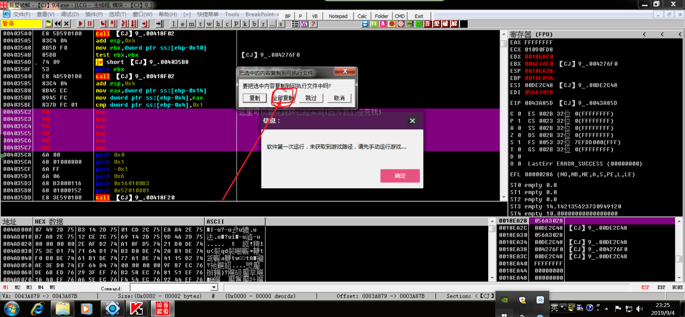

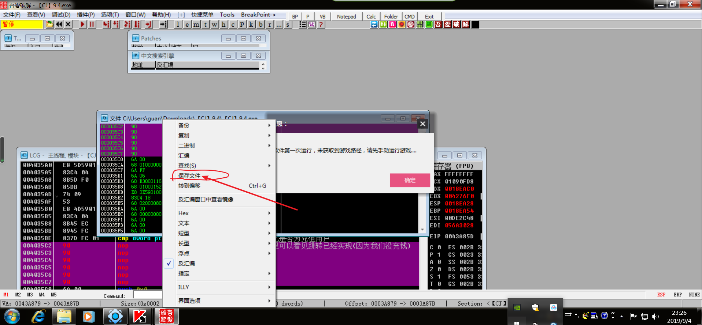

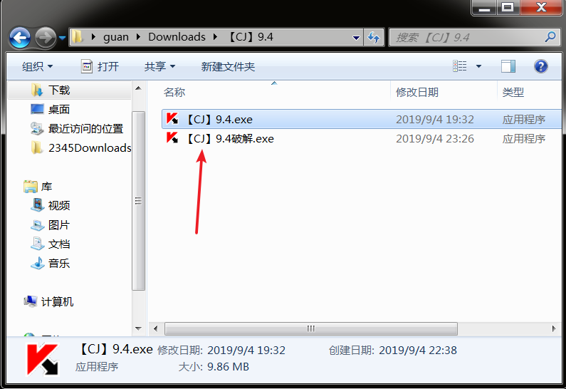

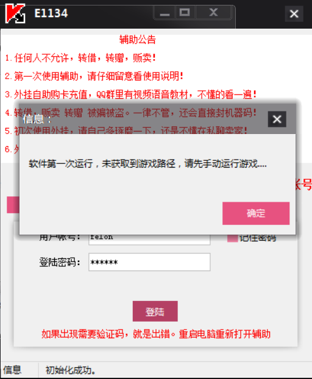

