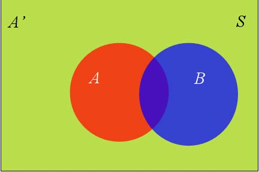

summary: demo
id: 20200210-01-饶龙江
categories: 
tags: 
status: Published 
authors: 饶龙江
Feedback Link: http://www.sctu.edu.cn

# 贝叶斯公式及其推论的理解和运用
## 贝叶斯公式的得来：
当我们需要计算事件A在事件B下的条件概率时，可以计算P(A|B)=P(AB)/P(B),又因为条件概率公式P(AB)= P(B|A)*P(A)，所以可得P(A|B)= P(B|A)*P(A)/P(B)。而在一个样本空间中，

事件B可以划分成几个部分，例如下图中事件B可以分为AB同时发生和A’B同时发生两种情况，它们共同组成了事件B，所以事件B的概率还可以表示成P(B)=P(AB)+P(A’B),根据条件概率公式对P(AB)和P(A’B)变形可以便得到贝叶斯公式：

$P(A|B)=(P(B|A)P(A))/(P(B|A)P(A)+P(B|A^{'})P(A^{'}))$
 
在上述贝叶斯公式中，我们将事件B看作事件A和A’发生的情况下产生的结果，于是贝叶斯公式便可以简单的理解成已知结果发生时求导致结果的某种原因的概率。例如下面这个问题1：
“将两信息分别编码为A和B传送出去接收站收到时,A被误收作B的概率为0.02,而B被误收作A的概率为0.01.信息A与信息B传送的频繁程度为2:1.若接收站收的信息是A,问原发信息是A的概率是多少?”
在这个问题中，设发送信息A为事件A，发送信息B为事件B，接收到信息的信息为A是事件C，接收到的信息为B是事件D，那么我么将事件C作为结果，题目也就转换成了已知结果C发生求条件A的概率问题。
所以可以得到:P(A|C)=P(AC)/(P(AC)+P(BC))，P(A)=2/3，P(B)=1/3,P(AC)=0.98*2/3，P(BC)=0.01*1/3,带入数据可计算出P(A|C)=196/197。
## 贝叶斯推论：
贝叶斯公式经过变形可以得到贝叶斯推论：
$P(A|B)=P(A)P(B|A)/P(B)$
 
在这个式子中，我们把P(A)称为"先验概率"（Prior probability），即在B事件发生之前，我们对A事件概率的一个判断。P(A|B)称为"后验概率"（Posterior probability），即在B事件发生之后，我们对A事件概率的重新评估。P(B|A)/P(B)称为"可能性函数"（Likelyhood），这是一个调整因子，使得预估概率更接近真实概率。
在问题1中，P(A)就是先验概率，是在实验结果前测试的概率，而P(A|C)Z则是在实验结果后得到的后验概率，由于在式子中的调整因子大于1，所以使得先验概率被增强，事件A发生的可能性变大了。
## 贝叶斯推论在现实生活中的运用
 贝叶斯推理实际是借助于新的信息修正先验概率的推理方法。显然，这样的方法如果运用得当，可以使我们在依据概率作出决断时，不必一次收集一个长期过程的大量资料，而可以根据事物发展的情况，不断利用新的信息来修正前面的概率，作出正确决策。例如，在我们无法对一件事做出准确的判断时，我们可以通过寻找它的调整因子来增大或者减小它的概率，在经过多次调整后，我们将它的概率增加或者减少到可以做出判断。
## 我有问题
Duration: 1:00
[我有问题](https://github.com/gschen/sctu-issue/issues/new)

打开上述链接，对问题进行详细的描述，我们在收到问题后，第一时间予以解答。