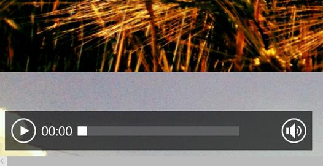
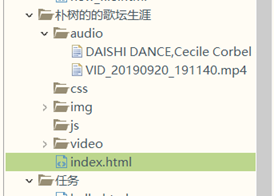

summary: demo
id: 20190929-01-王卓越
categories: HTML
tags: 
status: Published 
authors: 王卓越
Feedback Link: http://www.sctu.edu.cn

# 音频所涉及的标签
## 案例描述
Duration :2:00
在网页添加音频时，我们会掌握一些重要的元素和一些重要的标签，这些是我们音频建立的基础，也会遇到一些困难的问题。比如音频不能放出需要注意一些标签和语法上的错误，我们需要掌握一些我们所遇到的困难。
## 有关音频的标签和元素
Duration :6:00

此处涉及一个标签，和一个元素。同时涉及controls元素出现的属性，则是向用户显示音频控件(比如说播放，暂停。)
### 各种元素的涉及
loop：如果出现该属性，则每当音频结束时重新开始播放。
muted：出现该属性，则音频输出为静音。
preload：规定当网页加载时音频是否默认被加载以及如何被加载。
src：规定音频文件的URL
## 创建路径
Duration :3:00

我采用的是相对路径，（在html文件夹中创建一个文档，名为：audio将其音频放入即可）可以避免不必要的错误。
## 总结
Duration :1:00
对于网页中添加音频来说，不算是特别难，但在向网页中添加视频时<video>出现的错误，无法加载出添加的网页视频。

