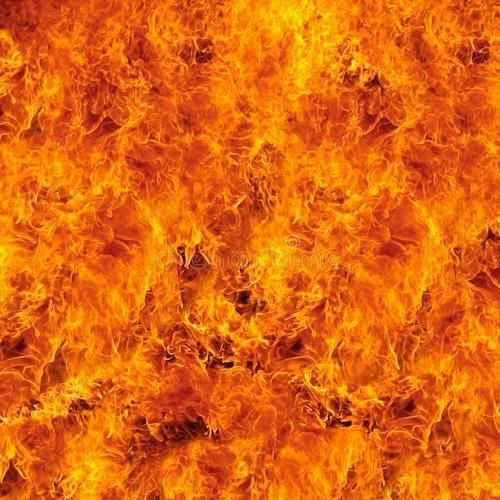
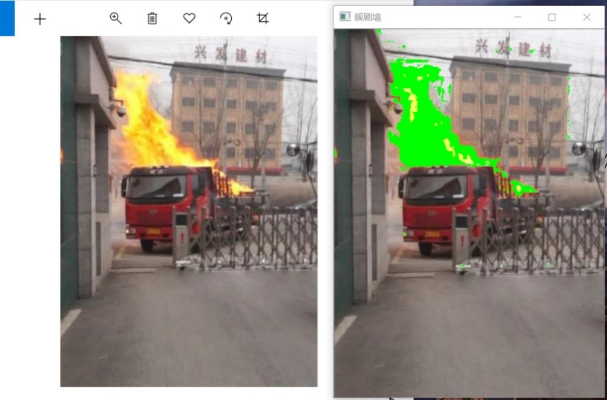

summary: demo
id: 20190929-01-马原涛
categories: tensorflow
tags: sctu-ai
status: Published 
authors: 马原涛
Feedback Link: http://www.sctu.edu.cn

# 基于RGB颜色特征的火焰识别
## 问题提出及分析
在计算机中图片一般用数组储存，以像素点为单位。
```python
import cv2 as cv
import numpy as np
src=cv.imread("img/3.jpg")
print(src.shape)#返回（高、宽、通道数）
print(src.size)#返回像素点个数
```
在RGB颜色空间下，每个像素点的颜色由R、G、B三通道组成，RGB颜色空间以R(Red红)、G(Green绿)、B(Blue蓝)三种基本色为基础,进行不同程度的叠加,产生丰富而广泛的颜色,所以也叫三基色模式。每个通道的取值范围从0到255，每种颜色都有对应的RGB值。

火焰也是如此，只要找到火焰颜色的RGB值的规律，就可以借此来识别图中的火焰。那么如何找到火焰的RGB值规律呢？

## 问题解决

最简单的方法当然是统计学中的抽样调查啦，找几张只有火焰的图，读取它们的RGB值，并从中找出规律。也可以参考他人所写的相关文章，直接借用别人的数据。如图1
<div align=center>

</div>

```python
#计算机中像素点RGB值在数组中存储的顺序是B、G、R
b=0
g=0
r=0
for i in range(len(src)):
    for j in range(len(src[i])):
        b += src[i][j][0]
        g += src[i][j][1]
        r += src[i][j][2]
#三通道均值
b_=b/src.size
g_=g/src.size
r_=r/src.size
print("b、g、r三通道均值分别为{}、{}、{}".format(b_,g_,r_))
#b、g、r三通道均值分别为5、33、74
```


## 分析
除了RGB的取值范围存在规律之外，RGB三者的值之间也存在关系，这里直接为大家提供一些数据作为参考。

火焰RGB均值取值范围：R=217、G=109、B=78
<center>

$$
R(x,y)>G(x,y)>B(x,y)

$$

$$
R_m=\frac{1}{K}\sum_{i=1}^k R(x_i,y_i)
$$

RGB模型下提取疑似火焰区域
</center>
上式子中R(x，y),G(x，y),B(x，y)表示该像素点三种颜色的通道值，Rmon表示R通道的平均值， K代表总像素点数。

疑似火焰区域的关系式：
<center>

$$
r=R/(R+G+B) ,g=G/(R+G+B),b=B/(R+G+B)
$$


$$
r \geq 1.14g-0.076
$$

$$
r \leq -0.989g-0.991
$$

$$
r \geq -2.077g-1.025
$$

$$
r \leq -1.881b-0.9582
$$

$$
r \leq 95.348b-0.171
$$

$$
r \geq -0.543b-0.506
$$

$$
g \geq 0.846b-0.048
$$

$$
g \leq 0.461b-0.495
$$

$$
g \leq191.957b-0.621
$$

将上述公式作为条件，可以大致提取疑似火焰区域
</center>
效果图：
<div align=center>

</div>

```python
#代码
import cv2 as cv
import numpy as np
src=cv.imread("img/3.jpg")
def img_show(src):
    ch=np.random.rand()*100
    cv.namedWindow("图片", cv.WINDOW_AUTOSIZE)
    cv.imshow("图片", src)
    cv.waitKey(0)
    cv.destroyAllWindows()
def img_process(src):
    #三通道均值：蓝，绿，红
    r_aver=217
    g_aver=110
    b_aver=78
    for i in range(len(src)):
        for j in range(len(src[i])):
            b_p=src[i][j][0]/sum(src[i][j])#b=b/(R+B+G)
            g_p=src[i][j][1]/sum(src[i][j])
            r_p = src[i][j][2] / sum(src[i][j])
            if src[i][j][2]>r_aver and src[i][j][2]>src[i][j][1]>src[i][j][0] :
                if r_p>=1.14*g_p-0.076 and r_p<=-0.989*g_p+0.991 and             r_p>=-2.077*g_p+1.025:
                    if r_p<=-1.881*b_p+0.9582 and r_p<=95.348*b_p+0.171 and r_p>=-0.543*b_p+0.506:
                        if g_p>=0.846*b_p+0.048 and g_p<=-0.461*b_p+0.495 and g_p<=191.957*b_p-0.621:
                            src[i][j][0] = 0
                            src[i][j][1] = 255
                            src[i][j][2] = 0
    return src
new_image=img_process(src)
img_show(new_image)

```
## 参考文献
[1]耿庆田,于繁华,赵宏伟,王闯.基于颜色特征的火焰检测新算法[J].吉林大学学报(工学版),2014,44(06):1787-1792.