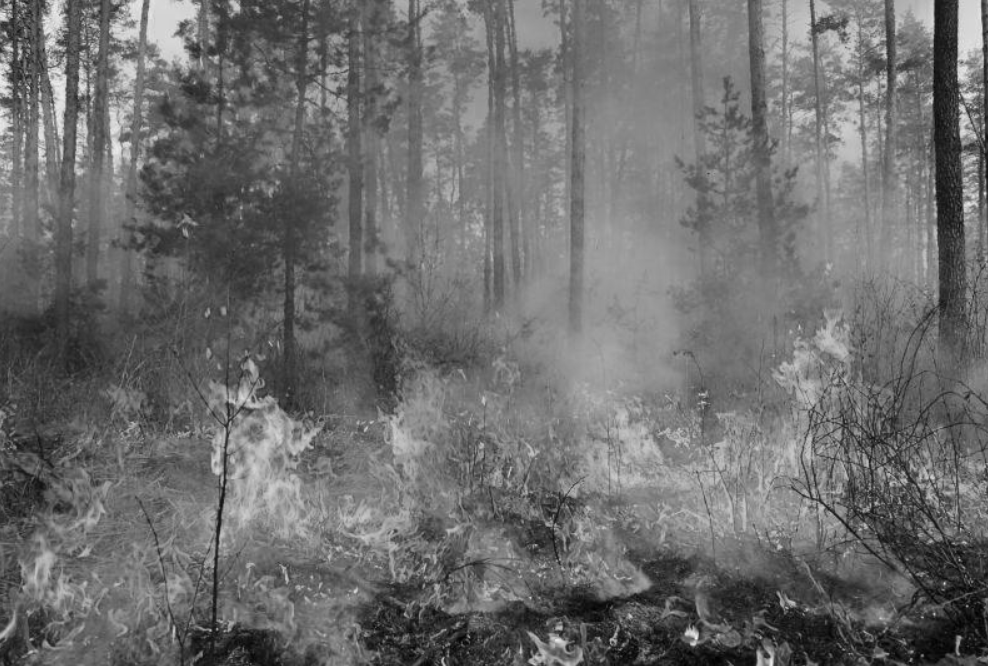

summary: demo
id: 20200210-01-饶龙江
categories: python
tags: 
status: Published 
authors: 饶龙江
Feedback Link: http://www.sctu.edu.cn

# 加权平均法读取灰度化图像介绍
## 效果
Duration: 1:00

## 加权平均法思想简介：
Duration: 5:00
灰度化的原理时假定每个像素点的三通道值相同，并用统一的灰度值待代替。加权平均法读取灰度化图像时，是将三个通道的通道值进行加权，然后用来代替灰度。
实际中加权平均法RGB灰度化的公式为：

$Gray(x,y)=w_{r}R(x,y)+w_{g}G(x,y)+w_{b} B(x,y)                             (1)式$

式中$w_{r} 、w_{g}、w_{b}$表示三个通道的权值，且三者之和为1。
## python代码
Duration: 5:00
```python

import cv2 as cv
import numpy as np
def gray_pixels(image):
    for i in range(len(image)):
        for j in range(len(image[i])):
            a = image[i][j]         #得到每个像素点的三通道值，需要注意的是，python读取出图片的三通道值不再是R、G、B三个顺序，而是变成了G、B、R这个顺序。
            g = 0.59*a[0]+0.11*a[1]+a[2]*0.30   #运用加权平均法公式计算出该像素点的灰度值。
            image[i][j]=g        #将图片的三个通道变成一个通道，并将得到的灰度值赋给该通道。

```
## 我有问题
Duration: 1:00
[我有问题](https://github.com/gschen/sctu-issue/issues/new)

打开上述链接，对问题进行详细的描述，我们在收到问题后，第一时间予以解答。
