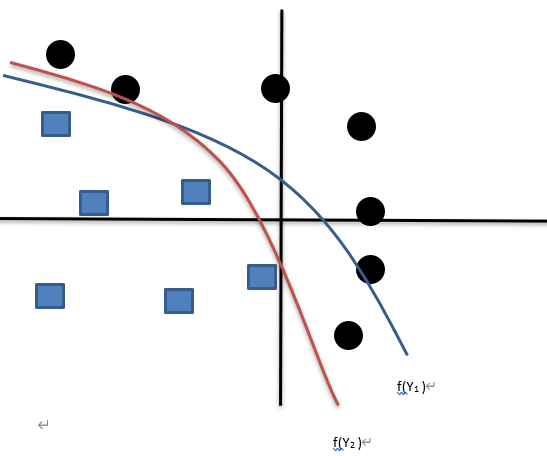

summary: demo
id: 20191013-01-马原涛
categories: tensorflow
tags:
status: Published 
authors: 马原涛
Feedback Link: http://www.sctu.edu.cn

# 激活函数的作用及部分激活函数介绍
## 问题提出
这周在学习前向传播和神经网络全连接的时候，激活函数这部分一直困扰着我，不能明白其原理作用，于是在网上查阅了很大资料，实验总结之后做了笔记，方便大家学习。
## 问题的分析
学习深度学习算法，一般都是先学线性回归，y=wx+b。线性回归理论可以很简单与其他算法思想相结合，但是线性回归也存在着很多局限性，在实际应用中一个很大的局限就是’线性’。而在实际运用中遇到的比较多且比较难的问题一般是非线性问题。
来看个例子：

	一个二分类问题，请对下方图片中的图形进行分类

	如果只是单纯的以一次线性回归Y1=w1*x+b1来做分类，几乎不可能从图中找出一条直线来区分两个图形。

    就算多叠加几层线性回归，仍然不理想。
$$	Y2=w1*Y1+b2 $$
$$ 	Y3=w3*Y2+b1 $$

图一

## 问题的解决
通过图一可以看出，线性回归其实已经能区分一部分图形，只是效果还不能让人满意。既然直线的效果不好，能不能用曲线呢？或者能不能让图一中的直线弯曲来达到我们想要的效果呢？

答案是能，这也是激活函数一个很重要的作用。

激活函数--Sigmiod函数：
 $$ 
 f(x)=\frac{1}{1+e^{-x}}
 $$

图二 Sigmiod函数

给每层函数加入激活函数，f(Y1)、f(Y2)，让线性变为非线性。

图三

或许你还会提出一个问题，直线是变成曲线了，但怎么确保这条曲线就是我想要的呢？

将原函数加入激活函数，原函数不一定是变成激活函数那种曲线，每层隐藏层都加入了激活函数，在每一次迭代的时候，会根据训练效果来决定这条线哪该多弯一点哪该少弯一点。

## 部分激活函数介绍
激活函数的作用如果只是线性和非线性的转换，显然不用设计这么多激活函数。非线性变换只是作为激活函数的一个基础作用，不同激活函数还拥有一些额外的作用。

下面介绍一些常用的激活函数及其其他的作用。

1. rule函数

图四：rule函数

	a.非线性变换。
    b.原函数小于0部分全变为0，大于0部分保留原值。
	c.优点：简单，计算机计算速度快，在正区间内可以较好的避免梯度消失的问题。
2. sigmiod函数
$$ f(x)=\frac{1}{1+e^{-x}}$$
 

图五：sigmiod函数

    a. 非线性变换。
    b. 值压缩，将原函数中的值投影（压缩）在0-1之间。
	c.容易产生梯度消失问题。
3. softmax函数

函数的输入是从K个不同的线性函数得到的结果，而样本向量 x 属于第 j 个分类的概率为：

$$
p(y=j)=\frac{e^{x^t}W_j}{\sum_{k=1}^K e^{x^t W_k}}
$$

  

图六：softmax函数

    a. 非线性变换。
    b. 值压缩，将原函数中的值投影（压缩）在0-1之间。
    c. 常应用于多分类问题的概率计算，假设有一个4分类问题，用softmax函数得出的属于某个分类的概率[x1,x2,x3,x4]，x1,x2,x3,x4全位于0到1，且x1+x2+x3+x4=1。
4. tanh函数

$$
tanh⁡(x)=\frac{e^x-e^{-x}}{e^x+e^{-x}}
$$       

  

图七：tanh函数

    a. 非线性变换。
    b. 值压缩，将原函数中的值投影（压缩）在-1到1之间。
    c.存在梯度消失问题，运算较复杂。

