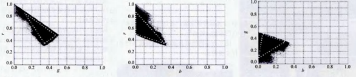
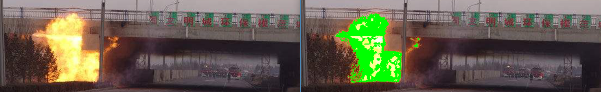

summary: demo
id: 20191020-01-马原涛
categories: python
tags:
status: Published 
authors: 马原涛
Feedback Link: http://www.sctu.edu.cn

# 基于颜色空间的物体识别
## 问题分析
某些事物的颜色总是固定的或者说在一个有限的范围内变动，比如火焰、烟雾等。这些事物在三维的颜色空间中总是分布在一定范围内，如下图是火焰在RGB颜色空间的分布。

图一：火焰图像在rgb颜色空间的分布

其他颜色空间也是相同的原理，例如HSV颜色空间：

图二：火焰图像在hsv颜色空间的分布

## 问题解决

这些分布我们要如何去提取，并为我们所用呢？在三维空间中虽然也可以去获取其分布规律，但比较麻烦，可以把问题简单化，将其降到二维空间。

这里以火焰在rgb颜色空间中的分布为例，选取一些火焰的图片，截取其R-B、R-G、B-G三个量的截面图，如下

图三：火焰图像的r-g、g-b、g-b截面图

用直线截取像素点主要分布区域，由于选取的火焰图片中有其他因素的干扰，所以会出现多余的零散的点。下面用别人采取的数据集来获取

图四：火焰图像的r-g、g-b、g-b截面图

每个图通过三条线圈选出像素点主要分布区，用函数公式表达，如下：

$$
r \geq 1.14g-0.076
$$

$$
r \leq -0.989g-0.991
$$

$$
r \geq -2.077g-1.025
$$

$$
r \leq -1.881b-0.9582
$$

$$
r \leq 95.348b-0.171
$$

$$
r \geq -0.543b-0.506
$$

$$
g \geq 0.846b-0.048
$$

$$
g \leq 0.461b-0.495
$$

$$
g \leq191.957b-0.621
$$

图五：火焰识别效果图

以上述得出的规律，将任意图片中满足条件的像素点做标记，，即能得出疑似火焰的区域。

## 总结
这种方法的优点：

	    简单，且能够较好的将我们所选的物体选出，虽然其中可能包括其他相似颜色的物体，但可以用在初选阶段，减少图片中存在的其他干扰。

缺点：

		只能用于颜色存在规律的物体
	    容易将相似的颜色物体囊括进去
## 参考文献
[1]耿庆田,于繁华,赵宏伟,王闯.基于颜色特征的火焰检测新算法[J].吉林大学学报(工学版),2014,44(06):1787-1792.

