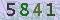
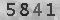

summary: demo
id: 20200210-01-饶龙江
categories: python
tags: 
status: Published 
authors: 饶龙江
Feedback Link: http://www.sctu.edu.cn
# 验证码图像去噪案例
## 运用背景
对于批量的图像处理工作，往往是繁琐的，尤其是对于图像信息的提取，前期的处理及其重要。
## 效果展示


## 思路分析：
对于验证码图片，图像的噪声主要是不均匀的点分布而成，所以在选择过滤噪声的方法时，首先考虑选择非线性的双边滤波和高斯滤波法，同时，大批次的RGB图像占用内存较大以及处理时需要处理大量的数据，对于系统的占用较大，所以在去噪之前还需要先将图像转化为灰度化图像，减小储存和方便后期处理。
### 图像灰度化
首先读取图像，根据加权平均法对图像进行灰度化处理，加权平均法的灰度转化如下：

$Gray(x,y)=w_r R(x,y)+w_g G(x,y)+w_b B(x,y)$  
在电视工业标准中，采取$w_r=0.30，w_g=0.59，w_b=0.11$


### 图像去噪
在灰度化完成后，需要对图像进行去噪，由于本例中的噪声主要是不均匀的像素点组成，在选择方法时就只考虑双边滤波，
## Python代码
```python
import cv2 as cv
import numpy as np
src = cv.imread("imgs/fire/code.jpg")
cv.namedWindow("input image",cv.WINDOW_AUTOSIZE)
#灰度化图像：
def dispose_pixels(image):
    for i in range(len(image)):
        for j in range(len(image[i])):
            a = image[i][j]
            g = 0.59*a[0]+0.11*a[1]+a[2]*0.30#工业电视标准
            image[i][j]=g
    # 双边滤波：
    src_bilater = cv.bilateralFilter(src, 9, 75, 75)
```
## 我有问题
Duration: 1:00
[我有问题](https://github.com/gschen/sctu-issue/issues/new)

打开上述链接，对问题进行详细的描述，我们在收到问题后，第一时间予以解答。
