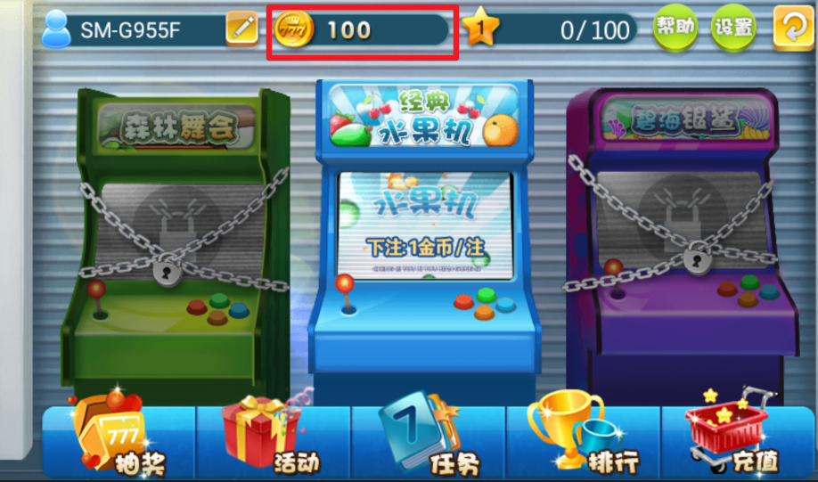
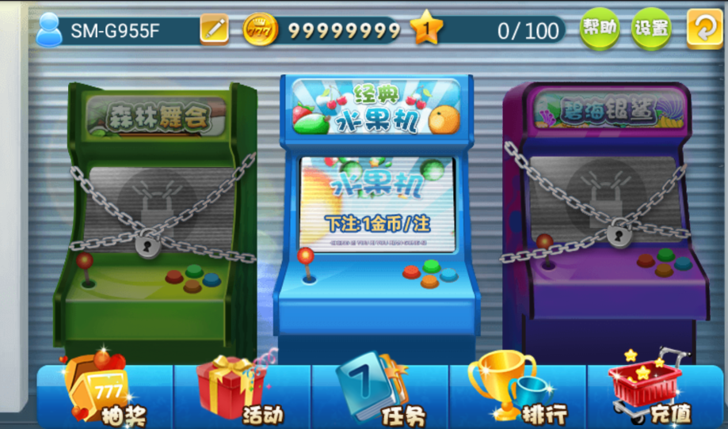
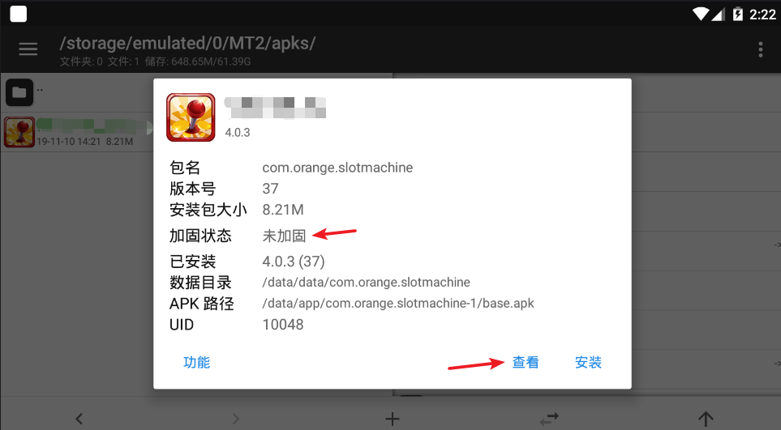
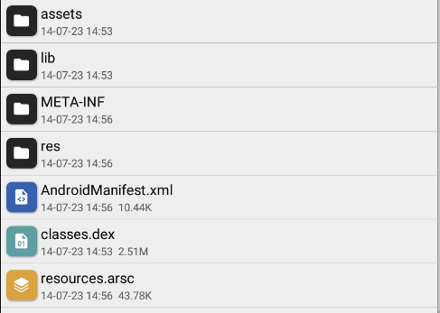
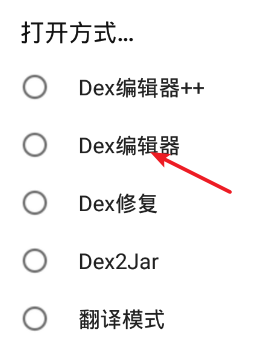
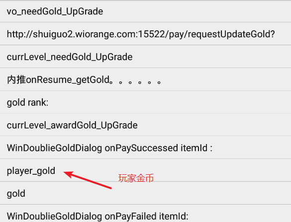
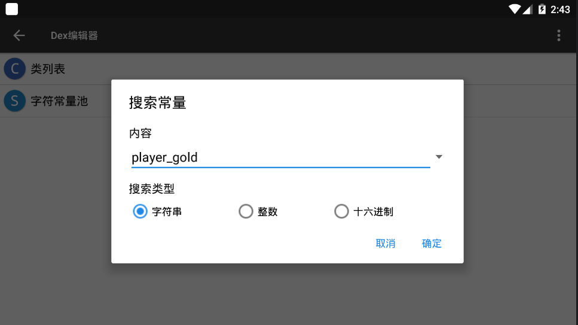
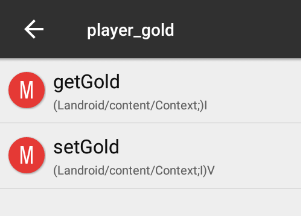
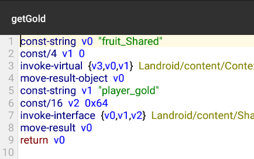

summary: demo
id: 20200210-01-官学琦
categories: security
tags: sctu-android
status: Published 
authors: 官学琦
Feedback Link: http://www.sctu.edu.cn

#Android逆向—修改数据

##案例介绍
当经app市场火热，特别是游戏app这一块，很多人无聊的时候都会拿起手机玩几把游戏。但是当你玩了几把游戏后金币用完了需要充值才能继续玩，这个时候整个人心情都不好了。所以此时我决定拿起我的“武器”破解它。
###原图及成果

##破解必备

###使用工具：
Android手机一部、mt管理器

###必备知识
Smali语言基础、掌握apk文件的基本构成及各文件的作用、关键词搜索

##破解步骤
###打开游戏观察哪些地方可以破解
首先游戏为单机游戏，其次我们从图1可以看出有两处地方可以破解，第一由于游戏本身为单机游戏，游戏数据储存在本地，所以我们可以通过修改游戏数据来增加金币；第二通过破解充值达到增加金币。
###使用MT管理器得到软件资源
打开MT管理器找到需要破解的软件，由于软件未加固我们直接点击“查看”得到文件资源

###使用MT管理器编辑classes.dex文件查找关键词
这里不详细将得到的各各文件及文件夹的用处，如果大家感兴趣可以上网百度了解相关知识。（Classes.dex文件存放软件源码）
点击classes.dex文件对其进行编辑，由于软件的代码纷繁复杂我们需要通过查找关键词来找到关键代码（由于我们需要增加金币所以搜索关键词为：金币、gold）

###找到关键代码修改数据
通过在字符串中查找“gold”我们发现了“player_gold”（玩家金币）关键词，接着我们复制这个关键字到代码中去查找，最终得到两个与“player_gold”关键词相关得代码。这里我们选个“getGold”（获得金币）进行修改。

通过下图代码我们找到关键词“player_gold”，那么关键需要修改的代码就不远了，我们接着再看“const/16 v2 0x64”这句代码的意思是将16进制“0x64”赋值给“v2”，然而16进制的“0x64”转化为10进制为“100”即为我们初始的金币。所以我们只需要将他改成我们想要的数值就成功了。

##结语
逆向纯属爱好，以上内容仅供逆向学习交流，本人不会发布与之相关的任何文件。如有侵权请联系官方删除。
