summary: demo
id: 20191110-01-马原涛
categories: tensorflow
tags: sctu-ai
status: Published 
authors: 马原涛
Feedback Link: http://www.sctu.edu.cn

# 微信小程序与tensorflow.js准备工作
这篇文章主要讲解如何将tensorflow与微信小程序结合，使得tensorflow的模型能够在微信小程序上呈现出来。

一共分为三篇文章：准备工作、模型引入、模型应用

1)	下载微信小程序稳定版，版本号最新的就行。新建一个小程序项目,AppID必须是正式的没有可以注册一个。

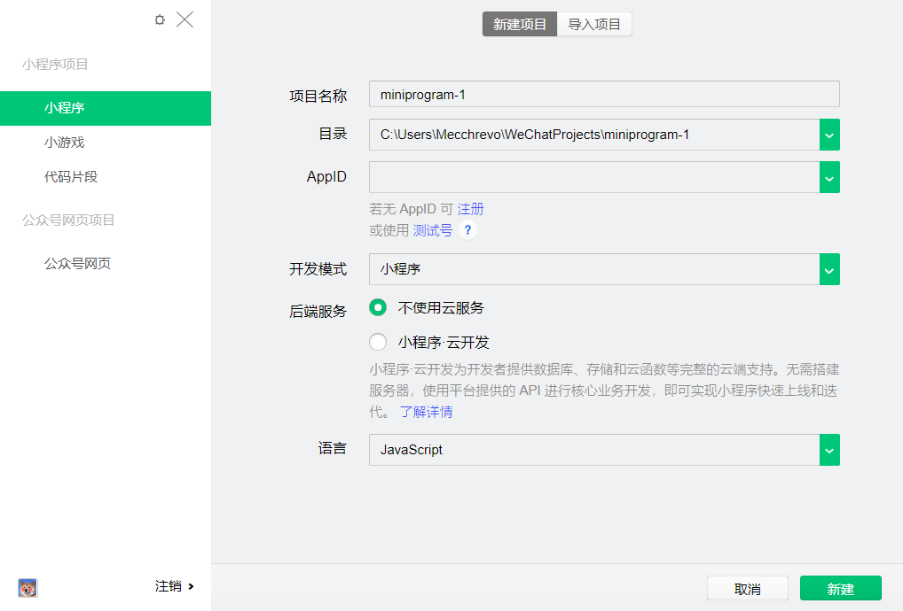

2)	打开项目后点击右上角详情—>本地设置-->调试基础库-->选择最新版本并勾选使用npm模块。

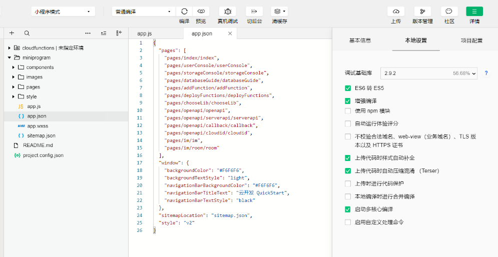

3)	打开以下网址，登录自己的小程序账号添加tensorflowJS插件。
https://mp.weixin.qq.com/wxopen/plugindevdoc?appid=wx6afed118d9e81df9&token=1076294821&lang=zh_CN

4)	安装tensorflowJS库，安装LTS版本(安装过程不需要配置，一直点下一步即可),
https://nodejs.org/en/

5)	安装成功后，打开PowerShell(管理员)，如下图
输入 node –version 和 npm –version 查看版本号检测是否安装成功

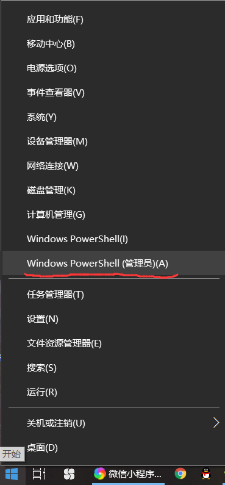
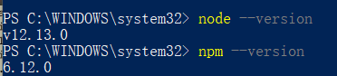

6)	接下来使用npm安装tfjs所用的一些包。

&emsp;&emsp;&emsp;
先切换到小程序项目的目录下，输入 npm init 对环境进行初始化

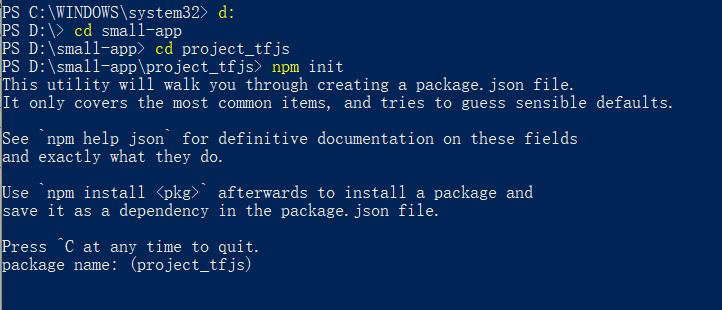

&emsp;&emsp;&emsp;
之后会要求输一些配置信息，没什么特别需求直接回车，最后输入yes即可

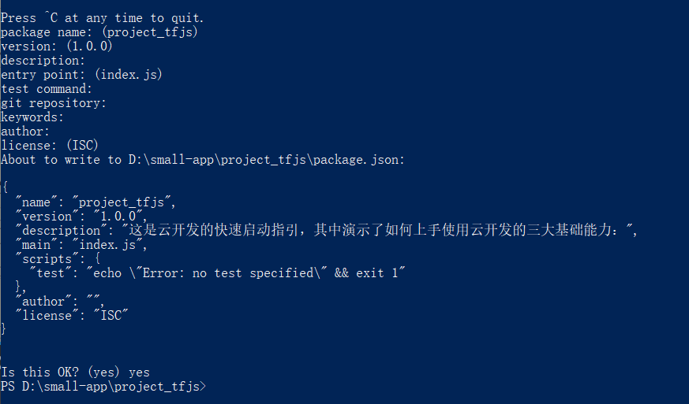

&emsp;&emsp;&emsp;
分别安装以下包

&emsp;&emsp;&emsp;
npm install @tensorflow/tfjs-core

&emsp;&emsp;&emsp;
npm install @tensorflow/tfjs-converter

&emsp;&emsp;&emsp;
npm install fetch-wechat

7)	回到微信小程序页面，点击工具-->构建 npm
进入package.json可以查看已经安装的包，每次新建项目都要重复初始化和安装包的操作

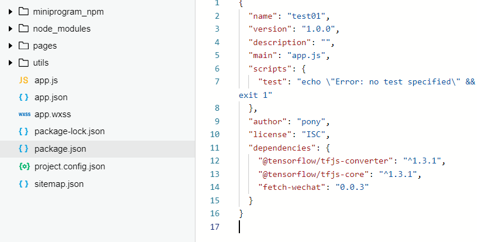

8)	删除一些微信小程序自带的代码，app.js内的代码可以都删除。

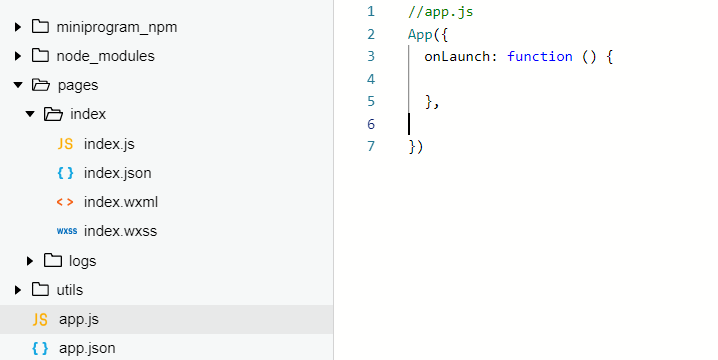

&emsp;&emsp;&emsp;
删除Index.js内的内容

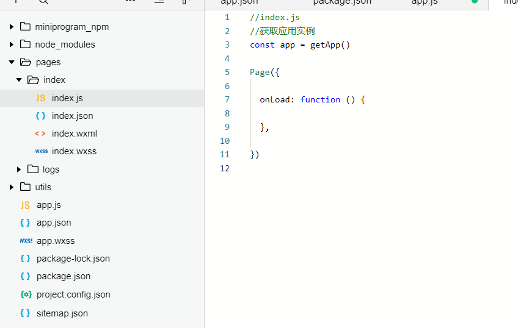

&emsp;&emsp;&emsp;
删除logs文件夹

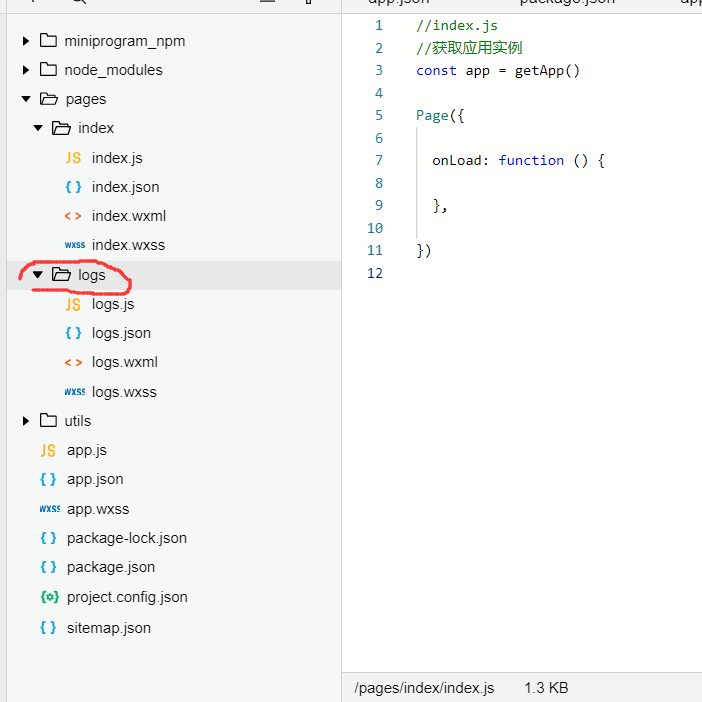

&emsp;&emsp;&emsp;
app.json内指向logs的部分也删除,删除代码时前后相应的逗号别忘了删除，不然会报错。

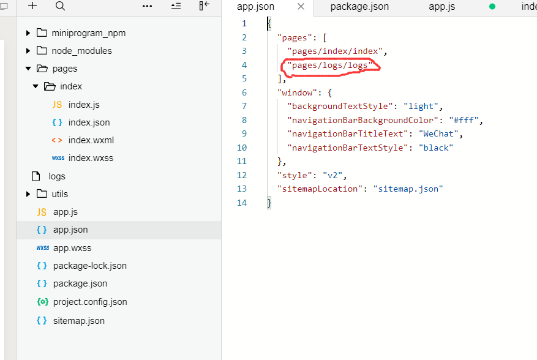

9)	之后用代码导入包，进入之前添加tensorflowJS插件的网页，下方有引入插件的代码及相关说明。&emsp;&emsp;&emsp;
https://mp.weixin.qq.com/wxopen/plugindevdoc?appid=wx6afed118d9e81df9&token=1076294821&lang=zh_CN

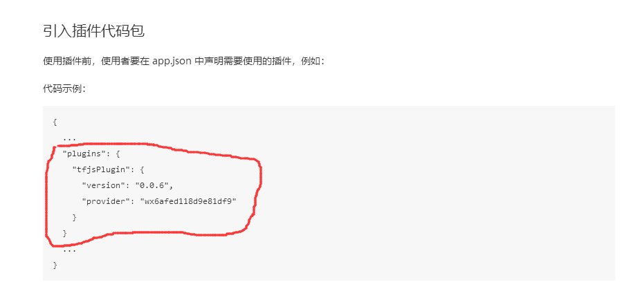

&emsp;&emsp;&emsp;
复制到app.json内，只复制红线部分

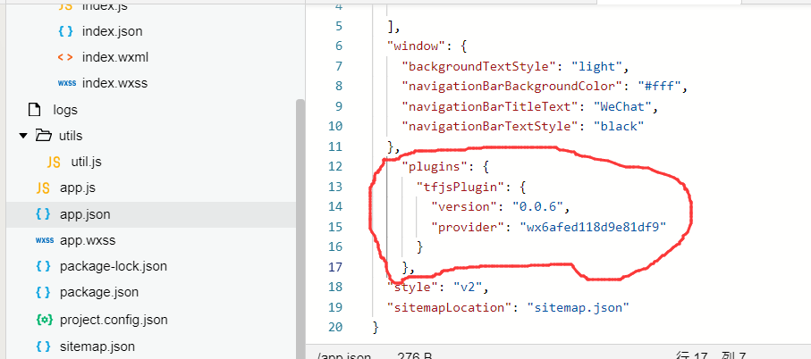

&emsp;&emsp;&emsp;
复制红线内代码到app.js

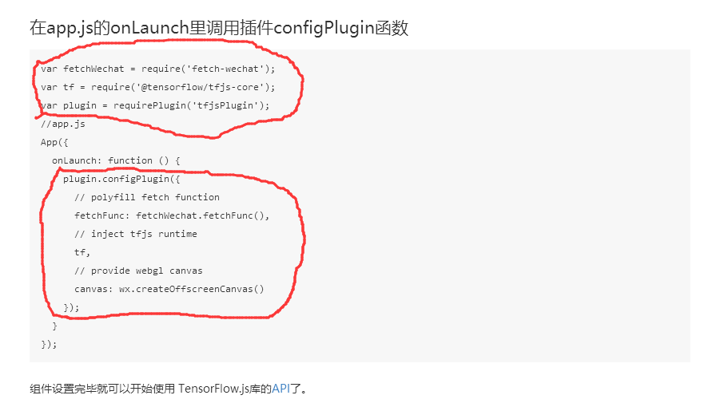

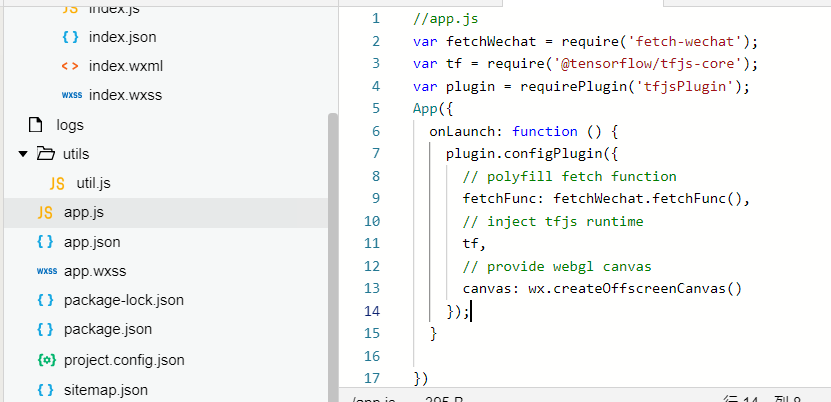

10)	之后用tensorflow打印一个常量，检测是否能正常运行

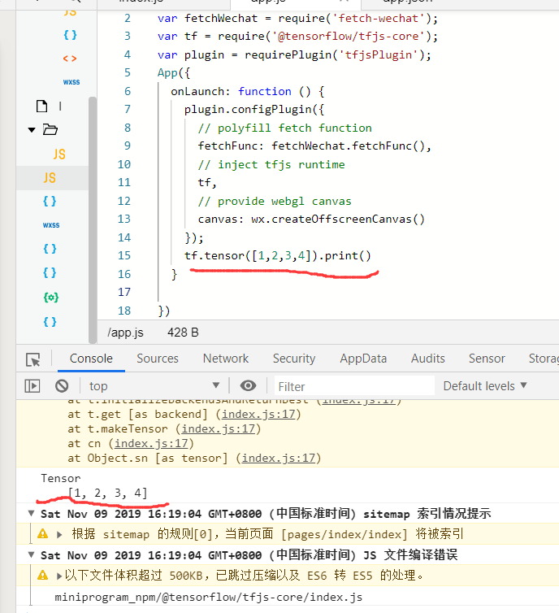

11)	导入tfjs需要注意的地方

&emsp;&emsp;&emsp;
基础库需要切换到2.7.0以上的版本（一般是最新版本）

&emsp;&emsp;&emsp;
Npm的初始化和安装需要在项目目录下操作

&emsp;&emsp;&emsp;
每次安装npm包之后，需要重新构建npm

