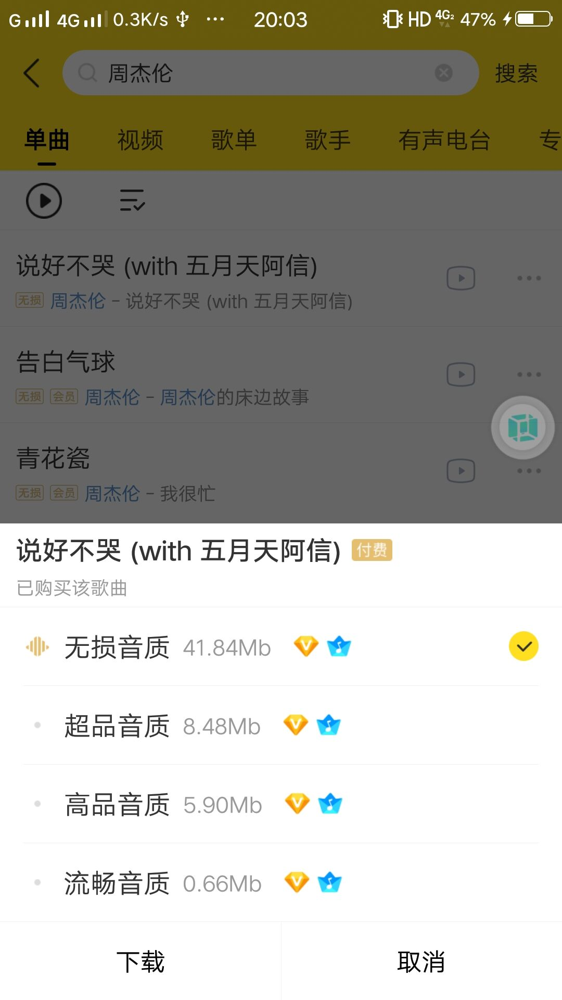

summary: demo
id: 20200210-01-官学琦
categories: security
tags: sctu-android
status: Published 
authors: 官学琦
Feedback Link: http://www.sctu.edu.cn

#Android逆向——破解某音乐app

##案例介绍
对年轻人来说听歌在日常生活中是必不可少的，从买CD到使用mp3再到手机app听歌科技发展非常迅速。以前可以在网上免费听所有歌曲，现在很多歌不是需要VIP就是付费。这使得很多读书党想听又没钱听歌，那么今天就来分享一下怎么免费听到心仪的歌曲。

###方法有两种：

1、爬虫，使用爬虫技术到音乐网站的网页上爬取音乐；

2、逆向破解，通过逆向破解电脑软件或者手机软件的方式实现零充值听VIP、付费音乐。

##破解必备
###逆向工具
MT管理器、酷我音乐
###破解原理
音乐app中既有VIP音乐也有付费音乐，点击下载VIP音乐时会判断当前用户是否是VIP账户，同理下载付费音乐也是一样，所以我们可以从此处下手破解。
##破解步骤
###破解VIP功能
使用工具进入classes.dex文件，字符串搜索与VIP相关的关键词，此时我们发现出现了比较显眼的字符串“isVipUser”，然后我们使用代码的常量搜索“isVipUser”找到与之相关的代码。
在列出的多个类里面我们发现了“VipInfoHelper（VIP助手）”并选择这个类，再通过常量查找“isVipUser”得到最终的函数“isVipUser”，我们点击进去查看smail代码，可以由下图看出“isVipUser”调用了另一个函数“getState”（重点），通过代码中的路径找到指定的函数观察代码修改返回值（也可以直接写改“isVipUser”里面的代码）。这样就成果破解VIP功能了。

###破解付费音乐
当下载付费音乐时会判断当前用户是否购买，所以这次我们搜索的关键词为与bought，这里省去一些判断的步骤来到关键词“hasbought”（判断是否购买），同样在第一次的搜索当中出现了很多的类，这次我们选择“ConsumptionQueryUtil”（消费查询），进入类再次搜索“hasbought”，进入该函数改变smail代码的返回值。完成破解
###成功截图

##免责声明
以上内容仅供学习交流，支持正版软件。

