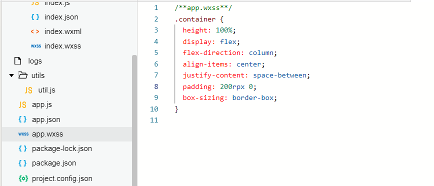

summary: demo
id: 20191117-01-马原涛
categories: tensorflow
tags: sctu-ai
status: Published 
authors: 马原涛
Feedback Link: http://www.sctu.edu.cn

# 微信小程序与tensorflow.js模型引入
## 
## 1) 创建camera对象和canvas对象

&emsp;&emsp;&emsp;用小程序实现人物的姿态检测功能

&emsp;&emsp;&emsp;Camera对象实时获取图像，传送给后台模型处理，处理完的结果在canvas对象内显示

    1.	添加camera
    2.	调整camera为全屏
    3.	在<camera>…</camera>中添加canvas对象

&emsp;&emsp;&emsp;进入下图目录，如果<view>内有默认填充的代码可以清理掉


<div align=center>

</div>

&emsp;&emsp;&emsp;创建camera对象，并添加一些属性，如后置摄像头、关闭闪光灯、相关报错、样式：全屏。
<div align=center>

</div>

&emsp;&emsp;&emsp;进入index.wxss页面，同样的先将无关内容删除。
<div align=center>

</div>

&emsp;&emsp;&emsp;添加样式,发现已经设置过样式（小程序初始化的样式）。
<div align=center>

</div>

&emsp;&emsp;&emsp;进入app.wxss页面，将padding后的值修改为0，然后保存。如果出现提示点Ok就行。
<div align=center>

</div>

&emsp;&emsp;&emsp;然后就可以在模拟器上，看到自己的头像出现（手动打码）
<div align=center>

</div>

&emsp;&emsp;&emsp;进入index.js页面，来添加一些代码，使得我们能获取camera得到的一帧一帧的图片。
<div align=center>

</div>


&emsp;&emsp;&emsp;进入index.wxml页面添加canvas对象
<div align=center>

</div>

&emsp;&emsp;&emsp;回到index.js页面，添加红线部分代码，传入canvas对象
<div align=center>

</div>

## 引入模型
&emsp;&emsp;&emsp;进入下面的网址，直接调用谷歌提供的模型作为案例。

&emsp;&emsp;&emsp;
https://tensorflow.google.cn/

&emsp;&emsp;&emsp;
点击学习-->针对javascript-->查看模型

<div align=center>

</div>

&emsp;&emsp;&emsp;以PoseNet模型为例，该模型能够对人物的姿态进行检测
<div align=center>

</div>

&emsp;&emsp;&emsp;可以点击进入github页面，查看该模型的一些介绍和用法。
<div align=center>

</div>

&emsp;&emsp;&emsp;
进入PowerShell(管理员)指令界面，进入到项目目录下开始安装该模型。

&emsp;&emsp;&emsp;
npm install @tensorflow-models/posenet

&emsp;&emsp;&emsp;
安装之后，返回小程序项目重新点击构建npm

&emsp;&emsp;&emsp;
回到index.js页面，导入模型，没报错就证明导入成功。

<div align=center>

</div>

## 异步加载
&emsp;&emsp;&emsp;这里有个问题需要注意，一些模型可能比较大，加载较慢，所以一般采用异步加载，但小程序不支持异步加载，要再安装一个库。回到PowerShell(管理员)指令界面，输入:


```
npm install regenerator-runtime
```
&emsp;&emsp;&emsp;
之后回到小程序项目做一些修改，点击右上角详情-->本地设置-->取消es6转es5，如果’使用npm模块’没勾选的，现在勾选上

<div align=center>

</div>

&emsp;&emsp;&emsp;修改代码部分就不累赘了，一些说明直接注释在代码旁边。将index.js内的所有代码替换为下方的代码。

```javascript

const posenet=require('@tensorflow-models/posenet')//模型的下载命名
const regeneratorRuntime=require('regenerator-runtime')//异步加载库的下载命令
//index.js
Page({
  //async 异步加载 ，onLoad是在加载时触发可能会造成卡顿，改为onReady加载完毕后触发
  async onReady() {
    const camera = wx.createCameraContext(this)//调用接口
    this.convas = wx.createCanvasContext("pose", this)
    this.net=await posenet.load({
      architecture: 'MobileNetV1',  //模型架构
      outputStride: 16,             //cnn中的stride参数
      inputResolution: 193,         //输入形状
      multiplier: 0.5               //层数
    })//加载模型，配置参数，详细的参数说明可以查看那个模型的github页面下的说明
    //console.log(this.net)   //该行代码用于检测模型是否加载成功
    let count=0
    const listener=camera.onCameraFrame((frame) => {
      count++
      if(count===4){
        //console.log(frame)
        count=0
      }
      
    })//监听器，每帧刷新时都会把监听器得到的信息通过fram传给我们.这里设置了每隔4帧
  listener.start()
 
  }
})

```
## 可能遇到的问题
&emsp;&emsp;&emsp;碰上不合法域名问题，是因为模型的下载不是在本地而是从google的网址上下载的，微信小程序为了保障安全，涉及到新的域名都要在个人的微信小程序页面添加。

&emsp;&emsp;&emsp;回到微信小程序官网，登录自己的账号，操作如下图

<div align=center>

</div>

&emsp;&emsp;&emsp;根据报错，把相应网址添加到request里，保存提交即可
<div align=center>

</div>


<div align=center>

</div>

&emsp;&emsp;&emsp;如果无法提交，提示域名未经过ICP备案，在详情里勾选不检测域名。这样就能在测试的时候访问该域名，如果要发布正式的微信小程序就得将模型放在已经备案的域名上。
<div align=center>

</div>

&emsp;&emsp;&emsp;最后点击保存，在控制台能够查看模型信息即表示模型加载成功。
<div align=center>

</div>