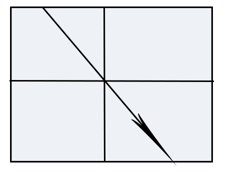

summary: demo
id: 20200210-01-饶龙江
categories: python
tags: sctu-ai
status: Published 
authors: 饶龙江
Feedback Link: http://www.sctu.edu.cn

# Canny算法简介
## 算法用途
在处理图像时，有时我们需要图像的边界或通过边界得到一定的信息，如何有效而准确的找到这些边界并显示出来就了一个问题，而Canny算法则可以很好的解决它。
## 算法主要原理
图像中的边缘点即是图像中局部区域颜色变化较大或者亮度突然变化的区域，Canny算法采用非极大值抑制，判断是否为边缘点。
### 非极大值抑制
它是查找像素点的局部最大值，如果这个像素点是局部最大值，则保留；否则将其删除（值设置为0）。
 
## 步骤详情和部分Python实现
### 平滑图像
平滑图像主要采用高斯滤波的方法：
```python
#创建高斯矩阵
sigma1 = sigma2 = 1
sum = 0
gaussian = np.zeros([5, 5])#创建一个5*5的一维矩阵
for i in range(5):
    for j in range(5):
        gaussian[i, j] = math.exp(-1 / 2 * (np.square(i-3) / np.square(sigma1) + (np.square(j-3) / np.square(sigma2)))) / (2 * math.pi * sigma1 * sigma2)
        sum = sum + gaussian[i, j]
gaussian = gaussian / sum
#创建高斯滤波器
w =img.shape[0]
h =img.shape[1]
new_img = np.zeros([w-5,h-5])#创建一个新的数组，用于存储高斯滤波之后的图像
for i in range(w-5):
    for j in range(h-5):
        new_img[i,j] = np.sum(img[i:i+2,j:j+2]*gaussian)#使用卷积的方法进行高斯滤波
```
### 图像增强
增强边缘的基础是确定图像各点邻域强度的变化值。增强算法可以将图像灰度点邻域强度值有显著变化的点凸显出来。这些点一般通过计算梯度幅度来确定。

数字图像处理中，为了简便运算可以使用差分近似求取灰度值的梯度值(变化率)。即：使差商(Δf-Δx)近似取代微商(∂f/∂x)。
```python
w1=new_img.shape[0]
h1=new_img.shape[1]
theta = np.zeros([w1-1, h1-1])
dx = np.zeros([w1-1, h1-1])
dy = np.zeros([w1-1, h1-1])
d = np.zeros([w1-1, h1-1])
#创建新数组用于存储得到的梯度幅度图像
for i in range(w1-1):
    for j in range(h1-1):
        dx[i,j] = new_img[i, j+1] - new_img [i, j]
        dy[i,j] = new_img [i+1, j] - new_img [i, j]
        d[i,j]=np.sqrt(np.square(dx[i,j])+ np.square(dy[i,j]))
        #计算梯度方向
         theta[i, j] = math.atan(dx[i, j] / (dy[i, j] + 0.000000001))
```
### 非极大值抑制
判断该点是否为局部最大值，只需要比较该点的梯度幅度和梯度方向的两个亚像素点的梯度幅度大小，而亚像素点梯度幅度可以通过计算梯度方向两侧的像素点的权重得到，如图：

 

$weight = |dx| / |dy|$

$T1 = weight*G1 + (1-weight)*G2$

$T2 = weight*G3 + (1-weight)*G4$
```python
#极大值抑制
    d = np.copy(M)
    W, H = M.shape
    NMS = np.copy(d)
    NMS[0, :] = NMS[W - 1, :] = NMS[:, 0] = NMS[:, H - 1] = 0
    for i in range(1, W - 1):
        for j in range(1, H - 1):
            # 如果当前梯度为0，该点就不是边缘点
            if M[i, j] == 0:
                NMS[i, j] = 0
            else:
                gradX = dx[i, j]  # 当前点 x 方向导数
                gradY = dy[i, j]  # 当前点 y 方向导数
                gradTemp = d[i, j]  # 当前梯度点
                # 如果 y 方向梯度值比较大，说明导数方向趋向于 y 分量
                if np.abs(gradY) > np.abs(gradX):
                    weight = np.abs(gradX) / np.abs(gradY)  # 权重
                    grad2 = d[i - 1, j]
                    grad4 = d[i + 1, j]
                    # 如果 x, y 方向导数符号一致
                    # 像素点位置关系
                    # g1 g2
                    #    g
                    #    g4 g3
                    if gradX * gradY > 0:
                        grad1 = d[i - 1, j - 1]
                        grad3 = d[i + 1, j + 1]
                    # 如果 x，y 方向导数符号相反
                    # 像素点位置关系
                    #    g2 g1
                    #    g
                    # g3 g4
                    else:
                        grad1 = d[i - 1, j + 1]
                        grad3 = d[i + 1, j - 1]
                # 如果 x 方向梯度值比较大
                else:
                    weight = np.abs(gradY) / np.abs(gradX)
                    grad2 = d[i, j - 1]
                    grad4 = d[i, j + 1]
                    # 如果 x, y 方向导数符号一致
                    # 像素点位置关系
                    #      g3
                    # g2 g g4
                    # g1
                    if gradX * gradY > 0:
                        grad1 = d[i + 1, j - 1]
                        grad3 = d[i - 1, j + 1]
                    # 如果 x，y 方向导数符号相反
                    # 像素点位置关系
                    # g1
                    # g2 g g4
                    #      g3
                    else:
                        grad1 = d[i - 1, j - 1]
                        grad3 = d[i + 1, j + 1]
                # 利用 grad1-grad4 对梯度进行插值
                gradTemp1 = weight * grad1 + (1 - weight) * grad2
                gradTemp2 = weight * grad3 + (1 - weight) * grad4
                # 当前像素的梯度是局部的最大值，可能是边缘点
                if gradTemp >= gradTemp1 and gradTemp >= gradTemp2:
                    NMS[i, j] = gradTemp
                else:
                    # 不可能是边缘点
                    NMS[i, j] = 0
    W, H = NMS.shape
    DT = np.zeros([W, H])
```

则只需要确定梯度方向然后进行比较判断。
### 双阈值确定边缘
在极大值抑制后，还需要设置一大一小两个边界值，认为大于大边界的点为真边缘，小于小边界的为假边缘，处于中间的像素点如多连接有真边缘，则也被认定为真边缘，非则为假边缘。
```python
# 定义高低阈值
    TL = 0.1 * np.max(NMS)
    TH = 0.3 * np.max(NMS)
    for i in range(1, W - 1):
        for j in range(1, H - 1):
            # 双阈值选取
            if (NMS[i, j] < TL):
                DT[i, j] = 0
            elif (NMS[i, j] > TH):
                DT[i, j] = 255
            # 连接
            elif (NMS[i - 1, j - 1:j + 1] < TH).any() or (NMS[i + 1, j - 1:j + 1].any() or (NMS[i, [j - 1, j + 1]] < TH).any()):
                DT[i, j] = 255
```
## 总结
在图像增强时，也可以使用一些专门的算子进行计算，上述代码只是采用了较为简单的方法；同时，在确定边缘点时，也有不同的思路，因此重点是需要掌握Canny算法的思路，具体操作可以根据自身对代码的掌握程度而确定。
