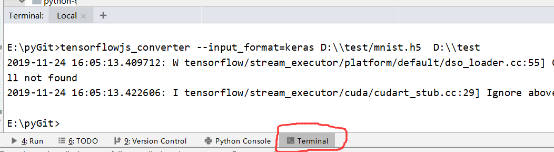
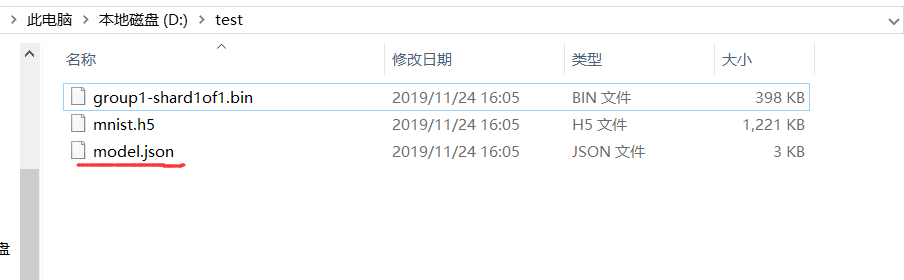
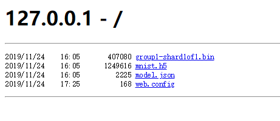
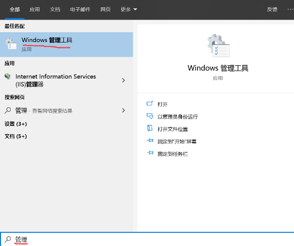
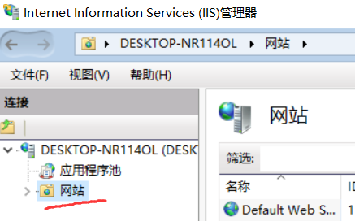
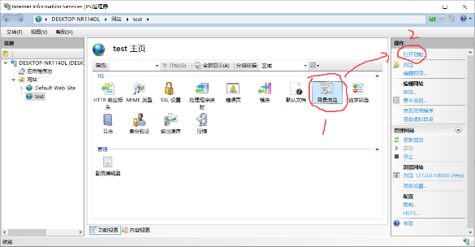
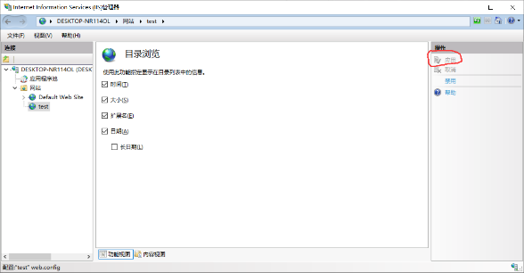
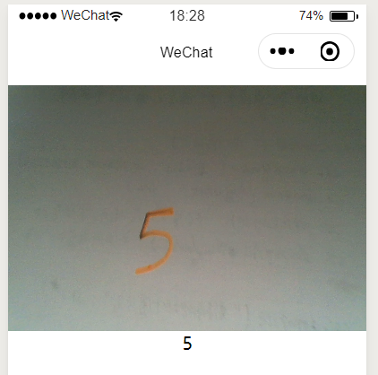

summary: demo
id: 20191124-01-马原涛
categories: tensorflow
tags: sctu-ai
status: Published 
authors: 马原涛
Feedback Link: http://www.sctu.edu.cn

# 在微信小程序中调用tensorflow自定义模型
## 问题提出
在成功调用官网打包好的tensorflowjs模型后，我怎么调用自己的模型呢？又需要做哪些处理呢？


## 问题解决

1.	安装好python和tensorflow
2.	安装tensorflowjs : pip install tensorflowjs

    注：如果你的tensorflow版本是2.0的，在下载tfjs时可能会被更新为1.15版本的。可以考虑新建个python环境。
3.	准备已经训练好的模型，并通过 model.save(“模型命名.h5”) 代码将模型保存为h5格式的文件。
    下面是本文使用的mnist手写数字集的模型代码案例。

```python
import tensorflow as tf
mnist = tf.keras.datasets.mnist
(x_train, y_train),(x_test, y_test) = mnist.load_data()
x_train, x_test = x_train / 255.0, x_test / 255.0
model = tf.keras.models.Sequential([
  tf.keras.layers.Flatten(input_shape=(28, 28)),
  tf.keras.layers.Dense(128, activation='relu'),
  tf.keras.layers.Dropout(0.2),
  tf.keras.layers.Dense(10, activation='softmax')
])
model.compile(optimizer='adam',
              loss='sparse_categorical_crossentropy',
              metrics=['accuracy'])
model.fit(x_train, y_train, epochs=5)
model.evaluate(x_test, y_test)
model.save('D:\\test/mnist.h5')


```
4)	通过tensorflowjs_converter命令将h5格式的模型文件转换为json格式的文件。

        1.打开pycharm的Terminal指令框
<div align=center>

</div>


        2. 输入转换指令：
        tensorflowjs_converter --input_format=keras D:\\test/mnist.h5  D:\\test 
        注释：tensorflowjs_converter –模型格式 模型地址 保存地址
        3.查看model.json是否生成
<div align=center>

</div>

5)	将模型放在服务器上，如果没有可以在本地创建，步骤如下 
    1.	打开pycharm的Terminal的指令框
    2.	输入python3 -m http.server 8000
    3.	打开浏览器输入 localhost:8000  输出如下界面


<div align=center>

</div>
&emsp;&emsp;&emsp;如果出现localhost拒绝访问,可能是你的系统没开启iis服务，只能手动开启了。

&emsp;&emsp;&emsp;未开启的建议依次按以下步骤来：

            1.百度：如何安装iss服务
            2.打开管理工具

<div align=center>

</div>

            3.进入管理工具界面，单击“Internet Information Services (IIS)管理器”。

            4.右键单击“网站”，选择“添加网站”。
<div align=center>

</div>

            5.在弹出的界面中输入网站名称、选择物理路径(model.json所在的文件地址)、IP地址输入为127.0.0.1、端口为8000，然后点击确定。

            6.打开目录展示功能：目录浏览—打开功能—启用

<div align=center>

</div>


<div align=center>

</div>

6) 在项目中安装相应的库
   
&emsp;&emsp;&emsp;详细过程请参考之前发布的博客《微信小程序与tensorflow.js准备工作》

在项目目录下使用npm安装对应包，安装代码如下：

```
npm install fetch-wechat

npm install @tensorflow/tfjs-converter

npm install @tensorflow/tfjs-core

npm install @tensorflow/tfjs-layers

npm install regenerator-runtime
```
7) 效果


<div align=center>

</div>


