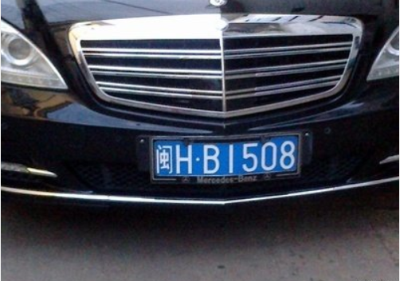
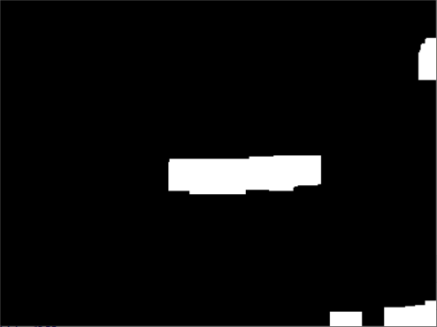

summary: demo
id: 20200210-01-饶龙江
categories: python
tags: sctu-ai
status: Published 
authors: 饶龙江
Feedback Link: http://www.sctu.edu.cn

# 车牌定位简介
## 问题描述
当拍摄一张包含车牌信息的照片时，往往还含有一些不必要的信息，这些信息在人眼中很容易被过滤，但是对于电脑来说，分辨出非有用信息是非常困难的，所以需要为电脑设计一些方法，帮助它去除无用信息，也就是提取需要的车牌区域。

## 方法原理
提取车牌区域的原理是先将图片中车牌区域的轮廓表示出来，再去除一些不必要的区域，然后将轮廓连通的区域进行填充，最后利用车牌的面积、长宽比例的特点，将车牌区域在原图中划分出来
## 效果



## 步骤
 
### 图像预处理
图像预处理主要是对图像灰度化和二值化，灰度化图像后更有利于不必要信息的去除，在选择灰度化方法时，可以采用电视工业标准，二值化后的图像则有利于Canny算法的轮廓提取。
### 提取轮廓边缘
边缘的提取主要是采用Canny算法，将图像区域中边缘点提取出来，Canny算法的图像增强步骤中有几种专门的算子，对于车牌区域的提取，一般选用soble算子。
### 去除部分轮廓
去除部分轮廓的原理是先通过闭操作将图像的轮廓进行填充，再通过开操作将图像中的不满足车牌区域特点的轮廓过滤掉，部分Python代码如下：

### 提取车牌部分轮廓
提取车牌轮廓可以根据车牌得长宽比例和面积特点，将图像中的车牌部分标准出来，需要对得到的图像进行寻找、绘制轮廓的操作，这个步骤可以使用cv2中findContours和drawContours函数来完成；最后通过绘制的轮廓在原图中相应位置上进行车牌区域提取。

## 全部代码
```python
def CANNY(img_path):
    # 读取图片
    img = cv.imread(img_path)
    print('-----',img.shape)
    print(img[1][2])
    # BGR 转换成 RGB 格式
    img_rgb = cv.cvtColor(img, cv.COLOR_BGR2RGB)
    # 灰度化
    img_gray = np.dot(img_rgb[..., :3], [0.299, 0.587, 0.114])
    #高斯滤波器
    #二值化
    max = float(img.max())
    min = float(img.min())

    x = max - ((max - min) / 2)
    ret,img_gray = cv.threshold(img_gray, x, 255, cv.THRESH_BINARY)
    sigma1 = sigma2 = 1#设置方差
    gau_sum = 0
    gaussian = np.zeros([5, 5])
    for i in range(5):
        for j in range(5):
            gaussian[i, j] = math.exp((-1 / (2 * sigma1 * sigma2)) * (np.square(i - 3) + np.square(j - 3))) / (
                        2 * math.pi * sigma1 * sigma2)
            gau_sum = gau_sum + gaussian[i, j]
    # 归一化处理
    gaussian = gaussian / gau_sum
    # 高斯滤波
    W, H = img_gray.shape
    new_gray = np.zeros([W - 5, H - 5])
    for i in range(W - 5):
        for j in range(H - 5):
            new_gray[i, j] = np.sum(img_gray[i:i + 5, j:j + 5] * gaussian)#采用卷积的方法
    cv.imshow("new_gray",new_gray)
    # 计算梯度幅值
    W, H = new_gray.shape
    #由于涉及到边界的问题，所以创建的新数组比原数组要少2行2列
    dx = np.zeros([W - 1, H - 1])
    dy = np.zeros([W - 1, H - 1])
    M = np.zeros([W - 1, H - 1])
    theta = np.zeros([W - 1, H - 1])
    #使用微差代替微商
    '''
    for i in range(W - 1):
        for j in range(H - 1):
            dx[i, j] = new_gray[i + 1, j] - new_gray[i, j]
            dy[i, j] = new_gray[i, j + 1] - new_gray[i, j]
            # 图像梯度幅值作为图像强度值
            M[i, j] = np.sqrt(np.square(dx[i, j]) + np.square(dy[i, j]))
            # 计算  θ - artan(dx/dy)
            theta[i, j] = math.atan(dx[i, j] / (dy[i, j] + 0.000000001))
    '''


    #使用soble算子
    soble_X = np.array([[-1, 0, 1], [-2, 0, 2], [-1, 0, 1]])  # X方向
    soble_Y = np.array([[-1, -2, -1], [0, 0, 0], [1, 2, 1]])  # Y方向
    for i in range(W-2):
        for j in range(H-2):
            dx[i][j] = np.sum(new_gray[i:i + 3, j:j + 3] * soble_X)
            dy[i][j] = np.sum(new_gray[i:i + 3, j:j + 3] * soble_Y)
            M[i, j] = np.sqrt(np.square(dx[i, j]) + np.square(dy[i, j]))


    '''
    #使用robert算子

    robert = np.array([[-1,-1],[1,1]])
    for i in range(W-1):
        for j in range(H-1):
            dx[i][j] = np.sum(new_gray[i:i+2,j:j+2]*robert)
            dy[i][j] = np.sum(new_gray[i:i+2,j:j+2]*robert)
            M[i, j] = np.sqrt(np.square(dx[i, j]) + np.square(dy[i, j]))
    '''
    '''
    #使用laplace算子
    laplace1 =np.array([[0,1,0],[1,-4,1],[0,1,0]])#第一种laplace算子
    laplace2 = np.array([[0,1,0],[1,-4,1],[0,1,0]])#第二种laplace算子
    for i in range(W-2):
        for j in range(H-2):
            dx[i,j] = np.sum(new_gray[i:i+3,j:j+3]*laplace1)
            dy[i,j] = np.sum(new_gray[i:i+3,j:j+3]*laplace1)
            #dx[i,j] = np.sum(new_gray[i:i+3,j:j+3]*laplace2)
            #dy[i,j] = np.sum(new_gray[i:i+3,j:j+3]*laplace2)
            M[i,j] = np.sqrt(np.square(dx[i, j]) + np.square(dy[i, j]))
     '''
    #极大值抑制
    d = np.copy(M)
    W, H = M.shape
    NMS = np.copy(d)
    NMS[0, :] = NMS[W - 1, :] = NMS[:, 0] = NMS[:, H - 1] = 0
    for i in range(1, W - 1):
        for j in range(1, H - 1):
            # 如果当前梯度为0，该点就不是边缘点
            if M[i, j] == 0:
                NMS[i, j] = 0
            else:
                gradX = dx[i, j]  # 当前点 x 方向导数
                gradY = dy[i, j]  # 当前点 y 方向导数
                gradTemp = d[i, j]  # 当前梯度点
                # 如果 y 方向梯度值比较大，说明导数方向趋向于 y 分量
                if np.abs(gradY) > np.abs(gradX):
                    weight = np.abs(gradX) / np.abs(gradY)  # 权重
                    grad2 = d[i - 1, j]
                    grad4 = d[i + 1, j]
                    # 如果 x, y 方向导数符号一致
                    # 像素点位置关系
                    # g1 g2
                    #    g
                    #    g4 g3
                    if gradX * gradY > 0:
                        grad1 = d[i - 1, j - 1]
                        grad3 = d[i + 1, j + 1]
                    # 如果 x，y 方向导数符号相反
                    # 像素点位置关系
                    #    g2 g1
                    #    g
                    # g3 g4
                    else:
                        grad1 = d[i - 1, j + 1]
                        grad3 = d[i + 1, j - 1]
                # 如果 x 方向梯度值比较大
                else:
                    weight = np.abs(gradY) / np.abs(gradX)
                    grad2 = d[i, j - 1]
                    grad4 = d[i, j + 1]
                    # 如果 x, y 方向导数符号一致
                    # 像素点位置关系
                    #      g3
                    # g2 g g4
                    # g1
                    if gradX * gradY > 0:
                        grad1 = d[i + 1, j - 1]
                        grad3 = d[i - 1, j + 1]
                    # 如果 x，y 方向导数符号相反
                    # 像素点位置关系
                    # g1
                    # g2 g g4
                    #      g3
                    else:
                        grad1 = d[i - 1, j - 1]
                        grad3 = d[i + 1, j + 1]
                # 利用 grad1-grad4 对梯度进行插值
                gradTemp1 = weight * grad1 + (1 - weight) * grad2
                gradTemp2 = weight * grad3 + (1 - weight) * grad4
                # 当前像素的梯度是局部的最大值，可能是边缘点
                if gradTemp >= gradTemp1 and gradTemp >= gradTemp2:
                    NMS[i, j] = gradTemp
                else:
                    # 不可能是边缘点
                    NMS[i, j] = 0
    W, H = NMS.shape
    DT = np.zeros([W, H])
    # 定义高低阈值
    TL = 0.1 * np.max(NMS)
    TH = 0.3 * np.max(NMS)
    for i in range(1, W - 1):
        for j in range(1, H - 1):
            # 双阈值选取
            if (NMS[i, j] < TL):
                DT[i, j] = 0
            elif (NMS[i, j] > TH):
                DT[i, j] = 255
            # 连接
            elif (NMS[i - 1, j - 1:j + 1] < TH).any() or (NMS[i + 1, j - 1:j + 1].any() or (NMS[i, [j - 1, j + 1]] < TH).any()):
                DT[i, j] = 255

    kernel = np.ones((5, 20), np.uint8)
    closingimg = cv.morphologyEx(DT, cv.MORPH_CLOSE, kernel)
    cv.imshow('closingimg', closingimg)
    cv.waitKey(0)
    cv.destroyAllWindows()

    # 进行开运算
    openingimg = cv.morphologyEx(closingimg, cv.MORPH_OPEN, kernel)
    cv.imshow('openingimg', openingimg)
    cv.waitKey(0)
    cv.destroyAllWindows()

    # 再次进行开运算
    kernel = np.ones((11, 5), np.uint8)
    openingimg = cv.morphologyEx(openingimg, cv.MORPH_OPEN, kernel)
    cv.imshow('openingimg', openingimg)
    cv.waitKey(0)
    cv.destroyAllWindows()

    rect = locate_license(openingimg, img)
    return rect, img
```
## 总结
本方法适合用于正面拍摄的车牌图片，可以有效的将车牌区域提取出来，需要注意的是，一些图片的效果可能会不理想，这跟图片拍摄的环境和角度都有关系，同时，结构元素的选取也可以变动，这也造成了提取效果的不同，所以对于车牌提取的算法还需要不断的进行优化。
