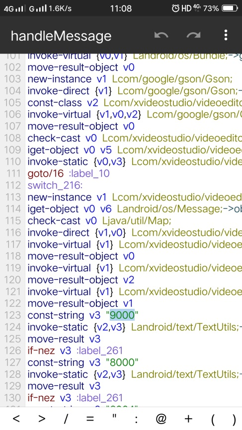
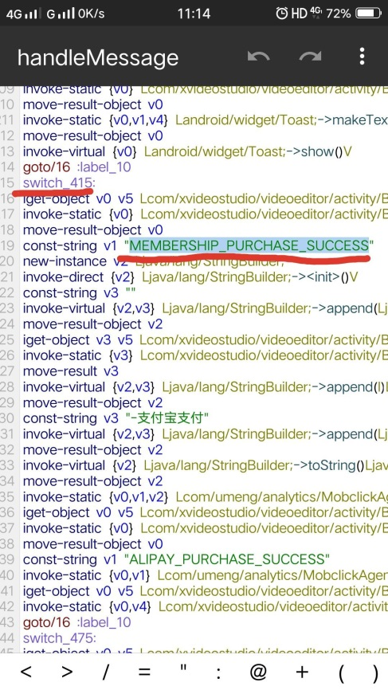
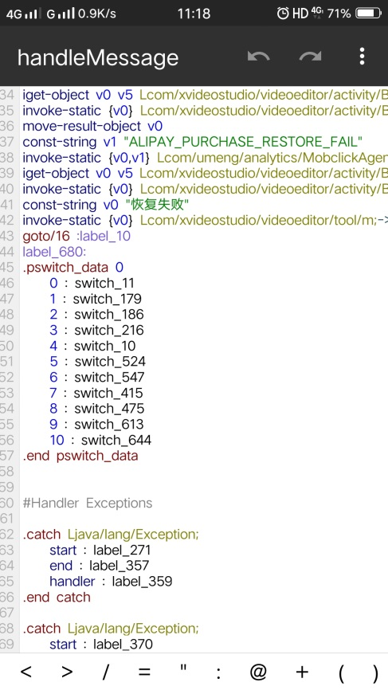
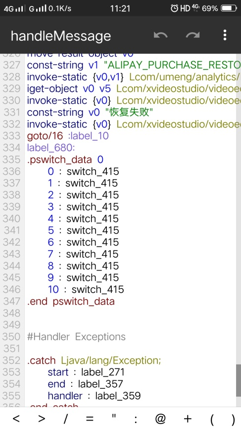

summary: demo
id: 20200210-01-官学琦
categories: security
tags: sctu-android
status: Published 
authors: 官学琦
Feedback Link: http://www.sctu.edu.cn

#Android逆向—内购（支付）破解

##案例介绍

在网络发达的时代手机受到大众青睐，手机软件当下异常火热大多软件需要充值成为vip用户才能使用更多的功能所有有很多厂商因此也获得了一些利益。那没有没有不用充值就能使用vip功能的方法呢？今天就为大家带来软件内购（支付）破解

###原图及效果

##破解必备
###使用工具

MT管理器

###所需知识

支付宝和银行卡方法名：handlemessage
支付宝支付成功代码：9000

##破解步骤：

###第一步
首先使用MT管理器打开软件安装安装包，进入dex文件直接搜索上述支付宝支付成功代码：9000

###第二步
在搜索的四个类中我们怎么选择我们需要的类呢？其实我们只需要翻译对应的英文单词的意思就能知道我们需要的是第三个类。当我们进入类中再次搜索支付宝支付成功的代码：9000，定位到方法中去。

###第三步
目前我们已经来到了代码部分，可以看到图中有我们需要的代码“9000”，现在我们需要做的就是仔细查找关键代码并修改它，如下图步骤中我们定位到了关键的代码，并且通过smali代码推断出源代码使用了switch语句判断是否支付成功。

###第四步
最后我们既然已经知道代码的原理，我们只需要通过修改代码就能完成内购破解了，废话不多说，我们直接来看图说话。

##免责声明
以上内容仅供学习，不得传播以及各种商业行为。
