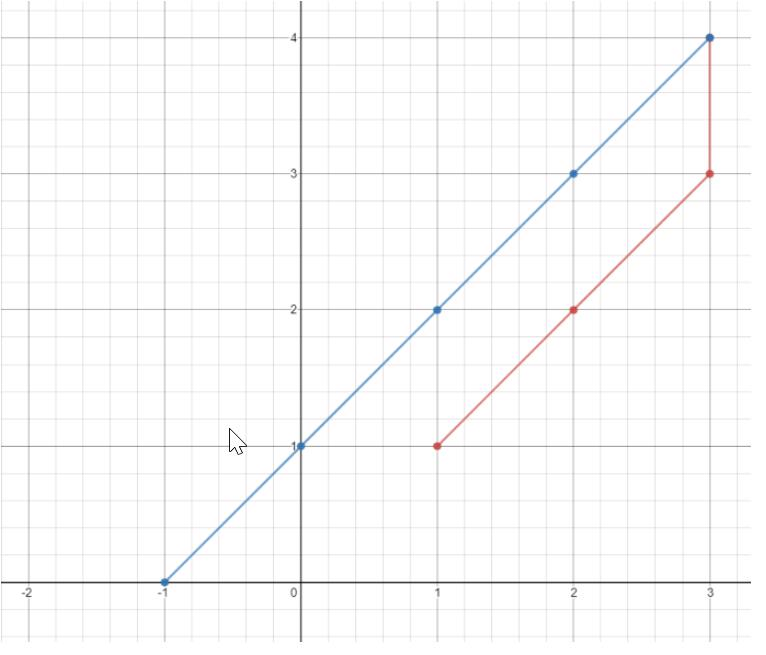

summary: demo
id: 20191208-01-王卓越
categories: python
tags: 
status: Published 
authors: 王卓越
Feedback Link: http://www.sctu.edu.cn

# 有关坐标题的解析
## 案例描述
平面上有 n 个点，点的位置用整数坐标表示 points[i] = [xi, yi]。请你计算访问所有这些点需要的最小时间（以秒为单位）。

你可以按照下面的规则在平面上移动：

每一秒沿水平或者竖直方向移动一个单位长度，或者跨过对角线（可以看作在一秒内向水平和竖直方向各移动一个单位长度）。
必须按照数组中出现的顺序来访问这些点。
 

示例 1：

输入：points = [[1,1],[3,4],[-1,0]]
输出：7
解释：一条最佳的访问路径是： [1,1] -> [2,2] -> [3,3] -> [3,4] -> [2,3] -> [1,2] -> [0,1] -> [-1,0]   
从 [1,1] 到 [3,4] 需要 3 秒 
从 [3,4] 到 [-1,0] 需要 4 秒
一共需要 7 秒
示例 2：

输入：points = [[3,2],[-2,2]]
输出：5
## 问题的解析
```python
def raw(l,n,q,k):
    if q<len(l):
        a=l[q][0]-l[n][0]
        b=l[q][1]-l[n][1]
        if abs(a)>abs(b) and q<len(l):
            k=k+abs(a)
            return raw(l,n+1,q+1,k)
        elif abs(b)>abs(a) and q<len(l):
            k=k+abs(b)
            return raw(l,n+1,q+1,k)
        elif abs(b)==abs(a) and q<len(l):
            k=k+abs(b)
            return raw(l,n+1,q+1,k)
    return k
l=eval(input('请输入：'))
n=0
q=1
k=0
print(raw(l,n,q,k))
```
通过对坐标规律的分析，可得知：坐标距离就等于两两坐标的x轴与y轴相减的绝对值的最大值列出条件即可解决。
## 总结
问题的解答源于对问题规律的掌握，认知也是有效的一种。
