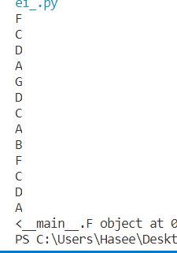
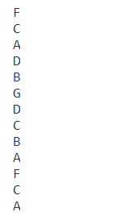

summary: demo
id: 20191222-01-王卓越
categories: python
tags:
status: Published 
authors: 王卓越
Feedback Link: http://www.sctu.edu.cn

# python中涉及到类的多重继承及super()的调用
## 案例介绍
在python类中有关子类的多重继承所涉及的问题；如super函数，若是多个子类继承自相同的父类与不同的父类会有什么不同，当子类存在多个父类时，继承的先后顺序，让我们来一一探究一下，着其中的规律。
接下来有这样一串代码：
```python
class A(object):
    def __init__(self):
        print('A')
        super(A,self).__init__()
class B(object):
    def __init__(self):
        print('B')
        super(B,self).__init__()
class C(A):
    def __init__(self):
        print('C')
        super(C,self).__init__()
class D(A):
    def __init__(self):
        print('D')
        super(D,self).__init__()
class E(B,C):
    def __init__(self):
        print('E')
        super(E,self).__init__()
class F(C,D):
    def __init__(self):
        print('F')
        super(F,self).__init__()
class G(D,C,B):
    def __init__(self):
        print('G')
        super(G,self).__init__()
if __name__=='__main__':
    f=F()
    g=G()
```
该代码涉及到多重继承问题，其中还涉及到了super这个函数。
运行这串代码我们会得到如下结果：

## super函数的用法
由上述代码我们可知，子类利用super函数来调用父类（超类），同理super()函数的语法:
```python
super(type[,object-or-type])
```
含义： type=类object-or-type=类，一般是self。
如上述C作为例子；用法：
首先super函数会找到C的父类(A)，然后把C的类对象转化为父类(A)的类对象，然后调用父类对象的方法。
## 案例的解决
由上述的分析及结果我们可以得到一个结论：当多重继承中存在多个子类同时继承相同的父类时，且自身作为父类时（C,D均为F的父类），例如C,D两个子类同时去继承相同的父类（A）时，利用super()函数只会在最后一个调用父类（即D调用A）。
那若是不同的父类，那会出现什么情况呢？看如下代码：
```python
class A(object):
    def __init__(self):
        print('A')
        super(A,self).__init__()
class B(object):
    def __init__(self):
        print('B')
        super(B,self).__init__()
class C(A):
    def __init__(self):
        print('C')
        super(C,self).__init__()
class D(B):
    def __init__(self):
        print('D')
        super(D,self).__init__()
class E(B,C):
    def __init__(self):
        print('E')
        super(E,self).__init__()
class F(C,D):
    def __init__(self):
        print('F')
        super(F,self).__init__()
class G(D,C,B):
    def __init__(self):
        print('G')
        super(G,self).__init__()
if __name__=='__main__':
    f=F()
    g=G()
```
当D的父类变为B时,输出结果变为:

由此可见，当父类变为不同时，super()就会分别调用各个父类，并输出每一个调用的父类，例子中的C,D就会分别调用他们的父类A和B，这样就会输出上述的结果。
## 总结
涉及多重继承关系中super()函数并不是去让子类继承父类并输出，而是将自身，即子类的对象转化为父类的对象并调用父类，明白这一点问题就迎刃而解了。
