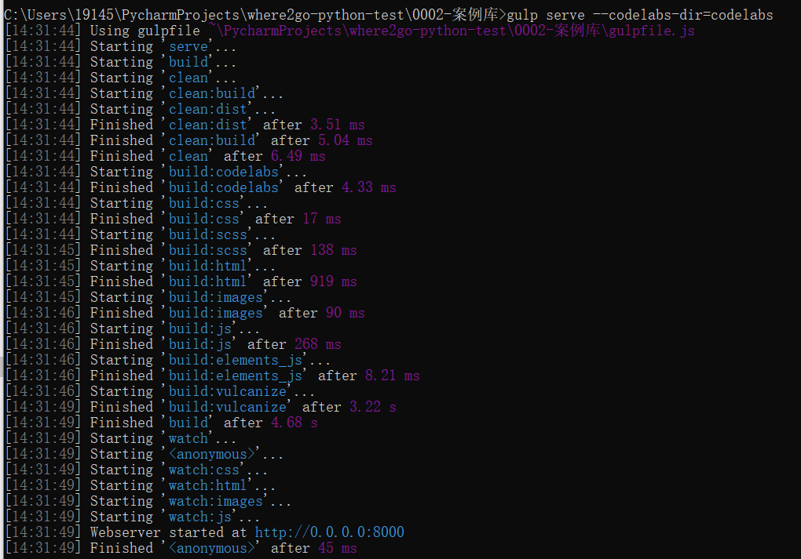
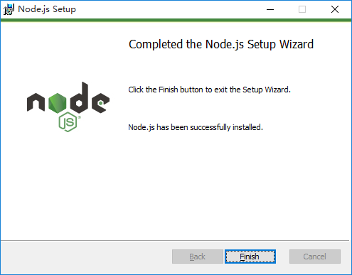
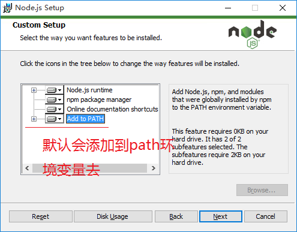
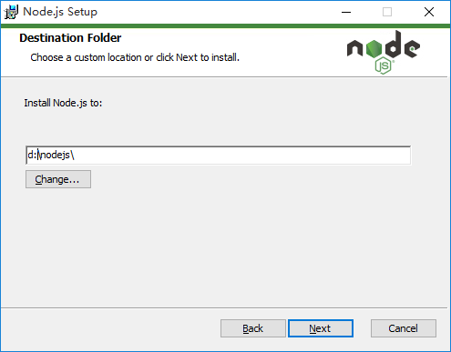
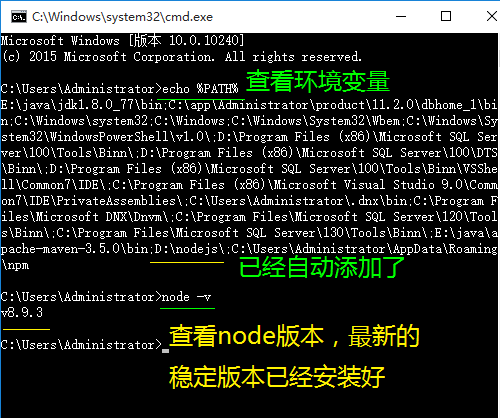
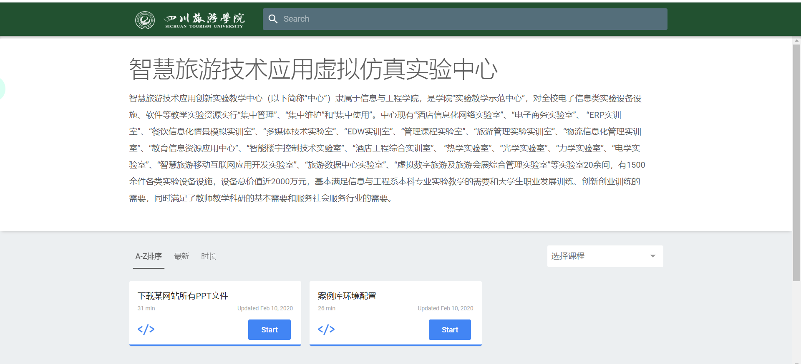

summary: demo
id: 20200210-01-刘玉江
categories: python
tags: 
status: Published 
authors: 刘玉江
Feedback Link: http://www.sctu.edu.cn

# 案例库环境配置

## 案例库环境配置

### 效果图



### 你将学到什么
* 本地配置案例库
### 你需要准备什么

- [安装 Nodejs](#本地配置案例库)
- [安装 npm](#安装npm)
- [安装 gulp](#安装gulp)

## 准备知识

gulp的基本知识


### 本地配置案例库
#### 安装Nodejs
进入 http://nodejs.org/en 下载 12.15.0LTS
完成后双击安装



打开CMD检查是否正常
#### 安装npm

输入命令npm config set registry=http://registry.npm.taobao.org 配置镜像站
#### 安装gulp
全局安装Gulp cnpm install gulp -g

检查版本 gulp -v

本地安装gulp，作为开发依赖 cnpm install gulp -D


## 案例实现
### 案例实现
用管理员身份打开cmd，进入到0002-案例库目录下
输入命令：npm install
等待全部安装好后 输入命令 gulp serve --codelabs-dir=codelabs
最后打开浏览器输入地址：127.0.0.1：8000



```


## 我有问题
Duration: 1:00
[我有问题](https://github.com/gschen/sctu-issue/issues/new)

打开上述链接，对问题进行详细的描述，我们在收到问题后，第一时间予以解答。