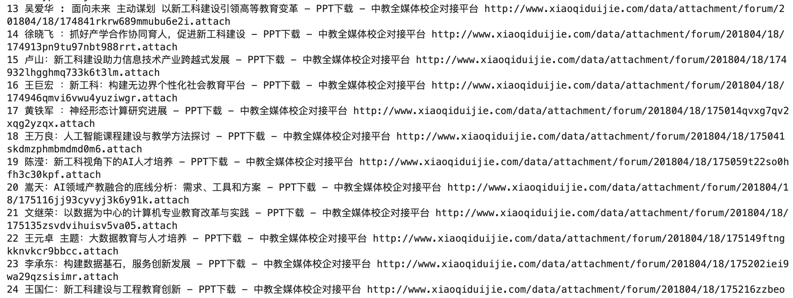

summary: demo
id: 20200210-01-刘玉江
categories: python
tags: 
status: Published 
authors: 刘玉江
Feedback Link: http://www.sctu.edu.cn

# 案例库环境配置

## 案例库环境配置
Duration: 5:00


日常生活和学习中，经常需要在某网站下载PPT等大量文件，由于文件分散在多个网页，或者一个网页有太多的下载链接，如果逐个点击下载，工作量较大。如何利用所学python知识按照指定规则自动下载需要的文件呢？

### 效果图


`你想要教别人实现一个什么功能？直接展示实验的结果截图。`

### 你将学到什么

* 利用python下载指定网站你需要的所有文件
* 如何利用requests下载HTML文件
* 如何利用BeautifuSoup解析HTML文档
* BeautifulSoup选择器用法
* 二进制文件写入
* 本地配置案例库

### 你需要准备什么


- 安装 Nodejs
- 安装 npm
- 安装 gulp

## 准备知识
Duration: 5:00
gulp的基本知识


### 本地配置案例库
进入 http://nodejs.org/en 下载 12.15.0LTS
完成后双击安装


打开CMD检查是否正常

输入命令npm config set registry=http://registry.npm.taobao.org 配置镜像站

### 利用BeautifulSoup加载并解析HTML文件

### 将二进制内容写入到文件

## 案例实现
Duration: 15:00

## 全部代码
Duration: 5:00

```python
import requests
from bs4 import BeautifulSoup

base_url = 'http://www.xiaoqiduijie.com/forum.php?mod=viewthread&tid='

for i in range(1,1000):
    try: 
        soup = BeautifulSoup(requests.get(base_url+str(i)).content)
        print(i, soup.title.text, soup.select_one('div#pdfview')['data-pdf'])
        
        pdf = soup.select_one('div#pdfview')['data-pdf']
        fname = 'ppt/'+soup.title.text.split('-')[0] + '.pdf'
        with open(fname, 'wb') as f:
            f.write(requests.get(pdf).content)
    except Exception as e:
        print(e)
```


## 我有问题
Duration: 1:00
[我有问题](https://github.com/gschen/sctu-issue/issues/new)

打开上述链接，对问题进行详细的描述，我们在收到问题后，第一时间予以解答。