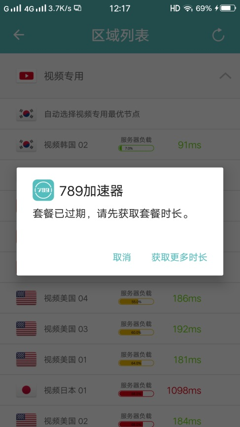
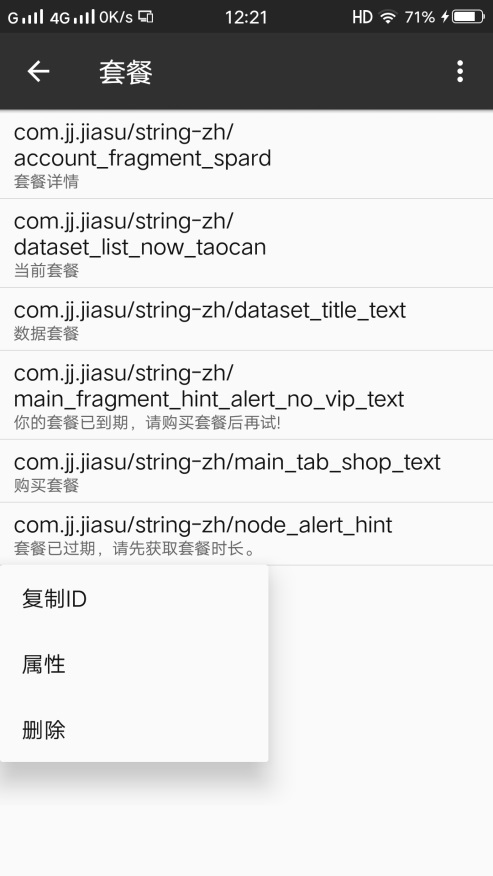
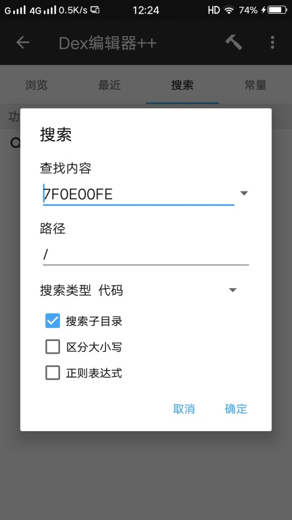
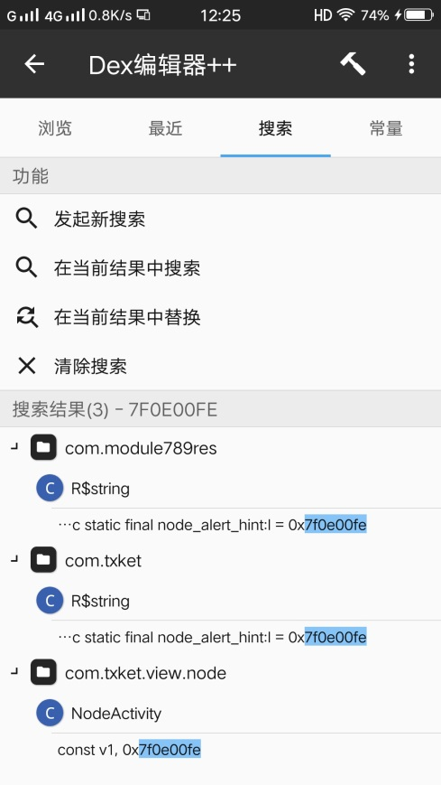
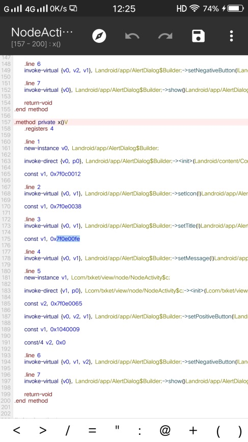
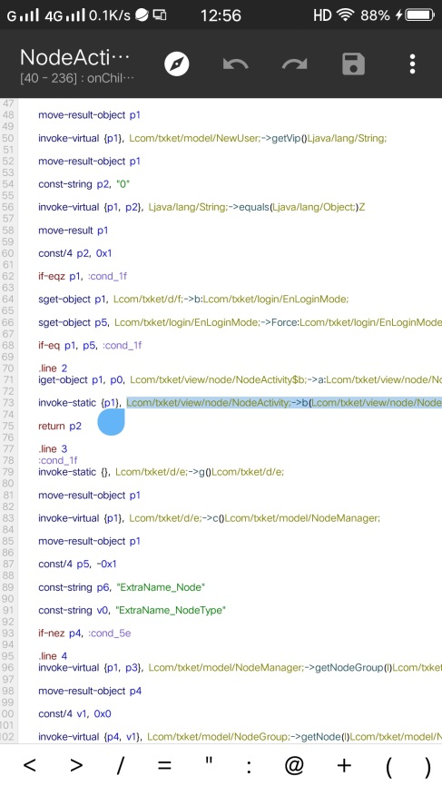
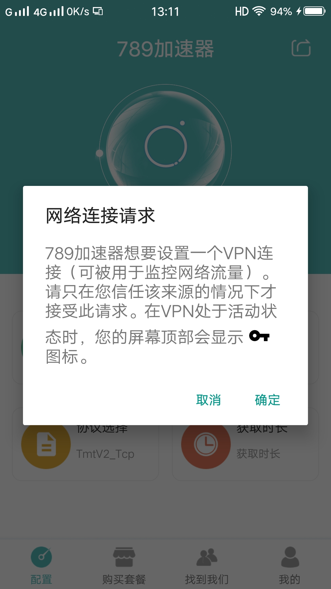

summary: demo
id: 20200210-01-官学琦
categories: security
tags: sctu-android
status: Published 
authors: 陈功锁
Feedback Link: http://www.sctu.edu.cn

# Android逆向——789加速器

##案例介绍
由于很多资料国内网站查不到，近段时间很多人问我怎么才能浏览国外的网站？
那当人是使用加速器了，我国为防止国外某些网站上的不良言论对我国青少年造成不良影响，
所以不开放访问国外网站，而需要查阅资料的朋友则需要使用加速器，
目前大多数加速器都是采用收费，那么下面我就教大家如何破解加速器。

##使用工具：
Android手机一部、mt管理器、789加速器

##必备知识
Smali语言基础、掌握apk文件的基本构成及各文件的作用

##破解步骤
第一步：安装789加速器，打开加速器并使用，由于我们没有付费所以不能正常使用。此时点击选择路线软件弹出对话框提示“套餐已过期，请先获取套餐时长”，如下图

第二步：打开mt管理器进入798加速器apk文件中的resource.arsc文件中搜索提示框中的内容并复制资源ID。

第三步：返回到apk文件目录，使用dex++打开所有的dex文件并搜索上一步得到的资源ID，经过对搜索结果的分析（需要samli文件基础，这里也可以编译成java代码观察代码），我们选择第三个。

第四步：通过分析代码我们可以知道软件提示的内容写在x()V方法里面，这个方法的无返回值，所以我们需要再次搜索是哪个地方调用了该方法。所以此时我们需要将x()V方法的的路径复制下来，完整的路径代码为“Lcom/txket/view/node/NodeActivity->x()V”

第五步：再次通过搜索来到了另一个方法中，发现此时的方法也没有返回值，我们继续是一次步骤用到的方法，此次复制b方法的路径再次搜索，完整路径为“Lcom/txket/view/node/NodeActivity;->b(Lcom/txket/view/node/NodeActivity;)V ”，最终我们来到了下图所示的代码中，此时我们发现在调用提示框方法的上面有两处判断的地方，这两的判断同是指向“cond_1f”，通过分析代码我们可以知道，如果满足上面任意一个判断则跳过提示框，所以我们只需要将判断的代码改为“goto”（无条件跳转）即可。我们将修改的内容保存打包签名重新安装软件

第六步：我们将安装的软件正常操作，发现已经没有提示框了，但是当我们继续往后操作发现又出现了新的提示信息。关于后面的破解和以上步骤基本一样所里这里就不再做解释。直接看最终的成功展示

##免责声明
逆向纯属爱好，以上内容仅供逆向学习交流，本人不会发布与之相关的任何文件。如有侵权请联系官方删除。

