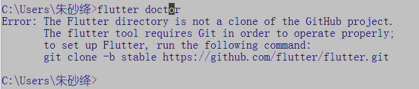
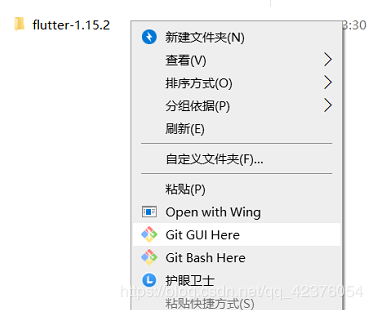
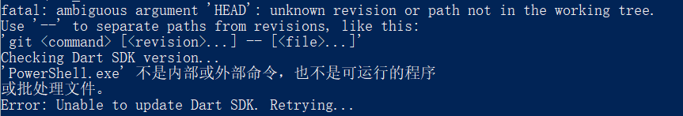
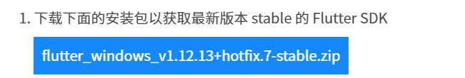

summary: demo
id: 20200210-01-朱竣菁
categories: flutter
status: Published
authors: 朱竣菁
Feedback Link: http://www.sctu.edu.cn
# Flutter 安装时请避开那些 “坑” ！

## 前言
根据 “官网” 给出的安装教程，我使用了命令行对 flutter sdk 进行了安装，当git 克隆完成、配置好环境变量以及用户变量后。想要利用 “flutter doctor” 来检查还有什么没有完成时，却出现了以下报错：

## 报错一

原因：该目录不是一个clone的git项目。但的确是克隆下载的。

拥有巨大智慧的网络朋友们给出了这样的解决方法：

“ 在文件夹上点击右键，选择创建一个仓库，目录选择 flutter 的这个目录。 ”

创建好了仓库，我们再来试试flutter doctor吧，竟然还是会出错 (网上千篇一律的解决方法都是手动创建仓库。。。。结果还是错的)。

## 报错二

原因：摸棱两可的 “head” 。

然后。。网上也给出了解决的方案：由于网络的原因，是镜像出现了问题。。。用户变量值修改一下最新的镜像。

我试了几个官网给的推荐用户变量值，依旧还是错误。。。。

## 出错的原因

其实 flutter 面向中国开发者主要有三个官方网站。 第一个是“flutter中文网  https://flutterchina.club/  ”。
第二个是“fultter英文官网 https://flutter.dev/ ”。第三个是“ flutter 社区中文资源网  https://flutter.cn/#  ”。

但由于广大网友百度搜索引擎里对于flutter中文网的认可度较高，排名第一，其实它里里面的内容不是很详细，它是被翻译的，有一些误差。由于在该网站的提供的github其实是存在问题的。建议大家还是去 flutter社区中文资源网或英文官网下载sdk 。

三个网站，我更推荐的是 flutter 社区中文资源网。第一，该网站内的开发者文档是可以中英文对照看的。第二，他对于中国开发者会遇到的问题进行了总和，例如sdk、镜像等问题，不需要特殊工具就能快速的下载安装。

## 解决的方法

因为克隆的文件 及 中文网提供的安装文件是错误的。
那我们需要将之前下载的内容删除，然后重新下载sdk，该文件夹大概有600m左右才是正确的sdk。

找到flutter-console.bat，运行后就可以利用检测啦

遇见了相同的问题的童鞋可以去 https://flutter.cn/docs/get-started/install/windows 这里获取最新的安装包，

                      

下载完成后解压，运行flutter-console.bat程序，输入 “flutter doctor” 来检查还有什么没有完成啦.
