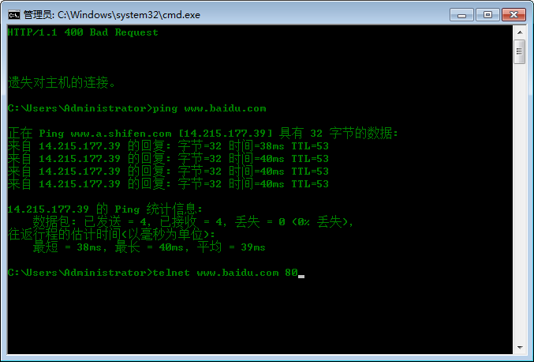
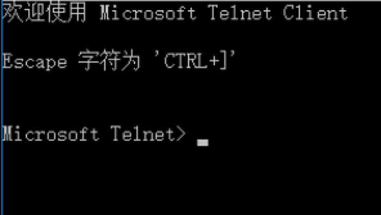

summary: demo
id: 20200210-01-李劲潮
categories:
tags: sctu-security
status: Published
authors: 李劲潮
Feedback Link: http://www.sctu.edu.cn

# 三分钟了解http协议

## 什么是http协议？

我们长话短说，直接进入正题。http协议翻译成汉语就是超文本传输协议，是一个简单的请求-响应协议。它在应用层进行使用，属于Web协议族中的一种。该协议运行在TCP之上，是基于C/S架构的一个通信协议。在使用时，服务器需要时时监控TCP的80端口，以保证通信。
http协议主要规范了服务器与客户端之间的消息传递。通俗的讲就是：客户端给服务器提出一个要求，然后服务器经过处理过后，将结果返回到客户端，这就是响应-请求模式。这个模式给早期的Web提供了可能。

## HTPP怎么工作？

一次HTTP操作主要有以下的四个流程：
1.客户端与服务器进行连接。
2.客户端发送一个请求给服务器。一个请求应包含URL、协议版本号、请求修饰符、客户端信息以及一些其他的内容。
3.服务器接到请求后，给予相应的响应信息，其格式为一个状态行，包括信息的协议版本号、一个成功或错误的代码、服务器信息、实体信息和其他的内容。
4.客户端在接收到服务器返回的信息后，进行显示。随后便与服务器断开连接。
上述过程中的某一步出现错误，那么产生错误的信息将返回到客户端， 通过显示屏进行输出，反馈给用户。上面四个步骤的过程，均由HTTP完成，用户只需要进行命令。

## 哪里会用到HTTP？

HTTP的应用非常广泛，早期主要是应用在Web上，进行对客户端数据的获取。后来随着移动网络的兴起，HTTP也开始服务APP。

## 一个直观的例子

使用cmd命令对百度进行HTTP请求。

进入后按快捷键Ctrl+J进入下面页面：

输入相应的请求头部，即可完成对百度的请求：

