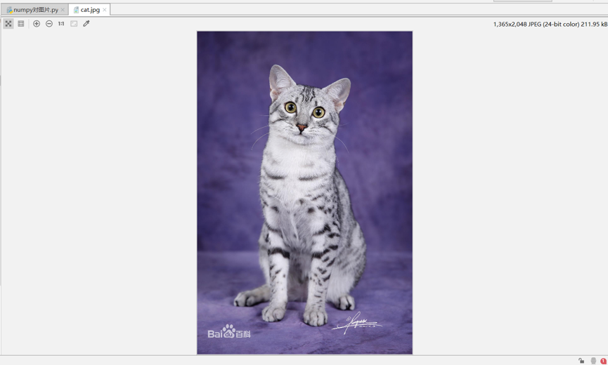
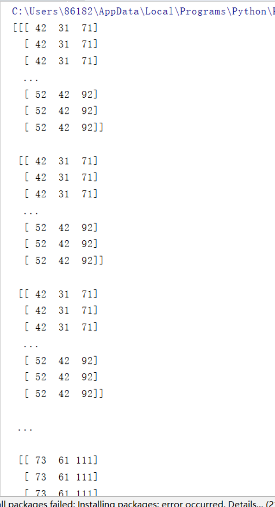
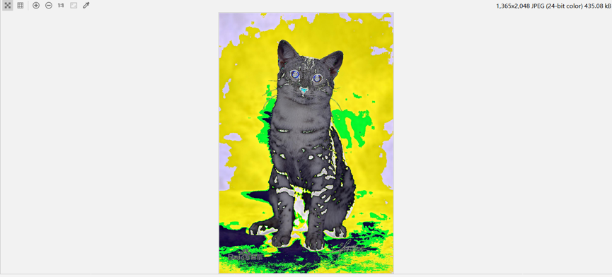
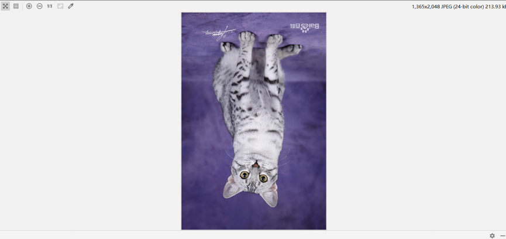
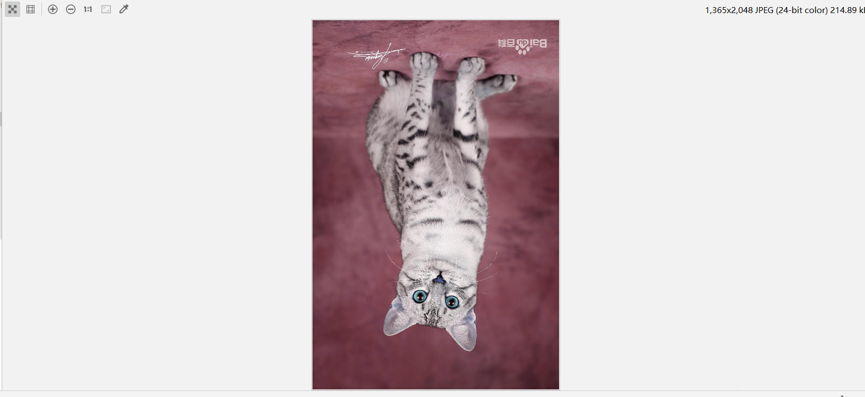

summary: demo
id: 20200210-01-李和龙
categories: python
tags: sctu-lanqiao
status: Published 
authors: ；李和龙
Feedback Link: http://www.sctu.edu.cn

# 基于numpy对图像进行简单处理
## 问题描述
在强大的python第三方库中，pillow库是一个对图像处理很有用的库，可以对图片进行很对操作，且非常简单易用。

但是我们知道图片其实有数据组成，那我们可以通过数据方向来对图片进行一定的处理，提取图片信息，将数据存入数组进行修改。
接下来我们便用代码进行尝试。
## Python代码
首先在执行之前我们需要用到matplotlib，pillow两个库做支撑，两个库均可以用pip方式下载。
首先我们有一张图片：

 
图2.1 cat.jpg
我们先将其读出数据存入数组：

```python
import matplotlib.pyplot as plt
img_arr = plt.imread("cat.jpg")
print(img_arr)
```



图2.2 得到的数组

这个三位数组就是img_arr,也就是我们想得到的关于图片的信息，是个很长的数组，每一组其实对应了一个像素点，前两个是坐标，第三个代表了颜色。
我们可以对其进行一些尝试：
```python
img_arr1=img_arr-100
plt.imsave("cat1.jpg",img_arr1)
```
这里的减100其实是对数组内所有数据，那就包括颜色；imsave也是一种将数组转化为图片的方法，让我们看看效果：



图2.3 修改后效果

因为numpy的属性，我们知道为三维数组，每组数据第一个代表横坐标，第二个代表纵坐标，那如果横纵坐标都颠倒，那图片是不是也颠倒了呢？
```python
plt.imsave("cat2.jpg",img_arr[::-1,::-1,:])
```
简单一行，我们看看效果：
 
 
图2.4 完全颠倒

那我们一起将颜色也相反呢？
```python
plt.imsave("cat2.jpg",img_arr[::-1,::-1,::-1])
 ```


图2.5 颜色相反

然后就得到几乎与之前不同的照片。
## 总结
从数据进行的修改很细，如果我们找到相应对图片的算法，我们也可以通过这样的方式来对图片进行ps，实现很多目的。

