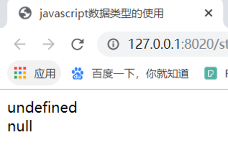

# JavaScript数据类型的使用

每一种计算机语言都有自己的数据结构和数据类型，JavaScript脚本语言中则是采用弱数据类型的方式，即一个数据不必首先做声明，可以再使用或赋值时再确定其数据的类型，接下来我们就介绍一下JavaScript数据类型的使用
## typeof运算符的使用
  typeof运算符有一个参数，即要检查的变量或值。例如：

```html
  var one = "test string";
alert(typeof one);//输出“string”
alert(typeof 86);//输出“number”

```

对变量或值，调用typeof将返回下列值之一：
（1）undefined：如果变量时Undefined类型的；
（2）boolean:如果变量是Boolean类型的；
（3）number：如果变量是Number类型的；
（4）string: 如果变量是String类型的；
（5）object: 如果变量是一种引用类型或Null类型的；

## undefined运算符的使用
undefined是未定义类型的变量，表示变量还没有赋值，如 var a;，或者赋予一个不存在的属性值，例如 var a = String.notProperty 。
在JavaScript中有一种特殊的数字常量NaN,表示“非数值”，当在程序中由于某种原因发生计算错误后，将产生一个没有意义的数值，此时JavaScript返回的数值就是NaN。
示例：
```html
<!DOCTYPE html>
<html>
	<head>
		<meta charset="UTF-8">
		<title>javascript数据类型的使用</title>
	</head>
	<body>
		<script type="text/javascript">
			var xiaozhan;
			document.write(xiaozhan + "<br/>")
		</script>
	</body>
</html>

```
运行效果：

## null类型的使用
JavaScript中的关键字null是一个特殊的之，表示空值，用于定义空的或者不存在的引用。不过null不等同于空的字符串或0。由此可见null与undefined的区别是：null表示一个变量被赋予了一个空值，而undefined则表示该变量还未被赋值。
示例：
````html
<!DOCTYPE html>
<html>
	<head>
		<meta charset="UTF-8">
		<title>javascript数据类型的使用</title>
	</head>
	<body>
		<script type="text/javascript">
			var xiaozhan;
			document.write(xiaozhan + "<br/>")
			var longlong = null;
			document.write(longlong + "<br/>")
		</script>
	</body>
</html>
````

运行的效果：


## Boolean类型的使用
布尔类型Boolean表示一个逻辑数值，用于表示两种可能的情况。逻辑真用true表示；逻辑假用false表示。通常我们使用1表示真，0表示假。
示例：
```html
<!DOCTYPE html>
<html>
	<head>
		<meta charset="UTF-8">
		<title>javascript数据类型的使用</title>
	</head>
	<body>
		<script type="text/javascript">
			var a1 = Boolean("");
			var a2 = Boolean("a");
			var a3 = Boolean("0");
			var a4 = Boolean("1");
			var a5 = Boolean("-1");
			var a6 = Boolean(null);
			var a7 = Boolean(undefined);
			var a8 = Boolean(new Object());
			document.write(a1+"<br/>");
			document.write(a2+"<br/>");
			document.write(a3+"<br/>");
			document.write(a4+"<br/>");
			document.write(a5+"<br/>");
			document.write(a6+"<br/>");
			document.write(a7+"<br/>");
			document.write(a8+"<br/>");
		</script>
	</body>
</html>

```
运行效果：

