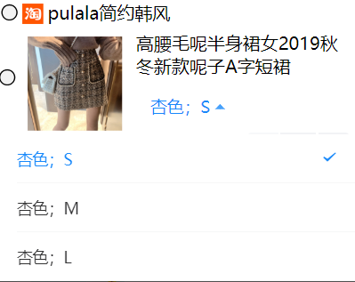
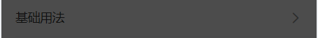
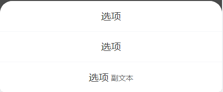

summary: demo
id: 20200210-20-江汪霖
categories: WeChat
tags: 
status: Published 
authors: 江汪霖
Feedback Link: http://www.sctu.edu.cn

# 微信小程序的上、下拉菜单

## 案例介绍
Duration :3:00
我们在使用小程序的时候基本的页面的一般都是很简洁的，所以会有一些菜单来做简单的诠释说明，或者是提供一些选项。这些菜单的弹出方式一般是向上和向下，那么如何来设置这些上下拉的菜单呢？

## 案例分析
Duration :3:00
上下拉菜单在微信小程序中起提示、选项的功能，当你点击它时会弹出属于这个菜单的相应选项。我们要使用vant组件库，将dist文件提前下载好然后保存到项目中。我们在小程序中调用组件库，并在正确引用就可以实现了菜单功能了。

## 案例实现
Duration :10:00

### 一、下拉菜单

#### （1）在json中调用van-tab组件。
```
  "usingComponents": {
    "van-dropdown-menu": "/dist/dropdown-menu/index",
"van-dropdown-item": "/dist/dropdown-item/index",
  }
}

```
#### （2）在js中对菜单进行设置。
option：设置菜单内容，

 value：设置菜单内容的排列顺序
 ```
 Page({
data: {
    option1: [
      { text: '白色；S', value: 0 },
      { text: '白色；M', value: 1 },
      { text: '白色；L', value: 2 }
    ],
    value1: 0,
  },
});

 ```
#### （3）在wxml中实现。
Active-color设置选中状态颜色，

Value设置排列顺序，

Option菜单内容
```
<van-dropdown-menu active-color="#ee0a24">
  <van-dropdown-item value="{{ value1 }}" options="{{ option1 }}" />
</van-dropdown-menu>
```




### 二、上拉菜单
#### （1）在json中调用van-tab组件。
```
  "usingComponents": {
    "van-action-sheet": "/dist/action-sheet/index"  
}
}

```
#### （2）在js中对菜单进行设置。
   name：设置菜单选项， 

   subname： 设置副标题，

   color：设置颜色
```
Page({ 
data: { 
show: false, 
actions: [ 
{ 
name: '选项' 
}, 
{ 
name: '选项' 
}, 
{ 
name: '选项',
subname: '副文本', 
openType: 'share' 
} 
] 
}, 
onClose() { 
this.setData({ show: false }); 
},
onSelect(event) { 
console.log(event.detail); 
} 
});

```
#### （3）在wxml中实现。
<van-action-sheet>:设置上来菜单

bind:select="onSelect" ：选中选项时触发，禁用或加载状态下不会触发

bind:close="onClose" ：关闭时触发
```
<van-action-sheet 
show="{{ show }}" 
actions="{{ actions }}" 
bind:close="onClose" 
bind:select="onSelect" 
/>

```


## 总结
Duration :3:00
设置上下拉菜单可以使我们的小程序界面简洁，我们在设置菜单的时候要注意对菜单内容和排列顺序设置正确。菜单跟其他的组件有一点点不同菜单一般是在js里面进行配置，我们可以根据自己的需要在js中对菜单进行设置。菜单设置的标签有很多，需要我们理解运用。