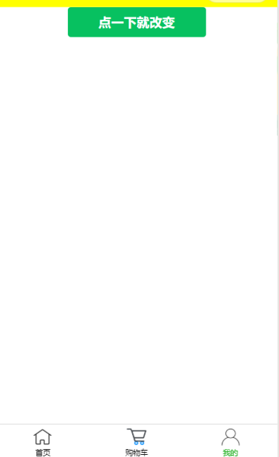
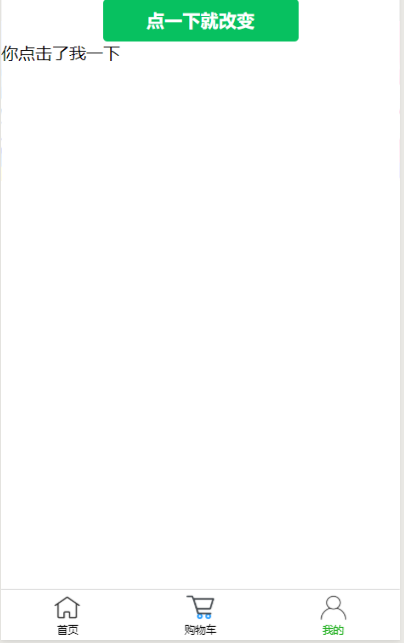

summary: demo
id: 20200210-01-王卓越
categories: wechat
tags: 
status: Published 
authors: 王卓越
Feedback Link: http://www.sctu.edu.cn


# 小程序利用button实现控制条件标签的变量
## 描述
Duration :3:00
在小程序中如何利用button按钮来实现控制条件标签的变量呢？这也许是许多小伙伴们的问题，今天我就来简单的给大家演示一遍。
## 演示步骤
Duration :10:00
### 第一步
首先打开微信公众平台，将一个primary的button按钮代码复制到开发平台上，再为其绑定一个名为”bindfirst”的事件，（当然这个bindfirst的事件需要在js中去定义，下面的步骤我将会去定义）代码如下；
```
<view>
  <button type="primary" bindtap="bindfirst"> 点一下就改变 </button>
</view>
```
### 第二步
我们创建一个text用来if条件标签来控制，同时再js中定义为一个空的量，
我们将if条件的定义一个judge变量给其赋值为true（if 条件标签如果为true，则显示text，如果为false则不显示text），再在button所绑定的事件中去改变text的值即可。代码如下；
#### wxml代码
```
<view>
  <button type="primary" bindtap="bindfirst"> 点一下就改变 </button>
  <text wx:if="{{judge}}">{{text}}</text>
</view>
```
#### js代码
```
Page({
  data: {
    text:[],
    judge:true,
  },
  onLoad: function () {
   
 
  },
  bindfirst:function(){
    var s=this.data.judge
    this.setData({text:"你点击了我",judge:!s})
  }
})
```
### 第三步
当我们点击一次时，会出现text，当点击第二次时就会关闭text，因为bindfirst中利用改变judge的值为true和false来达到改变text。
#### 效果图

## 小结
Duration :5:00
当我们点击button时就会触发绑定的bindfirst事件，而bindfirst事件中是text的变量，而data中所定义的text是一个空值，当我们点击时就会改变text中的量，从而达到简单的if条件标签的用button来控制。