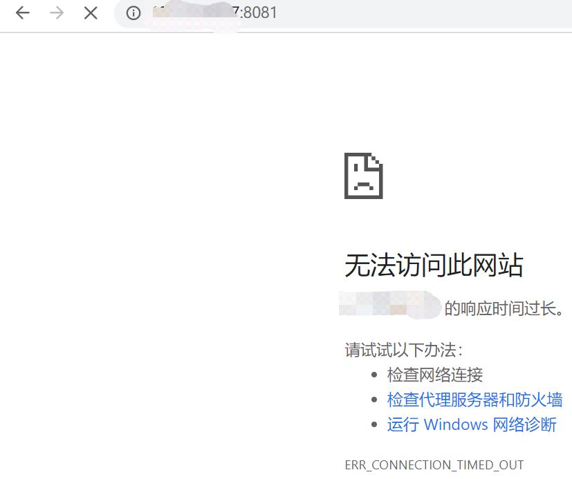
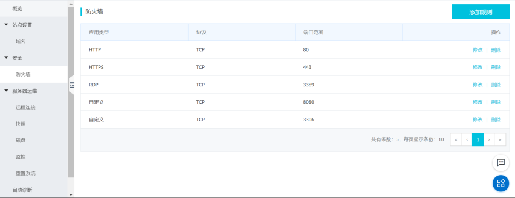
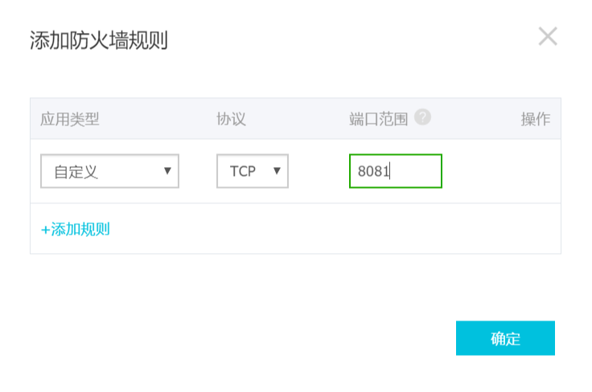
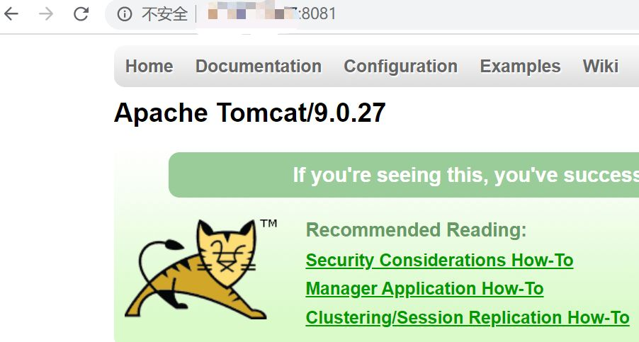
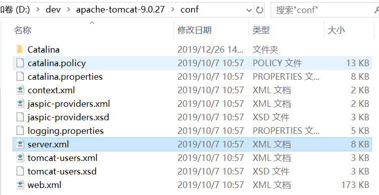
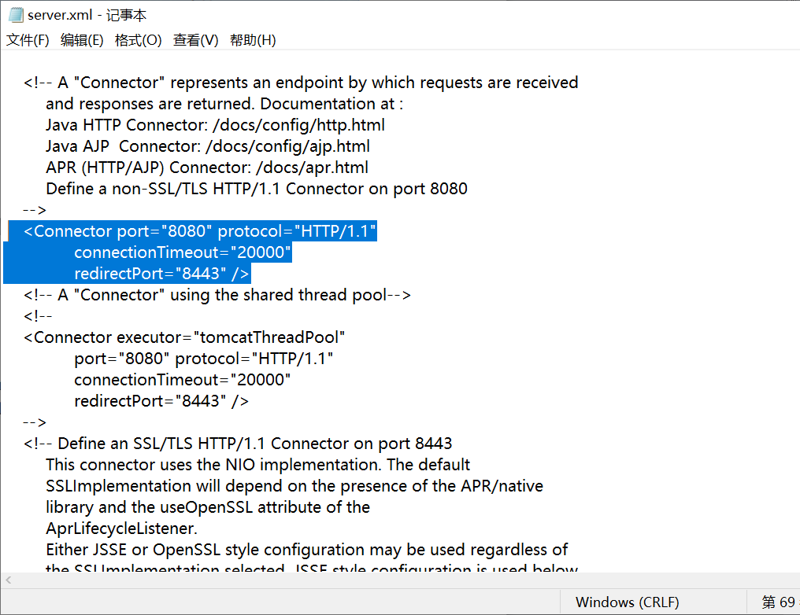

# 阿里云服务器tomcat无法访问解决办法

购买了阿里云服务器的同学，也许已经迫不及待的想将其利用起来，将自己的项目部署在我们的云服务器上。也许，我们在将项目部署之后，发现tomcat却无法访问，那我们应该怎么来解决这个问题呢？接下来我将为大家讲述这一过程。以及如何更改Tomcat端口号的方法。

 

## 在阿里云为tomcat端口号添加访问权限

第一步：进入服务器管理控制台

第二步：选择安全所属的防火墙，我们可以看见防火墙选项卡中，并没有我们刚才所访问的8081端口范围

 

第三步：选择右上方的添加规则，我们不用更改应用类型和协议，只需要在端口范围填写我们的tomcat端口号即可。

 

第四部，接下来我们再次测试一下之前的网址能否正常访问。

 

这就成功了！
## 更改Tomcat端口号

我们知道tomcat的默认端口号是8080，那么我们如何把端口号改成我们需要的端口号呢？
第一步：找到tomcat所属文件夹下的conf/server.xml文件

 

第二步：打开server.xml文件，找到<Connector port="8080" protocol="HTTP/1.1"connectionTimeout="20000"redirectPort="8443" />，
将port=”8080”,改为port=”8081”。

 

我们的更改也就完成了。
