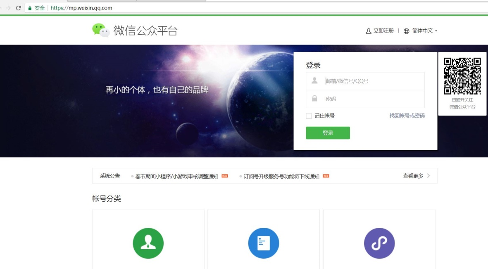
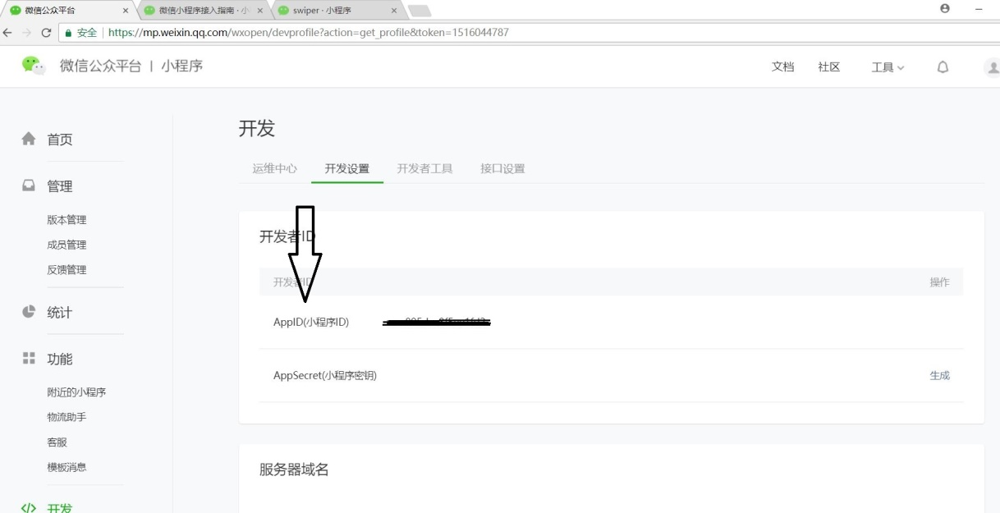
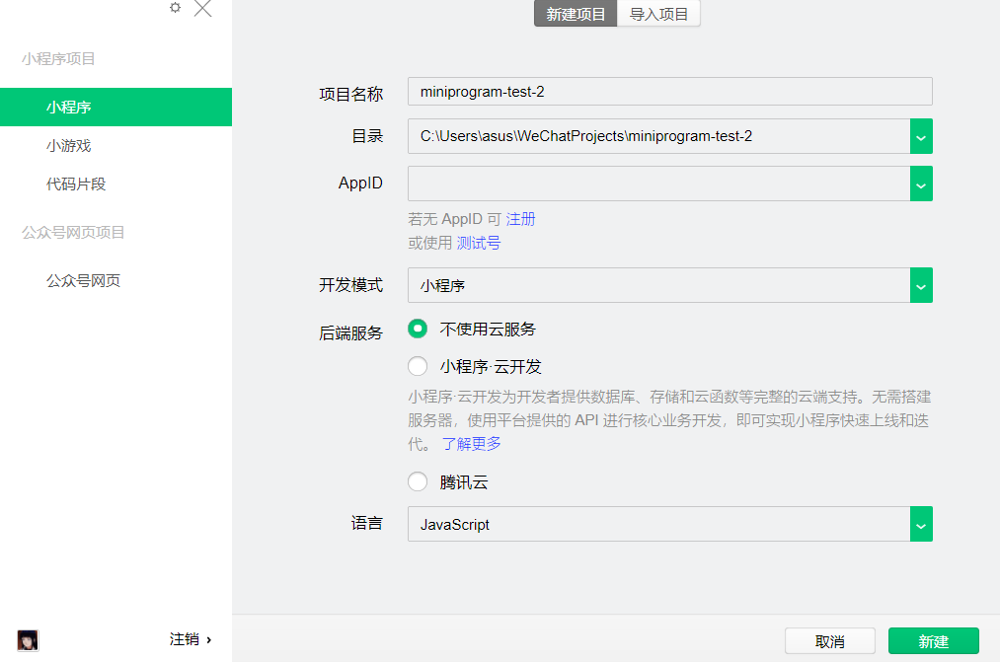
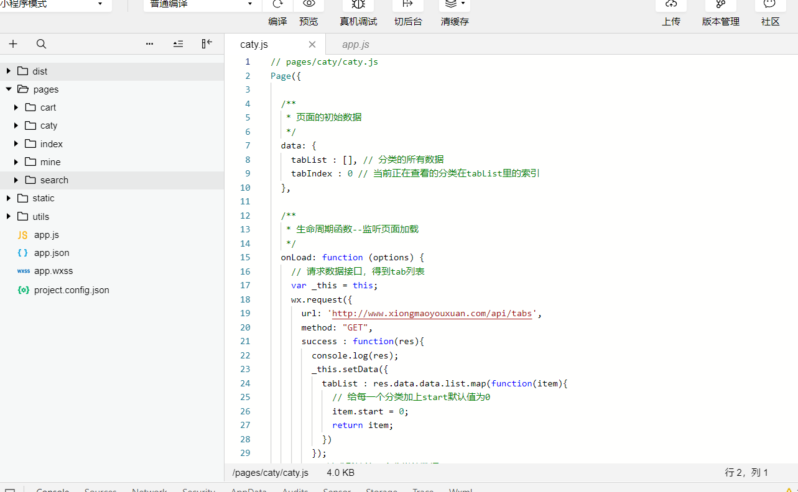
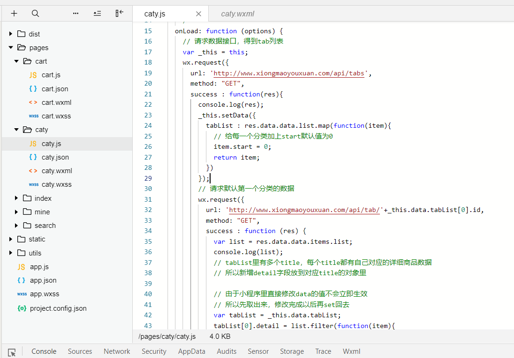
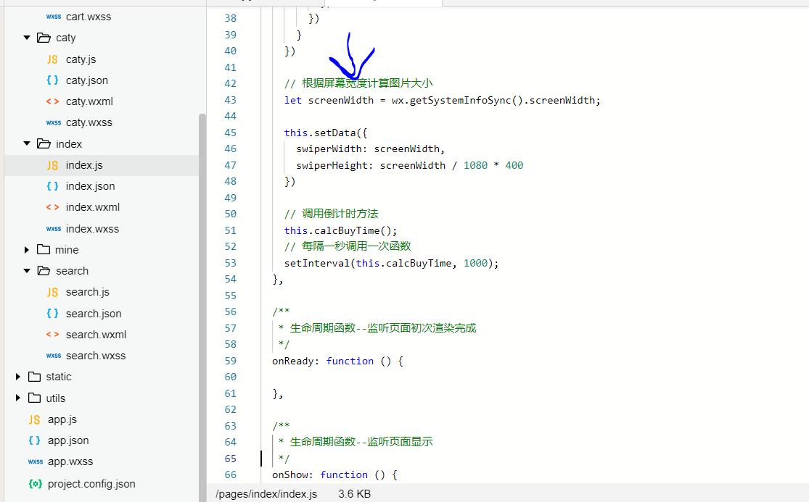
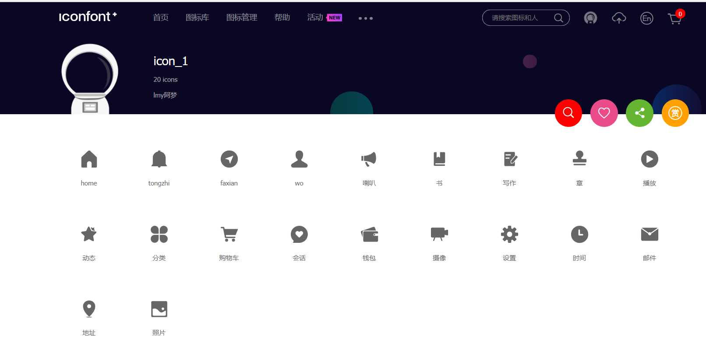
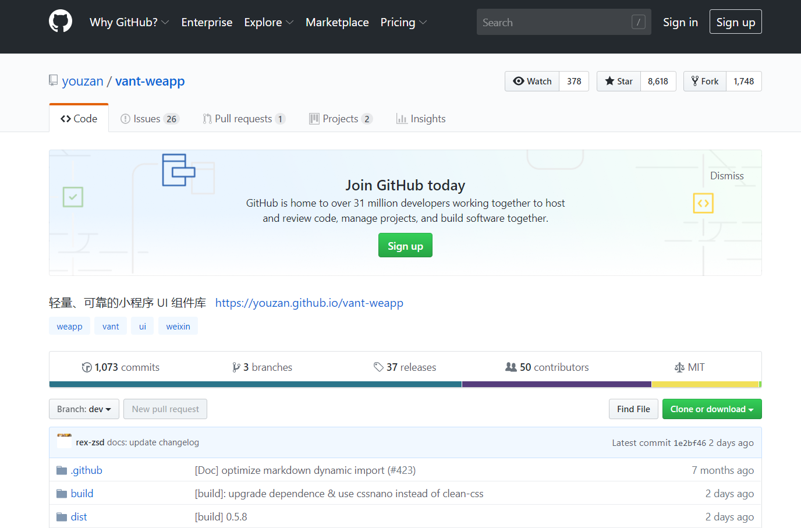

summary: demo
id: 20200210-01-王梦月
categories: wechat
tags: sctu-wechat
status: Published 
authors: 王梦月
Feedback Link: http://www.sctu.edu.cn


# 走进微信小程序
 

## 小程序准备工作
Duration: 5:00

微信小程序，英文名```Mini Program```，是一种不需要下载安装即可使用的应用，它实现了应用“触手可及”的梦想，我们可以便捷的通过扫一扫或者搜索即可打开应用。实现了不需要下载多个app便可进行用户体验。全面开放申请后，不光是企业政府等，个人也可成为小程序的开发者，接下来让我们走进微信小程序，一起探索奇妙的小程序之旅!!

打开网址```https://mp.weixin.qq.com```，注册账号，激活邮箱，并下载开发工具，如下图所示。




找到开发者设置下面的APPID，紧接着下载微信web开发者工具，选择新建项目。


输入开发者设置里面的```APPID```，小程序项目一触即发！
注意：由于小程序默认只允许请求一个合法接口域名，所以我们在做本地项目的时候不需要去校验合法域名，在开发工具右上角，点开详情，勾选不校验域名。

## 目录结构及文件分析
Duration: 5:00

如下我们可以看到项目的根目录和所有子目录：


小程序包含一个描述整体程序的app和多个描述各自页面的```page```，```app.js```是小程序的整个逻辑 、```app.json```是小程序的公共配置信息、```app.wxss```是小程序的公共样式表。而每个页面由四个文件组成，分别是：```js```（逻辑结构）、```wxml```（相当于```html```，页面结构）、```json```（页面配置）、```wxss```（页面样式表，相当于```css```）。```Dist```是```vantUI```库文件存放位置，```static```是存放静态资源的譬如图片等。
```Js```文件```data```里的数据可以绑定到```wxml```里的{{}}，修改数据则要使用```this.setData()```。



js处理事件：在```wxml```通过```bind```绑定事件，在```js```里的```app```对象内部新增这个事件的处理函数。


## 获取屏幕宽度 
Duration: 5:00

``` wx.getSystemInfoSync().screenWidth```


## 请求网络接口使用
Duration: 5:00

```wx.request()```
譬如：http://www.xiongmaoyouxuan.com/#/，F12用手机模式浏览，我们可以找到network里面的XHR，从header里查看url，从preview里查看返回的data值。

## Iconfonts图标
Duration: 5:00

打开网址```https://www.iconfont.cn/```  ，可以去搜索项目需要的图标，然后调整图标颜色的大小，下载到本地，注意图标风格要统一。


## vantUI
Duration: 5:00

打开网址 ```https://github.com/youzan/vant-weapp```  下载地址，下载压缩包，解压后把```dist```目录放到小程序的根目录，方便程序的使用。


## 适配手机需要使用rpx单位
Duration: 5:00

这是小程序独有的单位，不管任何手机屏幕宽度是多少，都可根据手机的大小自动按比例计算相应的px，具体比例是1px == 2rpx。