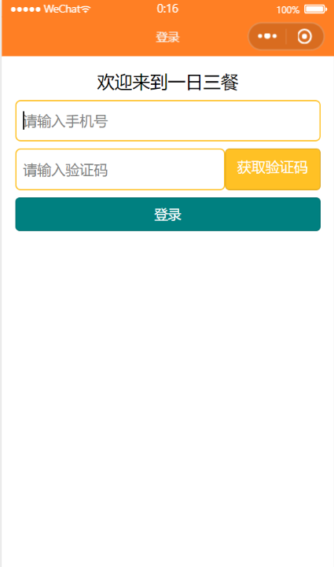

summary: demo
id: 20200210-01-赵微
categories: wechat
tags: sctu-wechat
status: Published 
authors: 赵微
Feedback Link: http://www.sctu.edu.cn

# 登录界面的框架搭建

## 案例介绍


当新用户登录一个APP时，输入手机号获取验证码的登录方式是比较快捷的。那么如何利用微信小程序制作一个常见的手机接收验证码的登录界面呢？


### 效果图



## 问题分析

一个简洁的登录界面需要的有输入框、按钮和提示字。
首先构建登录所需的输入框和按钮。
在wxml搭建框架，在wxss美化界面。

## 全部代码
```
<!--login.wxml-->
<view class="container">
<text>欢迎来到一日三餐</text>
<input type="number" bindblur="getPhone" placeholder="请输入手机号" class="phone_number"></input>
<view class="code">
<input type="number" bindblur="getCode" placeholder="请输入验证码" class="code_number"></input>
<button class="btn_code">获取验证码</button>
</view>
<view>
<button bindtap="login" class="btn_login">登录</button>
</view>

</view>


<!--login.wxss-->
.container{

  height: 100vh;
  display: flex;
  flex-direction: column;
  padding: 30rpx;
}

text{
  font-size: 40rpx;
  display: flex;
  justify-content: center;
}

input{
  border: 2rpx solid #FFC125;
  height: 90rpx;
  border-radius: 12rpx;
padding-left: 16rpx;
}

.phone_number{
  margin: 16rpx 0;
}

.code{
  display: flex;
  flex-direction: row;
  margin-bottom: 16rpx;
  width: 100%;
}

.btn_code{
background-color:  #FFC125;
color: white;
font-size: 32rpx;
}

.code_number{
  flex: 1;
}

.btn_login{
  background-color: #A2CD5A;
  color: white;
  font-size: 30rpx;
}


// pages/login/login.js
Component({
  /**
   * 组件的属性列表
   */
  properties: {

  },

  /**
   * 组件的初始数据
   */
  data: {
phone_number:'',
code:''
  },

  /**
   * 组件的方法列表
   */
  methods: {
    getPhone:function(e){
      this.setData({
        phone_number:e.detail.value
        
      })
      if(this.data.phone_number.length != 11 ){
      wx.showToast({
        title: '手机号输入错误',
      })
      return;
      }  
      console.log(this.data.phone_number)
      },
      getCode:function(e){
        this.setData({
          code:e.detail.value
        })
        console.log(this.data.code)
      },
      login:function(){
        wx.request({
          url: 'http://www.hengyishun.cn/login/login',
          data:({
            phone:this.data.phone_number,
            code:this.data.code
          })
          ,
          success(res){
            console.log(res.data);
          }
        })
      }
  }
})


// pages/login/login.json
{
  "component": true,
  "usingComponents": {}
}
```


## 代码释疑
上下输入框太近：margin: 16rpx 0;

输入框中的提示字太靠左：padding-left: 16rpx;

使输入框延长直至占满与按钮间的距离：flex: 1;

另外需要注意的是，text不是类名称，在wxss中前面不用加点。


