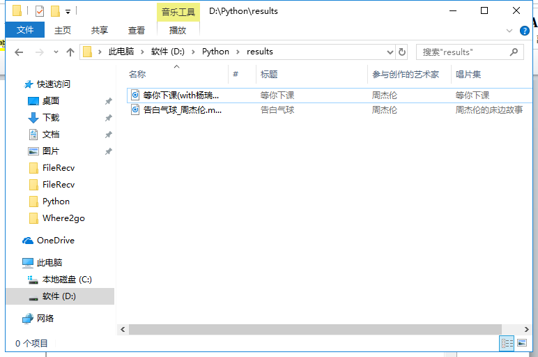

summary: demo
id: 20200210-01-邱胜
categories: python
tags: 
status: Published 
authors: 邱胜
Feedback Link: http://www.sctu.edu.cn


# 如何下载付费音乐

## 问题描述

现在越来越多的人注重知识产权问题，所以发现很多的时候下载原创歌曲都会付费或者成为VIP之后才能下载。虽然多数时候可以在线听歌，但是在车载音乐、小音箱等这些时候还是会需要下载。当然在万能（恶）的程序猿看来，这就是一件小事，用代码“盘它”就完事了。因为正好在网上看见了一个免费下载音乐的帖子，所以今天就分享给大家两个个怎么免费的去下载付费音乐的办法。
## 问题分析
首先我们先来分析一下问题，我们要达到的目的是，下载音乐。所以，第一、我们要先根据歌曲名称来搜索音乐，得到我们需要的歌曲的详细信息。第二、从刚才得到的信息中获取到该歌曲的下载地址。第三、根据下载地址下载歌曲。
## 解决方案
方法一：利用Python编码，输入歌曲名称下载。

首先要在QQ音乐里面找到歌曲搜索、下载的Request URL地址：
```python
def __init__(self):
       self.headers = {
                   'User-Agent': 'Mozilla/5.0 (Windows NT 10.0; Win64; x64) AppleWebKit/537.36 (KHTML, like Gecko) Chrome/65.0.3325.146 Safari/537.36'
                   }
       self.search_url = 'https://c.y.qq.com/soso/fcgi-bin/client_search_cp?ct=24&qqmusic_ver=1298&new_json=1&remoteplace=txt.yqq.top&searchid=34725291680541638&t=0&aggr=1&cr=1&catZhida=1&lossless=0&flag_qc=0&p=1&n=20&w={}&g_tk=5381&jsonpCallback=MusicJsonCallback703296236531272&loginUin=0&hostUin=0&format=jsonp&inCharset=utf8&outCharset=utf-8&notice=0&platform=yqq&needNewCode=0'
       self.fcg_url = 'https://c.y.qq.com/base/fcgi-bin/fcg_music_express_mobile3.fcg?g_tk=5381&jsonpCallback=MusicJsonCallback9239412173137234&loginUin=0&hostUin=0&format=json&inCharset=utf8&outCharset=utf-8&notice=0&platform=yqq&needNewCode=0&cid=205361747&callback=MusicJsonCallback9239412173137234&uin=0&songmid={}&filename={}.m4a&guid=8208467632'
       self.downloader_url = 'http://dl.stream.qqmusic.qq.com/{}.m4a?vkey={}&guid=8208467632&uin=0&fromtag=66'
```
然后再根据输入的歌曲名称，得到歌曲的详细信息：
```python
res = requests.get(self.search_url.format(keyword), headers=self.headers).text
       
       media_mid_temp = re.findall('"media_mid":"(.*?)"', res)
       media_mid = []
       for i in range(len(media_mid_temp)):
           media_mid.append('C400'+media_mid_temp[i])
       
       songmid = re.findall('"lyric_hilight":".*?","mid":"(.*?)","mv"', res)
       # 歌手
       singer_temp = re.findall('"singer":\[.*?\]', res)
       singer = []
       for s in singer_temp:
           singer.append(re.findall('"name":"(.*?)"', s)[0])
       # 歌曲名称
       songname = re.findall('},"name":"(.*?)","newStatus"', res)
```
接着再从歌曲的信息里面获得歌曲相应的下载地址：
```python
urls = []
       del_idex = []
       songname_keep = []
       singer_keep = []
       for m in range(len(media_mid)):
           try:
               fcg_res = requests.get(self.fcg_url.format(songmid[m], media_mid[m]), headers=self.headers)
               vkey = re.findall('"vkey":"(.*?)"', fcg_res.text)[0]
               urls.append(self.downloader_url.format(media_mid[m], vkey))
               songname_keep.append(songname[m])
               singer_keep.append(singer[m])
           except:
               print('[Warning]:One song lost...')
           time.sleep(0.5)
```
最后，再根据下载地址去下载该歌曲：
```python
 if num > len(urls):
           print('[Warning]:Only find %d songs...' % len(urls))
           num = len(urls)
       if not os.path.exists('./results'):
           os.mkdir('./results')
       for n in range(num):
           print('正在下载 第%d 首歌...' % (n+1))
           filepath = './results/{}'.format(songname_keep[n].replace("\\", "").replace("/", "").replace(" ", "")+'_'+singer_keep[n].replace("\\", "").replace("/", "").replace(" ", "")+'.m4a')
           urllib.request.urlretrieve(urls[n], filepath)
       print('完成下载到文件夹')

```
以周杰伦的《等你下课》和《告白气球》为例：


下载完成后，直接保存到相应的文件夹，而且不用修改名字等信息。

方法二：官网获取歌曲id后，利用官方接口，直接免费下载。

刚才举例用的是QQ音乐，现在用网易云音乐。网易云的歌曲的获取接口为：http://music.163.com/song/media/outer/url?id=数字.mp3
(这个可以百度得到）。我们首先在网易云音乐的官网上面搜索想要下载的歌曲。

我这里搜索的是；李荣浩的《年少有为》得到它的id，然后将它的id放到接口里面去，再打开该网页。

然后点击右边的扩展按钮，里面就可以下载啦！但是下载完成后需要我们自己去修改歌曲名字。
## 总结
今天分享的两个方法的根本其实是一样的，只是一个方法是利用代码让电脑帮我们直接完成下载，而另一个方法是需要我们自己人为的去手动完成。两个方法说不上好坏，当你要下载大量歌曲的时候用方法一是最好的，当你仅仅想要下载几首歌的时候用方法二是最好的。

但是这两种方法下载的歌曲的音质都是正常音质。如果是对音质要求比较高的小伙伴还是只有充VIP才行。
## 参考文献
代码部分来自：怎样下载付费音乐-Mr.云景
网址：Https://mp.weixin.qq.com/s/L2Sfm8oP769A9VWqhQkMrg
