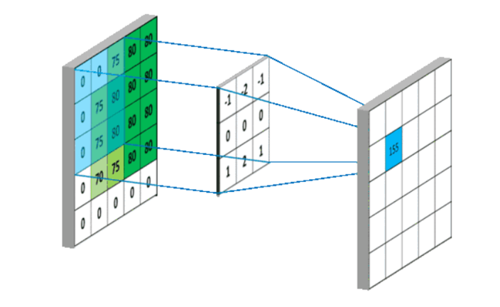

summary: demo
id: 20200210-01-饶龙江
categories: python
tags: sctu-ai
status: Published 
authors: 饶龙江
Feedback Link: http://www.sctu.edu.cn


# 燃气火焰检测主要步骤
## 问题描述
在现有的基础上，燃气火焰的检测主要是基于火焰颜色特征，由于燃气火焰不同于普通火焰，其中蓝色分量较多，一般的检测方法准确度不够，故采取其他方法来检测火焰，下面主要介绍4个步骤的思路和主要python代码。
## 背景差分法分离火焰
### 算法思路
背景差分法的主要思想是利用无火焰的背景图与含有火焰的图片作像素点对像素点的差分处理，需要注意的是，背景差分法运用时由于需要做差分处理，所以需要将三维的RGB图像转化为一维的灰度图像。因为当相同背景的像素点做差分后该像素点的灰度值为0，也就是黑色，而有火焰的像素点和背景做差分后的灰度值不为零，也就将火焰部分分离了出来。
### Python代码
```python
def chafenfa(img1,img2):#此时的img1和img2应该是灰度化之后的图像
    r1,c1=img1.shape
    new_image = np.zeros((r1, c1)) #构建一维数组，用于存放新的图像数据
    for i in range(r1):
        for j in range(c1):
            new_image[i][j]=abs(img1[i][j]-img2[i][j])
    return np.uint8(new_image)

```
## 滤波增强火焰图像
### 算法思路
差分法处理过的图像还存在一些噪声，所以需要对图像进行线性滤波；同时，由于图像种火焰不够明显，所有还需要增强图像中的火焰区域。滤波和增强的基本思路取决与噪声和需要增强部分的区域特点，噪声的特点是周围大部分都是背景色，且区域较小；增强部分的图像特点是周围是和自身差别不大的主体区域，且区域明显。所以，在进行滤波时，可以利用噪声点周围的背景色进行消除，增强的操作也可以利用像素点周围局部部分来进行。因此，只需要选择合适的滤波算子，对图像进行卷积操作，就可以同时达到消除噪声和增强图像的效果，这里采用的是的Laplace算子作为卷积核进行对图像的滤波和增强。

###  Python代码
```python
def Laplace_suanzi(img):#此时img为差分法处理后的灰度图片
  r, c = img.shape
  new_image = np.zeros((r, c))#构建一维数组，用于存放新的图像数据
  #L_sunnzi = np.array([[0,-1,0],[-1,4,-1],[0,-1,0]])#第一种算子   
  L_sunnzi = np.array([[1,1,1],[1,-8,1],[1,1,1]])#第二种算子
#由于涉及到边界，所以遍历时需要少2行2列。   
  for i in range(r-2):
    for j in range(c-2):
      new_image[i+1, j+1] = abs(np.sum(img[i:i+3, j:j+3] * L_sunnzi))
  return np.uint8(new_image)

```
##	Otsu方法分割图像
### 算法思路
Otsu不同于传统的二值化图像方法，它最大的特点是阈值是根据图片自适应的，从而避免了单一阈值造成的分割图像与目标图像差距太大的问题，Otsu算法以目标和背景的方差最大来动态的确定图像的分割阈值。
对于图像 Img(x,y)，前景(即目标)和背景的分割阈值记作T，属于前景的像素点数占整幅图像的比例记为 ω0，平均灰度为 μ0；背景像素点数占整幅图像的比例为 ω1，平均灰度为 μ1；整幅图像的平均灰度记为μ，类间方差记为g。
假设图像大小为M×N，图像中像素的灰度值小于阈值 T 的像素个数为 N0，像素灰度大于阈值T的像素个数为 N1，那么：
ω0=N0/ M×N                       (1)
ω1=N1/ M×N                       (2)
N0+N1=M×N                        (3)
ω0+ω1=1　　　                     (4)
μ=ω0*μ0+ω1*μ1                  (5)
g=ω0(μ0-μ)^2+ω1(μ1-μ)^2         (6)
g=ω0ω1(μ0-μ1)^2 　　             (7)
采用遍历的方法使得类间方差g最大的阈值T，即为所求。
###	Python代码
```python
def otsu_img(img):
    max_g = 0
    best_T= 0
    r,c=img.shape
    N=r*c
    for T in range(256):
        n0 = img[:T].sum()  # 阈值以下像素总数(前景)
        n1 = img[T:].sum()  # 阈值以上像素总数（背景）
        w0 = n0 / N  # 阈值以下像素数量占的比例（前景）
        w1 = n1 / N  # 阈值以上像素数量占的比例（背景）
        # 阈值以下平均灰度(前景)
        u0 = 0
        for i in range(T):
            u0 += i * img[i]
        # 阈值以上平均灰度(背景)
        u1 = 0
        for i in range(T, 256):
            u1 += i * img[i]
        # u = u0 * w0 + u1 * w1
        g = w0 * w1 * np.power((u0 - u1), 2)
        if g > max_g:
            max_g = g
            best_T=T
    for i in range(r):
        for j in range(c):
            if img[i][j]<best_T:
                img[i][j]=0
            else:
                img[i][j]=255
```
## 腐蚀与膨胀去除噪声
### 算法思路
腐蚀的原理是通过结构元素与目标元素比较，保留那些可以完全包含结构元素区域的中心点，再使用结构元素去填充，最后达到消除边缘噪声的目的。
腐蚀的原理是通过结构元素与目标元素比较，保留那些可以完全包含结构元素区域的中心点，再使用结构元素去填充，最后达到消除边缘噪声的目的。
### Python代码
```python
#腐蚀（以2*2的结构元素为代表）
def dilation(img):#此时图像是二值化之后的图像，即只有0、1两个灰度值
    kernel=np.ones((2,2),np.uint8)#构建全是1的2*2数组
    r,c =img.shape
    for i in range(r-1):
        for j in range(c-1):
            if img[i+2][j+2].sum ==kernel.sum:#由于img图像中只有0和1，所以当它们区域和相等时，即完全重合
                img[i][j]=img[i][j]
            else:
                img[i][j]==0
return img
#膨胀（以2*2的结构元素为代表）
def erosion(img):
kernel=np.ones((2,2),np.uint8)
r,c =img.shape
    for i in range(r-1):
        for j in range(c-1):
            if sum(img[i+2][j+2]*kernel):#只要它们卷积和不为零，即可认为有交集。
                img[i][j]=img[i][j]
            else:
                img[i][j]==0
    return img

```
## 总结
对于上面的主要步骤，其中有一些可以使用cv2内置函数完成，但为了更理解算法原理，并没有使用过多的内置函数，且上述腐蚀和膨胀只针对与二值化过后的图像有效果，总体还有待改进。
