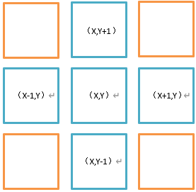

summary: demo
id: 20200210-01-马原涛
categories: tensorflow
tags: sctu-ai
status: Published 
authors: 马原涛
Feedback Link: http://www.sctu.edu.cn

# 基于多特征的神经网络火焰识别
## 前言
在之前的《基于RGB颜色空间的火焰识别》一文中，提过基于火焰的RGB颜色分布圈选出疑似火焰的区域，该方法能很好的圈选出火焰区域，但也会将一些颜色与火焰相近的非火焰区域圈选。本篇文章借鉴了前人的方法（请查看文末参考文献）并结合自己的理解，接着上一篇文章继续深入研究，解决上一篇文章中方法的缺陷，来更好的识别火焰。
***
## 面积变化率A
火焰在燃烧时，火焰在图像上呈现的面积总是不断变化的。可以通过火焰面积的变化来判断火势，作为火灾早期预警的一个重要判断依据。

火焰的面积变化率可以用相邻两帧中火焰像素点的变化来表示。假定第n帧的火焰像素点总数为Xn，第n+1帧的火焰像素点总数为Xn+1 （此处的火焰像素点可以用上一篇文章的方法得出），则第n帧到n+1帧的火焰的面积变化率A可用如下公式表达：
$$ A= \frac{|X_{n+1}-X_{n}|}{X_{n}}    $$

(1)

****

## 火焰相似度α
火焰在燃烧时面积形态总是不断变化的，但相邻两帧的火焰形态相似度总是存在着一定规律，借鉴他人文章中的数据，火焰的相似度一般在[0.8,1]范围内波动，而阳光、灯光等相似颜色的干扰相似度在[0.95,1]内小幅度波动，二者差异明显，可以作为排除非火焰干扰的方法之一。

假定第n帧图像的某一火焰像素点为Ln(x,y)，第n+1帧图像的某一火焰像素点为Ln+1(x,y)，x、y∈＆，＆为筛选出的疑似火焰的区域。则火焰相似度α可用如下公式表达：
$$ α= \frac{\sum_{x,y \epsilon ＆ } L_n(x,y) \cap L_{n+1}(x,y)}{\sum_{x,y \epsilon ＆ } L_n(x,y) \cup L_{n+1}(x,y)}  $$

(2)

***

## 火焰闪烁频率F
火焰的闪烁虽然看起来并无规律，但经过科学统计，火焰的闪烁频率主要集中在7~12Hz，并且与火焰大小、距离无关，所以闪烁频率可以作为火灾预测最直观、最显著的特征量，能够很好的排除移动的高亮干扰，如阳光、车灯等,文末所提及的论文中，作者以实验论证（感兴趣的读者可以自己做来看看）。

因为火焰像素点主要由火焰闪烁决定（风力等为次要因素），所以可以从火焰像素点的分布入手，去计算火焰的闪烁频率。

首先计算第n帧图像相对于第n-1帧的火焰像素点分布变化率P(n)。公式如下：

$$ P(n)=\frac{\sum_{x,y \epsilon ＆ } L_n(x,y) - \sum_{x,y \epsilon ＆ }L_n(x,y) \cap L_{n-1}(x,y)}
{\sum_{x,y \epsilon ＆ }L_{n-1}(x,y)} ,n\geq2  $$

(3)

（3）式中分子表示第n-1帧中未被识别为疑似火焰的像素点在第n帧中被识别为像素点的总数，分母即第n-1帧中被识别为像素点的总数。

由于计算频率使用的是过零检测法，所以需要确定一个零点，通过（4）式将分布变化率的均值Up作为零点。之后通过（5）式求出对应的火焰闪烁次数Nf，N为所检测的视频总帧数，sgn(x)为越阶函数。
$$  
U_p= \frac{1}{N-1} \sum_{n=2}^N P(n)
 $$

(4)

$$
\left \{ 
\begin{array}{c}
N_f=\frac{1}{2}\sum_{n=2}^N | sgn(P(n)-U_p)-sgn(P(n-1)-U_p)|\\[2ex] 
sgn(x) =
\begin{cases}
+1, & x\geq 0\ \\[1ex]
-1, & x<0
\end{cases} \\[4ex]
P(1)=0
\end{array}
\right.
$$

(5)

得到闪烁次数N_f后就可以计算出频率F了.（6）式中FPS为视频帧速率（比如常见的24帧/秒），N为所检测的总帧数。
$$  
F=\frac{FPS*N}{N-1}
 $$

(6)

根据实验得出火焰的频率一般在7~到12Hz，而灯光、落日等一般低于6Hz.依据此特征量可以很好的排除这些干扰。

***

## R通道灰度差分统计均值UD及其变异系数CV
将图像转换为R通道图像后（R通道指灰度化的时候把其他两个通道的值调为0，R通道调为1），有别于其他干扰因素，火焰相邻像素点之间呈现明显的灰度层次，也就是火焰颜色的分层特征，常用来作为火焰识别的加强判断。这里选取疑似火焰像素点与周围4个相邻火焰像素点的R通道灰度差分分布来识别火焰，如图1.

图1 相邻像素点选择

对于每一帧图像中的孤立像素点可以先去噪，或者在执行改方法的时候将其排除在外，因为孤立的疑似火焰像素点多为干扰，所以不考虑。按图一的方式将火焰化为联通区域，再计算两个像素点间的R通道灰度差分值，最后根据（7）式求得疑似火焰区域的R通道灰度差分均值，以该值作为判别火灾的一个重要因素。

$$
U_D=\frac{1}{M} \sum_{x,y \epsilon ɛ}|R(x,y)-R'|
$$

(7)

（7）式中UD为灰度差分均值；M为符合要求的联通区域总数；ɛ为去除孤立像素点后的火焰区域；R’为相邻像素点的R通道分量。

在计算R通道灰度差分值后可以计算其变异系数，因为变异系数相较于方差更能反应数据的离散程度。根据所求的R通道灰度差分均值，可以求出其变异系数CV.

$$
CV=\frac{\frac{1}{M}\sum_{x,y\epsilon ɛ}(|R(x,y)-R'|-U_D)^2}{U_D^2}
$$

(8)

由文末文章实验数据给出，火灾火焰的变异系数主要集中在[1,2.5]，有别于其他非火焰干扰。（8）式中CV变异系数原为标准差除以均值，这里方便计算改为方差除以均值。

***

## 深度学习神经网络融合判定
在得出以下A,α,F, UD,CV五个数值后，可以搭建一个简单的神经网络，以这五个参数作为输入值，输出0 or 1 来判断是否是火焰。通过神经网络来提高五个参数之间的关联性，提升识别效率。

***

## 参考文献
[1]陈嘉卿,张冰,宋英磊.基于RGB统计颜色模型的火焰识别[J].江苏科技大学学报(自然科学版),2017,31(02):178-184.
