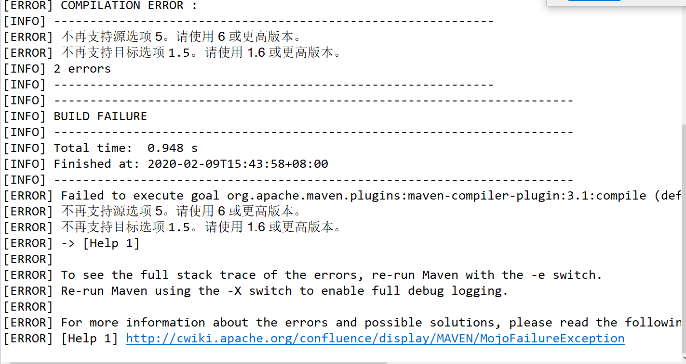
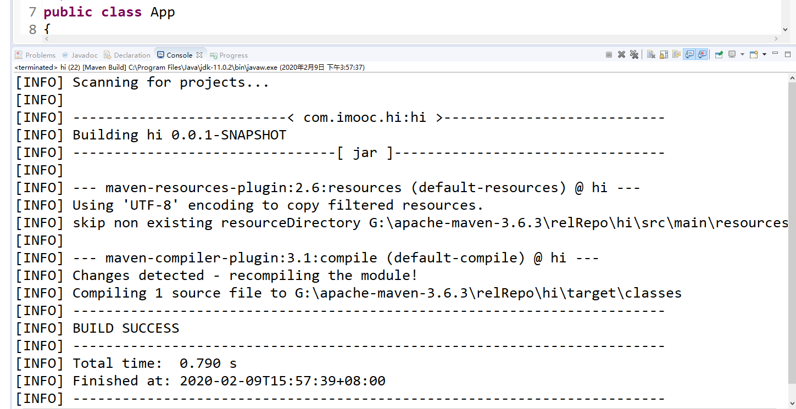

summary: demo
id: 20200210-01-黄晓锋
categories: java
tags: 
status: Published 
authors: 黄晓锋
Feedback Link: http://www.sctu.edu.cn

# maven在compile编译时出错

## 遇到问题

Maven在进行compile编译时控制台可能会BUILD FAILURE，并且报出以下错误：
[ERROR]不再支持源选项5。请使用6或更高版本。
[ERROR] 不再支持目标选项1.5。请使用1.6或更高版本。


## 可能原因

1.	可能由于自己电脑里安装了多个jdk版本，maven不知道用哪一个。
2.	由于pom配置文件里没有配置jdk属性。

## 解决办法

找到自己项目的pom.xml配置文件，并在文件中添加maven编译时的jdk设置。
编辑pom.xml，添加以下代码配置

```xml
<profile>

	<id>jdk-11</id>
	<activation>
		<activeByDefault>true</activeByDefault>
		<jdk>11</jdk>
	</activation>

	<properties>
	<project.build.sourceEncoding>UTF-8</project.build.sourceEncoding>
		<maven.compiler.source>11</maven.compiler.source>
		<maven.compiler.target>11</maven.compiler.target>
	</properties> 

</profile>
```

因为现在我现在使用的jdk版本是11.0.2，所以写的11，大家就更据自己的情况填写。

## 问题解决
最后再次进行clean compile，eclipse控制台显示BUILD SUCCESS。



到这里问题就已经解决了，而且如果还想要修改用户或全局的配置的话，就需要进入.m2\settings.xml或apache-maven-3.6.0\conf\settings.xml路径里的setting.xml文件中加入这段代码就可以了。