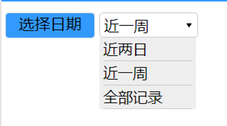

summary: demo
id: 20200210-02-刘连
categories: wechat
tags: sctu-wechat
status: Published 
authors: 刘连
Feedback Link: http://www.sctu.edu.cn
# 微信小程序——下拉菜单

## 下拉菜单的运用
下拉菜单在各类网页，app或者小程序中都是比较常见的输入控件。下拉菜单的下拉选项的多少可以根据自身需求进行调节，常运用于时间范围选择，地点区域选择，价格区间选择，等等。提供下拉菜单的目的是帮助用户更快更准确的选择相关条件。下拉菜单的运用可以简化页面设计，节约空间，在一定程度上简化设计。其缺点可能就是相比于单项选项卡还不够直观，用户每次想要查看所选选项时都必须打开菜单对选项进行比较。

## 基本框架
微信小程序中是没有html中的下拉标签的,所以要实现下拉菜单功能就必须自己动手写拉。在index.wxml文件中，我们需要写好下拉菜单的基础框架，使用view创建下拉选择的菜单，这里创建三个菜单，需要注意的是要加上data-name属性，用于下面实现选择菜单后显示在选择框里。分别通过bindtap给“请选择”的view绑定bindShowMsg方法，给菜单的view绑定mySelect方法，用于在js中实现控制。其中bindtap就是点击事件在.wxml文件绑定。
```
<view class='list-msg2' bindtap='bindShowMsg'>
```
上述代码就是在一个组件的属性上添加bindtap并赋予一个值(一个函数名)。当点击该组件时, 会触发相应的函数执行。在后台.js文件中定义tapMessage函数.
index.wxml文件代码如下：
```
<view class='list-msg'>
    <view class='list-msg1'>
        <text>选择日期</text>
    </view>
<!--下拉框  -->
    <view class='list-msg2' bindtap='bindShowMsg'>
        <text>{{tihuoWay}}</text>
        <image style='height:20rpx;width:20rpx;' src='/images/down.png'></image>
    </view>
<!-- 下拉需要显示的列表 -->
    <view class="select_box" wx:if="{{select}}">
        <view class="select_one" bindtap="mySelect" data-name="近两日">近两日</view>
        <view class="select_one" bindtap="mySelect" data-name="近一周">近一周</view>
        <view class="select_one" bindtap="mySelect" data-name="全部记录">全部记录</view>
    </view>
</view>

```
##  样式调整
小程序里的样式设置与HTML基本类似，就不一一介绍了。这里我们就简单介绍一下@keyframes规则。在index.wxss文件中我们使用了如下代码，其作用是实现下拉过度效果，使用@keyframes动画实现菜单的渐变打开和关闭动画。
```
@keyframes myfirst {
    from {
        height: 0rpx;
    }
    to {
        height: 210rpx;
    }
}

```
使用@keyframe实现下拉过度效果，以百分比来规定改变发生的时间，或者通过关键词 “from” 和 “to”，等价于 0% 和 100%。0% 是动画的开始时间，100% 动画的结束时间。
##  js方法
在index.js页面，编写两个方法，一个是bindShowMsg ()方法，另一个是mySelect方法，用于实现当选择了下拉的菜单后显示菜单内容。代码如下：
```
Page({
  /* 页面的初始数据   */
  data: {
    select: false,
    tihuoWay: '近两日'
  },
  /*生命周期函数--监听页面加载   */
  onLoad: function (options) {
  },
  bindShowMsg() {
    this.setData({
      select: !this.data.select
    })
  },
  mySelect(e) {
    var name = e.currentTarget.dataset.name
    this.setData({
      tihuoWay: name,
      select: false
    })
  },
  /*用户点击右上角分享 */
  onShareAppMessage: function () {
  }
})
```
编译小程序，预览小程序运行后的效果：
