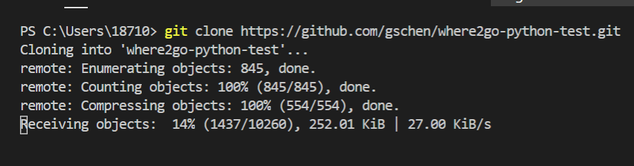
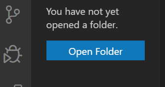
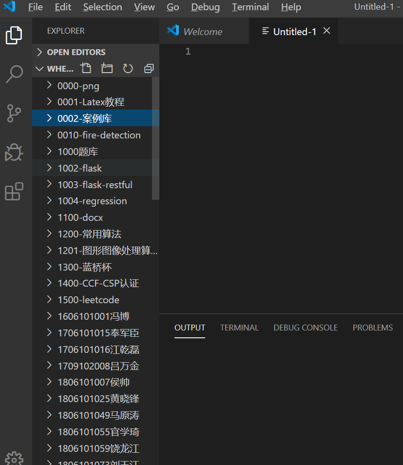

# Vscode克隆git项目

刚接触vscode大家可能还不知道如何在vscode克隆git项目，接下来我将给大家讲述如何使用vscode克隆git项目。

## 解决过程

一、	选择view->terminal,也就是打开我们的终端，也可以直接ctrl+`。
 

二、	在终端输入git clone url（下载地址）
 
  

三、	等待下载完成，耐心等待，如果下载失败，就把目标文件夹删了，再次下载，一定要把目标文件夹删了，下载才会进行，不然会报错。
 
  

四、cloning into 后面接的就是我们下载的目录，我们点击open folder，就会让我们选择文件夹。如果找不到下载的目录，我们可以提前在终端将目标文件夹复制，在电脑的搜索框搜索其位置，并复制即可
 
  

## 效果呈现

效果图如下：
 
 
