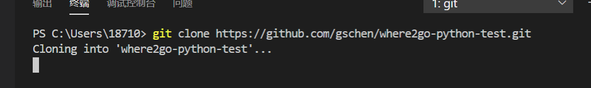

summary: demo
id: 20200210-02-王宇
categories: python
tags: 
status: Published
authors: 王宇
Feedback Link: http://www.sctu.edu.cn
# Vscode克隆git项目(外加提交和更新教程)

刚接触vscode大家可能还不知道如何在vscode克隆git项目，接下来我将给大家讲述如何使用vscode克隆git项目。

## 解决过程

一、	选择view->terminal,也就是打开我们的终端，也可以直接ctrl+`。
 

二、	在终端输入git clone url（下载地址）
 
  

三、	等待下载完成，耐心等待，如果下载失败，就把目标文件夹删了，再次下载，一定要把目标文件夹删了，下载才会进行，不然会报错。
 
  

四、cloning into 后面接的就是我们下载的目录，我们点击open folder，就会让我们选择文件夹。如果找不到下载的目录，我们可以提前在终端将目标文件夹复制，在电脑的搜索框搜索其位置，并复制即可
 
  

## 效果呈现

效果图如下：
 
 

 ## 提交

一、pull，我们选择左侧栏的第三个选项source control，我们选择...（刷新右侧）这个选项，选择pull，等待pull执行完成。

二、Commit All，我们选择commit all，这时在vscode界面上面会弹出一个输入框，我们在输入框内输入内容，再enter，这时我们发现左侧的文件不见了，即可进行下一步。

三、push，最后我们点击push，就可以看见左下方正在上传。耐心等待至上传完毕，我们就提交成功了。

## 更新

更新与提交同理。我们先找到我们需要改的文件，进行修改，修改完成后，我们进行保存。修改之后进行保存的文件，软件会自动将其分配在source control栏，然后我们就进行pull，commit all，push三部曲啦。

