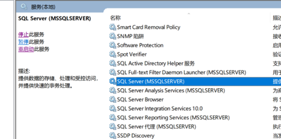

summary: demo
id: 20200210-03-刘玉江
categories: python
tags: 
status: Published 
authors: 刘玉江
Feedback Link: http://www.sctu.edu.cn

# 如何将MySQL完全卸载
## 前言

当MySQL没有卸载干净的时候，再重新安装它的时候，会出一些错误。接下来我们来介绍怎么将MySQL卸载干净。
## 步骤

### 1
使用快捷键win+r然后搜索services.msc，将SQL服务停止掉。


 

 

### 2
 打开控制面板：控制面板\程序\程序和功能，将MySQLserver卸载掉。

### 3

再去文件夹去删除掉MySQL的文件夹：Program Files\MySQL，和ProgramData\MySQL。ProgramData文件夹是隐藏文件夹，我们要先开启查看隐藏的项目。如果删不掉可以使用文件粉碎功能


### 4
最后我们再打开注册表，还是win+r然后输入regedit。
 
 找到MySQL文件然后删除。
``` HKEY\_LOCAL\_MACHINE\SYSTEM\ControlSet001\Services\Eventlog\Application\MySQL文件夹```

```HKEY\_LOCAL\_MACHINE\SYSTEM\ControlSet002\Services\Eventlog\Application\MySQL文件夹。```

```HKEY\_LOCAL\_MACHINE\SYSTEM\CurrentControlSet\Services\Eventlog\Application\MySQL的文件夹。```

如果没有相应的文件夹，就不需要删除。或者也可以使用查找功能，将与mysql相关的都删除掉。

完成了这些，就可以重启你的计算机，然后重新安装MySQL了。