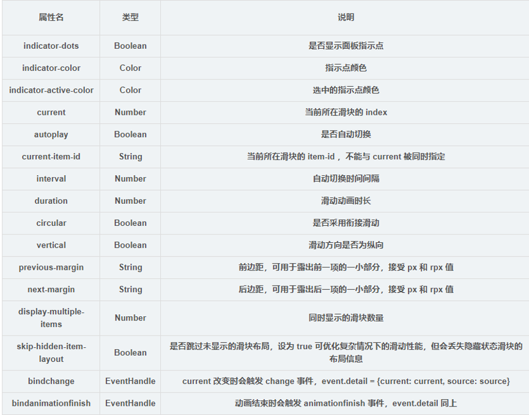

summary: demo
id: 20200210-03-刘连
categories: wechat
tags: sctu-wechat
status: Published 
authors: 刘连
Feedback Link: http://www.sctu.edu.cn
# 微信小程序中的轮播图

## 1 什么是轮播图拉菜单的运用
轮播图通俗的说就是在一个模块或者说窗口，通过电脑上鼠标点击、手机上手指滑动后，可以看到多张图片。轮播图的位置一般放置在页面首部，具有内容醒目、重点突出等特点。轮播图在一般的页面中常用于特色推荐，如淘宝网上轮播图中的都是特价商品以及其他一些好物推荐。轮播图在使用过程中，最重要的一个特点就是实时更新。小程序中的轮播图也大致具有以上特点。
## 2 小程序中的标签
微信小程序的制作与HTML前端制作是类似的，制作流程也极度相似，依旧是框架编写，样式修改，功能设置。但是微信小程序与HTML的标签是完全不一样的，微信小程序有自己的编写标签。轮播图编写过程中，我们经常会用到的标签是<view>、<swiper>、 <block>、<swiper-item>、<image>。其中比较重要的就是Swiper标签，它是一个滑块容器类组件，提供如下的一些属性。

## 3 轮播图的制作
在了解上述基础知识，结合我们已经学习的HTML知识就可以开始轮播图的制作了。　Swiper滑块组件代码，具有indicator-dots，autoplay，interval，duration四个属性。indicator-dots：是否显示面板指示点（默认值false）、autoplay：是否自动切换（默认值false）、interval：自动切换时间间隔(默认值5000)、duration：滑动动画时长（默认值500）。
 .wxml文件的代码如下：
'''
<view class="lunbo">
  <!--轮播图-->
    <swiper class='u-wrp-bnr' indicator-dots='true' autoplay='true' interval='5000' duration='1000' circular='true'>
      <block wx:for="{{movies}}" wx:for-index="index">
        <swiper-item>
          <image src='{{item.url}}' class='u-img-slide' mode='aspectFill'></image>
        </swiper-item>
      </block>
    </swiper>
  </view>
'''
在.wxss文件中，我们只需要对相关标签设置一定的属性就行。因为本次我们制作的是轮播图，所以相关数值就只有图片。在.js文件中，对movies的值进行赋值。

```
Page({
  data: {
inputValue: '', //搜索的内容
    //轮播图
    movies: [
      { url: '../../images/s1.jpg' },
      { url: '../../images/s2.jpg' },
      { url: '../../images/s3.jpg' },
      { url: '../../images/s4.jpg' }
    ],
}
}]
```
效果图如下（截图不完整）:

