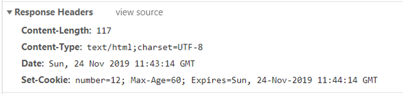

summary: demo
id: 20200210-04-刘玉江
categories: python
tags: 
status: Published 
authors: 刘玉江
Feedback Link: http://www.sctu.edu.cn

# 浅谈Cookie

## 1 什么是Cookie

Cookie，有时也用其复数形式 Cookies。类型为“小型文本文件”，是某些网站为了辨别用户身份，进行Session跟踪而储存在用户本地终端上的数据（通常经过加密），由用户客户端计算机暂时或永久保存的信息。就相当于我们在银行办理的银行卡，以后再去银行的时候，银行就直接能够通过银行卡辨别我们的身份。

## 2 Cookie的设置与获取
我们可以通过以下方式设置Cookie：

```java
//通过HttpServletResponse.addCookie的方式设置Cookie：注意new Cookie()时两个参数都是字符串

int number = 12;
//如何在cookie空间定义一个变量

Cookie cookie = new Cookie("number",String.valueOf(number));
cookie.setMaxAge(60);
response.addCookie(cookie);

```
在浏览器中可以查看到我们设置了number=12、Max-Age=60，还可以看见设置的时间



在这里我们设置了MaxAge，这是Cookie的有效期，单位为秒。Cookie中通过getMaxAge()和setMaxAge(int maxAge)来读写该属性。maxAge有3种值，分别为正数，负数和0。如果maxAge属性为正数，则表示该Cookie会在maxAge秒之后自动失效。浏览器会将maxAge为正数的Cookie持久化，即写到对应的Cookie文件中。无论客户关闭了浏览器还是电脑，只要还在maxAge秒之前，登录网站时该Cookie仍然有效。当maxAge属性为负数，则表示该Cookie只是一个临时Cookie，不会被持久化，仅在本浏览器窗口或者本窗口打开的子窗口中有效，关闭浏览器后该Cookie立即失效。当maxAge为0时，表示立即删除Cookie

我们再通过以下方式获取Cookie：

```java
//服务端获取客户端携带的cookie：通过HttpServletRequest获取

int number = 0;
Cookie[] cookies = request.getCookies();
for (Cookie cookie : cookies){
    if (cookie.getName().equals("number")){
        number = Integer.valueOf(cookie.getValue());
        break;
    }
}

```

## 3 总结
我们设置cookie用response，获取cookie用request，还有需要注意的是cookie是不能跨浏览器的。

如果服务器端向客户端发送重复的Cookie那么客户端原有的Cookie会被覆盖，例如客户端第一次请求服务器端，服务器端发送的Cookie是Set-Cookie:a=A，第二次请求发送的Cookie是Set-Cookie:a=AA，那么客户端只会留下后发送的Cookie，即a=AA。这也是一个修改Cookie的方法。还需要将MaxAge设置为0。新建的Cookie。除了value、maxAge之外的属性，比如name、path、domain都必须与原来的一致才能达到修改或者删除的效果。否则，浏览器将视为两个不同的Cookie不予覆盖。
