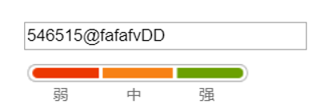
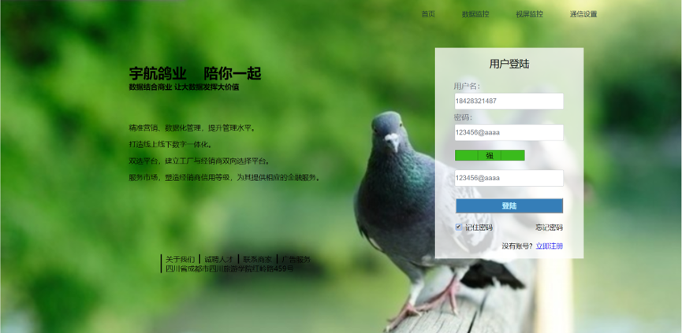
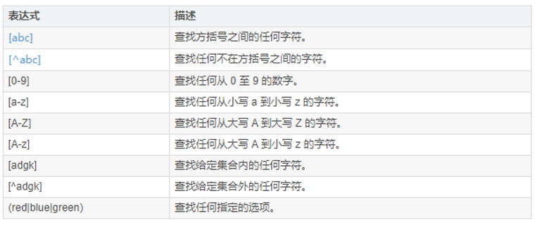

summary: demo
id: 20200210-04-刘连
categories: webpage
tags: 
status: Published 
authors: 刘连
Feedback Link: http://www.sctu.edu.cn
# 含有密码强度的注册页面

## 1 背景介绍 

随着互联网科技的迅速发展，人们对于互联网的依赖性却来越强。各种账号密码出现在人们生活的方方面面。为了提高密码的安全性，很多人都会设置一些复杂的密码。有的网站、app在用户注册的时候也会显示密码的破译困难等级，以此来提醒客户设置更加复杂的密码。如下图所示，就是我们常见的提示密码强度的效果：

## 2 过程分析
密码强度提示效果很明显需要用到css样式以及js进行进一部的设置。我们今天要实现的效果大概如图2.1所示。

整个页面中的重点就是右侧的用户登录部分。但是这个部分其实也不是太难，表单框架用form表单就可以完成，其他的内容也就不一一介绍了。这里唯一需要详细介绍的应该就是今天的密码强度提示效果了。密码强度提示主要是通过匹配数字，字母以及匹配除数字字母外的特殊符号来实现的。这里我们就需要用到css来进行匹配，相关的代码如下：
```css
<script type="text/javascript">
			function CheckIntensity(pwd) {
        var Mcolor, Wcolor, Scolor, Color_Html;       
        var m = 0;      
        //匹配数字
        if (/\d+/.test(pwd)) {
            debugger;
            m++;
        };
        //匹配字母
        if (/[A-Za-z]+/.test(pwd)) {         
            m++;
        };
        //匹配除数字字母外的特殊符号
        if (/[^0-9a-zA-Z]+/.test(pwd)) {            
            m++;
        };
       
        if (pwd.length <= 6) { m = 1; }
        if (pwd.length <= 0) { m = 0; }       
        switch (m) {
            case 1:
                Wcolor = "pwd pwd_Weak_c";
                Mcolor = "pwd pwd_c";
                Scolor = "pwd pwd_c pwd_c_r";
                Color_Html = "弱";
                break;
            case 2:
                Wcolor = "pwd pwd_Medium_c";
                Mcolor = "pwd pwd_Medium_c";
                Scolor = "pwd pwd_c pwd_c_r";
                Color_Html = "中";
                break;
            case 3:
                Wcolor = "pwd pwd_Strong_c";
                Mcolor = "pwd pwd_Strong_c";
                Scolor = "pwd pwd_Strong_c pwd_Strong_c_r";
                Color_Html = "强";
                break;
            default:
                Wcolor = "pwd pwd_c";
                Mcolor = "pwd pwd_c pwd_f";
                Scolor = "pwd pwd_c pwd_c_r";
                Color_Html = "无";
                break;
        }
        document.getElementById('pwd_Weak').className = Wcolor;
        document.getElementById('pwd_Medium').className = Mcolor;
        document.getElementById('pwd_Strong').className = Scolor;
        document.getElementById('pwd_Medium').innerHTML = Color_Html;
    }    
		</script>

```
对于上述代码，其中debugger 语句用于停止执行 JavaScript，并调用 (如果可用) 调试函数。使用 debugger 语句类似于在代码中设置断点。
上面的代码是这样执行的，首先遍历并找到匹配的 case，如果没有匹配（我们这个例子就是没有匹配的）则执行 default，但此时 default 中不存在 break，所以程序又沿着代码继续往下走了。
此外，在匹配过程中我们还用到了正则表达式——/[^0-9a-zA-Z]+/。js正则是在双正斜杠之中起作用的。其中方括号表示范围，^有非的意思。如：[1233]查找方括号之间的任何字符,而[^1233]则表示查找任何不在方括号之间的字符。相关具体内容参考下图：


## 3 总结
在实现这个含有显示密码强度的页面过程中，调试各各部分的位置花了很多时间。特别是密码强度显示条的位置最开始一直在尝试使用外链css样式进行调试，但是一直都没有任何效果，最后还是用行内样式进行设置才起了作用。关于这一点还有些疑问，对于外链样式和行内样式的设置可能还有点问题。 
