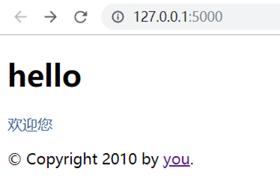

summary: demo
id: 20200210-05-刘玉江
categories: python
tags: 
status: Published 
authors: 刘玉江
Feedback Link: http://www.sctu.edu.cn

# Flask之模板继承

## 1 什么是模板继承

模板继承是```jinja2```里面最有力的部分了。就相当于在模板里面创建一个基础的骨架，里面的内容一般是一个网站中的常用元素，比如说网页的头部与尾部。这样下次需要用的话我们直接继承就好了。

## 2 基础模板

我们来新建一个 ```base.html```，它定义了一个简单的 ```HTML``` 骨架，用 于显示一个简单的两栏页面。“子”模板的任务是用内容填充空的块：
```html
<!DOCTYPE html>
<html lang="en">
<head>
    
    <link rel="stylesheet" href="{{ url_for('static', filename='style.css') }}">
    <title> - My Webpage</title>
    
</head>
<body>
    <div id="content"></div>
    <div id="footer">
      
      &copy; Copyright 2010 by <a href="http://www.baidu.com/">you</a>.
      
    </div>
</body>
</html>

```

在这个例子中，``````定义了几个可以被子模版填充的地方。接下来我们来写几个子模版：

```html


Index

  {{ super() }}
  <style type="text/css">
    .important { color: #336699; }
  </style>


  <h1>hello</h1>
  <p class="important">
    欢迎您



```

效果如下：




这里 `````` 标记是关键，它告诉模板引擎这个模板“扩展”了另一个模板， 当模板系统评估这个模板时会先找到父模板。这个扩展标记必须是模板中的第一个标记。 如果要使用父模板中的块内容，就要使用 
```{{ super() }}``` 。