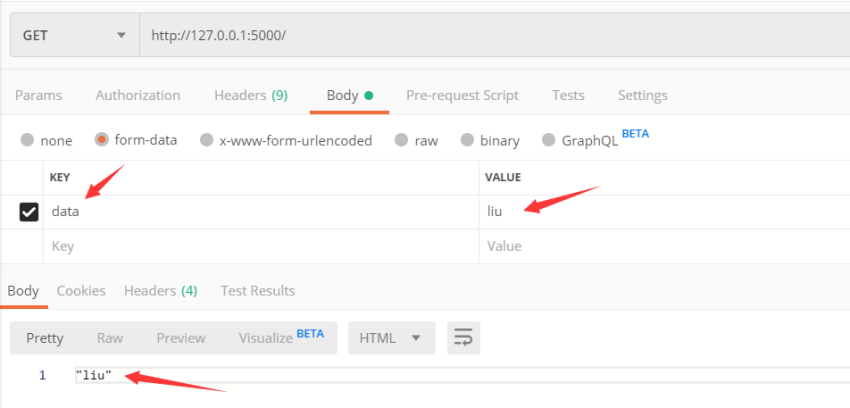
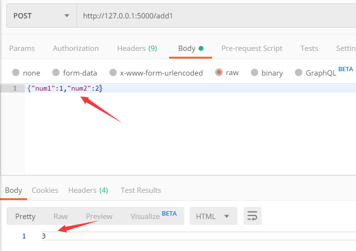
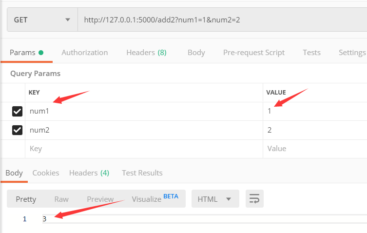

<<<<<<< HEAD
=======
summary: demo
id: 20200210-05-陈功锁
categories: python
tags: 
status: Published 
authors: 陈功锁
Feedback Link: http://www.sctu.edu.cn

>>>>>>> f4238d72b3b4c4ca8c74f9cda55f8a1335edc855


# Flask实现接收与返回json的接口

在我们做后台开发的时候，要能够实现与前端的数据交互，现在就主要讲一下在flask框架下如何实现一些简单的接口，功能是能够接收前端传来的json数据。

## 利用flask的request.form()方法接收



```python
import json

from flask import Flask, request

app = Flask(__name__)


@app.route('/')
def index():
    data = request.form['data']  # 获取值
    return json.dumps(data, ensure_ascii=False)

```


## 利用flask的request.get_data()方法接收



```python
@app.route('/add1', methods=['post'])
def Add1():
    # raw
    get_data = request.get_data()
    # 将bytes类型转换为json数据
    get_data = json.loads(get_data)
    num1 = get_data.get('num1')
    num2 = get_data.get('num2')
    return json.dumps(int(num1) + int(num2), ensure_ascii=False)
```

## 利用flask的request.args.to_dict()


```python
@app.route('/add2', methods=['GET'])
def Add2():
    get_data = request.args.to_dict()# 获取传入的params参数
    num1 = get_data.get('num1')
    num2 = get_data.get('num2')
    return json.dumps(int(num2) + int(num1), ensure_ascii=False)

```

对于前端POST请求发送过来的json数据，Flask后台可使用 request.get_data() 来接收数据，数据的格式为 bytes；再使用 json.loads() 方法就可以转换字典。

jsonify和json.dumps的区别：jsonify的作用实际上就是将我们传入的json形式数据序列化成为json字符串，作为响应的body，并且设置响应的Content-Type为application/json，构造出响应返回至客户端。json.dumps比jsonify可以多接受list类型和一些其他类型的参数。