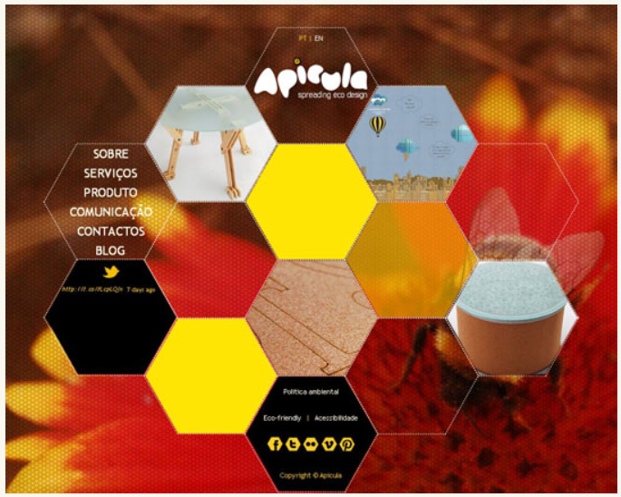
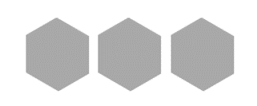

summary: demo
id: 20200210-04-刘连
categories: webpage
tags: 
status: Published 
authors: 刘连
Feedback Link: http://www.sctu.edu.cn
# 如何用HTML打印一个六边形

## 1 问题描述 
六边形在我们网页的制作中，运用得并不是特别广泛。但在一些制作精美，要求创新的一些网页上，我们还是不难看到六边形的身影，如下图1.1所示。用六边形组合的蜂窝状图形，相对来说可能运用的范围应该是最广的。下面我们就来介绍一下如何用HTML打印六边形吧。


## 2 解决过程
一个六边形我们可以看成是由两个相等的三角形和一个矩形构成。我们可以通过设置css样式的形式进行打印。将每一部分设置成一个div,对其位置，颜色等进行设置。三角形的设置我们可以将其宽与高设置为0，设置边框的宽度，及样式的样式，最后将上，左，右边的边框，设置成透明色（因为浏览器的显示原因，我们可以直接将颜色设置成白色），这样我们就可以得到想到的三角形。（这里得到的六边形并不是一个正六边形，如果想要得到一个正六边形，可以修改一些数据的值和一些图形的位置。）
如下表所示是一些主要代码：
```
<style type="text/css"> 
        #shape{ 
            margin: 200px 0px 0px 200px; 
            position: relative; 
            width: 300px; 
            height: 500px; 
            border: 1px solid white;
            overflow: hidden; 
           background-image: url("img/b9a5cbdce3c2b1a72470685a2106f98e.jpg"); 
           border-color:white ; 
        } 
        #A{ 
            position: absolute; 
            top:-150px; 
            width: 0px; 
            height: 0px; 
            border-width: 150px;   
            border-color:white white deepskyblue; 
            border-style: solid; 
        } 
        #B{ 
            border: 1px solid deepskyblue;
            position: absolute; 
            top:150px; 
            width: 300px; 
            height: 200px; 
           color:deepskyblue;
        } 
        #C{ 
            position: absolute; 
            top:350px; 
            width: 0px; 
            height: 0px; 
            border-width: 150px; 
            border-color:deepskyblue white; 
            border-style: solid; 
        } 
       </style> 
</head> 
```


除了上述方法，我们也可以利用transform属性来实现六边形的打印。而且利用这种方法的打印可能相对来说更简单，打印出来的图形也不需要太多的数值设置就可以更好看。（transform功能来实现文字或图像的旋转、缩放、倾斜、移动这四种类型的变形处理。）那么了解了单个六边形是如何打印的之后，那么怎样打印出由六边形组成的蜂窝状图形呢。我们可以用无序列表嵌套的方式，完成相应的打印。
```css
ul {
          margin: 0;
          padding: 0;
           }
        ul {
          list-style: none;
          width: 600px;
          margin: 100px auto;
           }
        li {
          float: left;
          margin: 0 8px;
          height: 100px;
          }
        .hex {
          overflow: hidden;
          display: block;
          width: 100px;
          height: 120px;
          transform: rotate(-60deg) skewY(30deg);
        }
        .hexIn {
          background-color:darkgray;
          display: block;
          width: 100px;
          height: 120px;
          line-height: 120px;
          text-align: center;
          transform: skewY(-30deg) rotate(60deg);
        }
     </style> 
    </head> 
   <body> 
    <ul>
      <li>
        <span class="hex"><span class="hexIn"></span></span>
      </li>
      <li>
        <span class="hex"><span class="hexIn"></span></span>
      </li>
      <li>
        <span class="hex"><span class="hexIn"></span></span>
      </li>
    </ul>
   </body>
```

## 3 总结
对于蜂窝状图形的打印，其中代码有一句是：transform: rotate(-60deg) skew(30deg)。其中Deg是表示倾斜角度的单位。Rotate表示旋转，skew倾斜。

