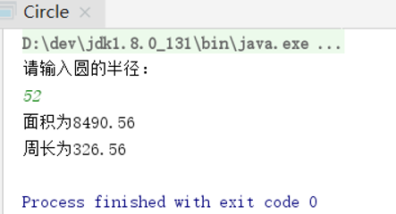

summary: demo
id: 20200210-04-刘连
categories: java
tags: 
status: Published 
authors: 刘连
Feedback Link: http://www.sctu.edu.cn
# 如何用Java定义一个类

## 1 类的定义

类是一种引用数据类型。类为对象的模板，简单的说就是分类。类是一个模板，它描述一类对象的行为和状态。类的定义包括“成员变量”的定义和“方法”的定义，其中“成员变量”用于描述一类对象共同的数据结构。在Java语言中，类的成员变量的定义可以使用如下语法：
class 类名 {成员变量类型变量名称；………}
类是用class关键字来定义的一种抽象数据类型，类不但定义了抽象数据类型的组成（成员变量），同时还定义了对该类型可以实施的操作（方法），类名的首字母必须大写。
注释：1.java 会给成员变量一个初始值，但是不会给局部变量初始值，所以局部变量应赋初始值。2.局部变量与成员变量名称相同时，有限选取局部变量的值。

## 2 定义类的思路
每个人的学习方法不同对于定义一个类的思路也可能会有所不同。一般来说我会将定义一个类分为两部分，即属性和方法（也可以说是成员变量和成员方法）。详细的说就是：1.先定义一个类；2.定义类的属性（成员变量）；3.定义类的方法；4.定义类的局部变量。

## 3 例题解释
例题1：设计一个圆形类，可以返回圆的面积与周长
思路：题目很简单，但是我们还是可以按照上面确定我们需要的基本条件。（1）确定成员变量为圆的半径。（2）确定成员方法为圆的周长和面积。确定了大概的
```
package day20190912;
import java.util.Scanner;
//1.成员方法：半径
public class Circle {
    public static void main(String[] args) {
        System.out.println("请输入圆的半径：");
        Scanner input=new Scanner(System.in);
        float r=input.nextFloat() ;
        Circular c=new Circular();
        c.area(r);
        c.perimeter(r) ;
    }
}
//2.成员方法：计算圆的周长和面积
class Circular{
    private float r;
    public void perimeter(float r){
        //周长等于3.14*2*r
        System.out.println("周长为"+(3.14*2*r));
    }
    public void area(float r){
        //面积等于3.14*r*r
        System.out.println("面积为"+(3.14*r*r));
    }
}
```


俗话说“黑猫白猫，抓到老鼠就是好猫”。定义类的方法有很多，每个人的方法并不一定要想同，能解决问题的办法就是好方法。

