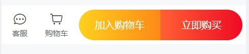

summary: demo
id: 20200211-01-吴怡辰
categories: wechat
tags: 
status: Published 
authors: 吴怡辰
Feedback Link: http://www.sctu.edu.cn

# 配置商品导航
## 问题描述
在我们打开购物小程序时，总是会出现加购导航，那么如何实现一个商品导航呢？
## 效果图

## 解决步骤
### json引入组件“goods-action-button”
```
"van-goods-action": "/dist/goods-action/index",
  "van-goods-action-icon": "/dist/goods-action-icon/index",
  "van-goods-action-button": "/dist/goods-action-button/index"

```
### wxml配置
在一个<van-good-action>标签下创建四个<van-good-action-icon>子标签，每个子标签写入bind:click传递点击事件参数，为配置js做准备。
```
<van-goods-action>
  <van-goods-action-icon
    icon="chat-o"
    text="客服"
    bind:click="onClickIcon"
  />
  <van-goods-action-icon
    icon="cart-o"
    text="购物车"
    bind:click="onClickIcon"
  />
  <van-goods-action-button
    text="加入购物车"
    type="warning"
    bind:click="onClickButton"
  />
  <van-goods-action-button
    text="立即购买"
    bind:click="onClickButton"
  />
</van-goods-action>

```
### js配置
onClickIcon配置点击事件条件处理函数
```
Page({
  onClickIcon() {
    Toast('点击图标');
  },

  onClickButton() {
    Toast('点击按钮');
  }
});

```
## 总结
购物车在日常使用中非常普遍，小程序掌握其开发方法十分有用。