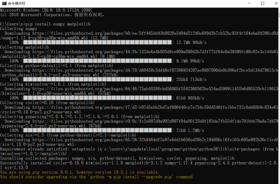
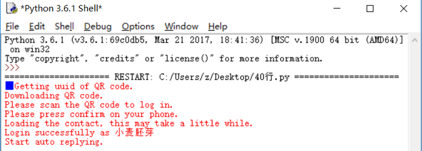

summary: demo
id: 20200211-01-张祯悦
categories: python
tags: 
status: Published 
authors: 张祯悦
Feedback Link: http://www.sctu.edu.cn

# 50行python代码拯救“懒癌”

## 奇妙的工具

刚刚开始学python的时候，老师就说现代技术的发展最终目的就是为了方便，说白了，就是大家都“懒”， 懒得什么事情都亲力亲为，如果有工具能帮助我们做事，岂不妙哉？


而现代文明的产物——电脑，就可以替代我们人做很多事情。而在众多的编程语言中，尤其不能放过Python这个小妖精！
纵观四海，笔者终于找到了一组可以直接利用微信控制电脑关机的代码！（为啥我自己写不出来呢？因为‘程序设计，菜是原罪’🐶）

## 用到的库

### 利用cmd，下载3个第三方库：itchat、opencv、matplotlib

下载命令：pip install + 库名



用同样的方式下载其他的库。用pip list检查第三方库是否安装成功。


## 全部代码 

``` python

#作者：痴海
#链接：https://zhuanlan.zhihu.com/p/47676417
#来源：知乎
#著作权归作者所有。商业转载请联系作者获得授权，非商业转载请注明出处。

import itchat
import os
import time
import cv2

sendMsg = u"{消息助手}：暂时无法回复"
usageMsg = u"使用方法：\n1.运行CMD命令：cmd xxx (xxx为命令)\n" \
           u"-例如关机命令:\ncmd shutdown -s -t 0 \n" \
           u"2.获取当前电脑用户：cap\n3.启用消息助手(默认关闭)：ast\n" \
           u"4.关闭消息助手：astc"
flag = 0 #消息助手开关
nowTime = time.localtime()
filename = str(nowTime.tm_mday)+str(nowTime.tm_hour)+str(nowTime.tm_min)+str(nowTime.tm_sec)+".txt"
myfile = open(filename, 'w')

@itchat.msg_register('Text')
def text_reply(msg):
    global flag
    message = msg['Text']
    fromName = msg['FromUserName']
    toName = msg['ToUserName']

    if toName == "filehelper":
        if message == "cap":
            cap = cv2.VideoCapture(0)
            ret, img = cap.read()
            cv2.imwrite("weixinTemp.jpg", img)
            itchat.send('@img@%s'%u'weixinTemp.jpg', 'filehelper')
            cap.release()
        if message[0:3] == "cmd":
            os.system(message.strip(message[0:4]))
        if message == "ast":
            flag = 1
            itchat.send("消息助手已开启", "filehelper")
        if message == "astc":
            flag = 0
            itchat.send("消息助手已关闭", "filehelper")
    elif flag == 1:
        itchat.send(sendMsg, fromName)
        myfile.write(message)
        myfile.write("\n")
        myfile.flush()

if __name__ == '__main__':
    itchat.auto_login()
    itchat.send(usageMsg, "filehelper")
    itchat.run()


```
## 运行效果

点击F5运行，会出现一个微信登录的验证二维码


用微信扫描，登录即可。




随后，微信文件助手就会发送这样的对话框

之后就可以实现远程操作辣！！比如当你选择了“睡眠模式”，但是过了一段时间你要睡觉了，不用电脑需要关机的时候，你就可以用微信实现远程操作了！
