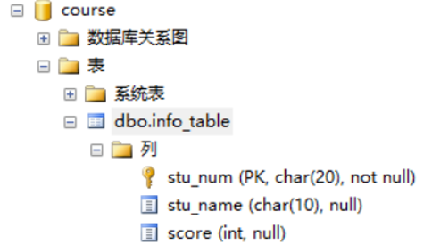
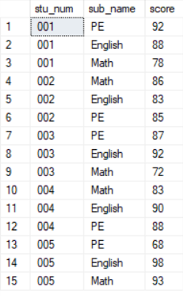
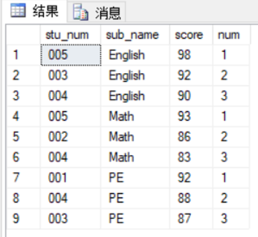

summary: demo
id: 20200211-01-李劲潮
categories: c
tags: sctu-ds
status: Published
authors: 李劲潮
Feedback Link: http://www.sctu.edu.cn

# 数据科学岗位的一道基础笔试题

## 案例介绍

前些时日，在玩手机的时候，偶然看到了一个博主的推文。文章的题目中，提到了“竟然连SQL都不会”。由于这段时间在学习数据库，所以对于SQL等字眼特别敏感。所以，对于这篇文章，我自然要读一读。
文章中讲到的其他方面这里不再过多的赘述。我从里面copy出了一道求职相关岗位时，会遇到的一道基础笔试题。我将在本例中对该题进行详细的解答。

## 问题描述

这里有一个成绩信息表info_table，每条记录是学生的某科目成绩信息，包括学生学号stu_num、科目名称sub_name、学生的该科目分数score等字段，请你写个SQL取一下每个科目分数前三的学生信息。

## 解题准备过程

相信大家都已读了题目，为了方便大家的理解以及接下来对相应SQL语句的验证，我们这里使用SQL Server Studio进行演示。

### 首先，我们先按照题目建库建表。

``` SQL
create database course;
use course;
create table info_table(
	stu_num char(20) primary key,
	stu_name char(10),
	score int check(score between 0 and 100)	
)
```

 

### 插入数据

为了后续的验证的方便，这里就再向该表中插入数据。三个科目（Math、English、PE），学生5人（001-005）。这里需要注意的是，因为PRIMARY KEY 约束 'PK__info_tab__89C2F6B20425A276'，所以在第一列sub_num就不能出现重复。这里我们将键PK__info_tab__89C2F6B20425A276直接删除就好。

### 数据插好后的表如下：

 

## 解题过程

准备工作就绪，现在就正式开始查询。在查询前，我们要明确三个问题:
- 查什么？
- 从哪里查？
- 条件是什么？
通过题目，显然有：__查的是学生信息，从info_table表中查，条件是每个科目分数第一__。

### 我给出的查询如下：
``` SQL
select * 
from(
	select stu_num,sub_name,score,row_number() 
	over(
	partition by sub_name 
	order by score desc
	) 
	as num
	from info_table
) 
T where T.num <= 3 
order by sub_name
```
### 查询结果如图：

 

## 结语

对于SQL，基础的语法学起来很简单，简单的查询上手也很容易。难就难在如何根据具体需求去写查询，并且为了达到同一查询目的，SQL语句并不唯一，这时你是否又能选出最佳的那一个呢？俗话说的好，“基础不扎实，地动山摇。”对于SQL我们一定要夯实基础，再进行熟练掌握。祝你成功！
