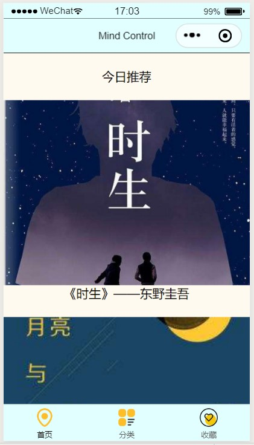
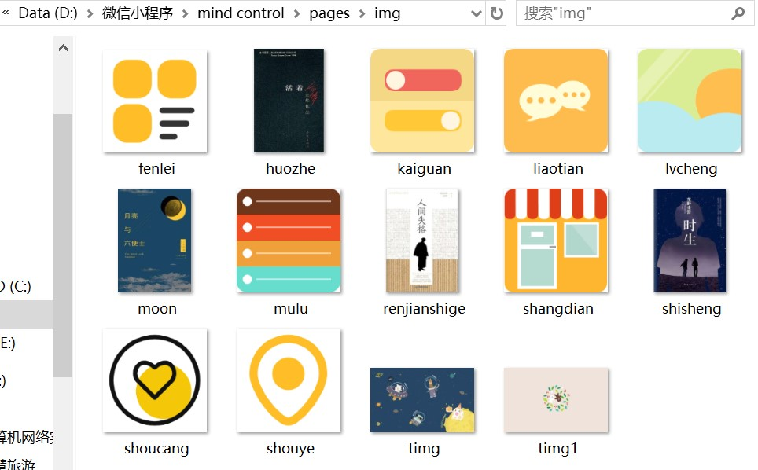

summary: demo
id: 20200211-02-吴怡辰
categories: wechat
tags: 
status: Published 
authors: 吴怡辰
Feedback Link: http://www.sctu.edu.cn

# 基础全局配置和页面配置
# 问题描述
小程序的基础是对全局的配置和页面的配置有一个整体的把握。
接下来从以下几个基础问题开始解决
如何在全局配置中在底部插入各种图标及文字？
如何在页面配置中插入图片并将图文居中？
如何设置全局及页面的背景颜色？
# 效果图

# 解决步骤
## 全局配置
### 图标下载
全局配置的图标我们可以直接在网上搜索并下载PNG的格式，将其保存在你所新建的一个在你的小程序pages文件夹下的一个image文件夹里。如下图：

### app.json配置
在app.json中，增加一个tabBar标签，并在这个标签里面写关于底部的图标和文字等内容。同时需要链接一个“”pages”:[ ]”，在全局配置的代码最顶部，在[ ]中写入pagePath的内容。
```
{
      "pagePath": "pages/index/index",
      "text": "首页",
      "iconPath": "pages/img/shouye.png",
      "selectedIconPath": "pages/img/shouye.png"
    },
    {	
      "pagePath": "pages/logs/logs",
      "text": "分类",
      "iconPath": "pages/img/fenlei.png",
      "selectedIconPath": "pages/img/fenlei.png"
    },
    {
      "pagePath": "pages/xinjian/xinjian",
      "text": "收藏",
      "iconPath": "pages/img/shoucang.png",
      "selectedIconPath": "pages/img/shoucang.png"
    }

```
## 页面配置
页面插入图片需要一个image标签，而要让图片下的文字和图片都居中，可以让图片和文字都在同一个view标签里面，然后通过wxss来设置样式。
### 插入图片（wxml代码）
```
<view class="shisheng">
     <image src="/pages/img/shisheng.jpg" mode="aspectFill"></image>
     <text>《时生》——东野圭吾</text>
     <text>\n</text>
</view>

```
### 图文居中（wxss代码）
```
.shisheng{
  display: flex;
  flex-direction: column;
  align-items: center;
}
```
# 总结
在添加图标或图片时，直接将其拖动到小程序开发工具里的image文件夹下是不可以的，需要在复制到电脑里的存放小程序文件的文件夹里的image文件夹。全局配置时尤其注意对“[ ]”和“{ }”的使用及每个未完结的 ] 和 } 后面的英文状态下的逗号。