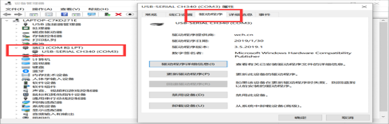
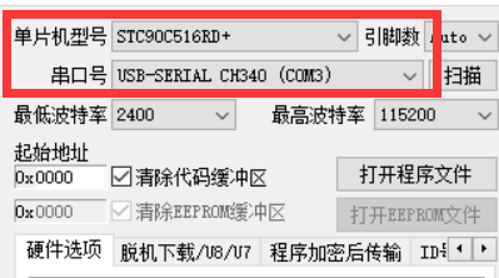
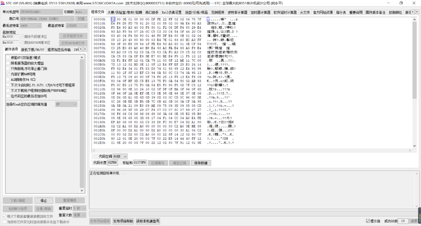
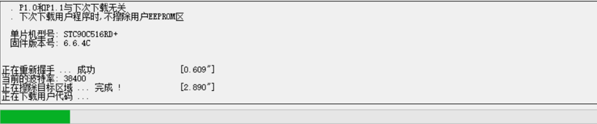
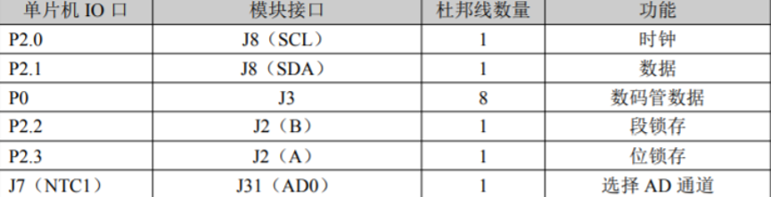

summary: demo
id: 20200211-02-李劲潮
categories:
tags:
status: Published
authors: 李劲潮
Feedback Link: http://www.sctu.edu.cn

# NTC测温，数码管显示

## 硬件环境

51单片机开发板，功能模块独立性高，能够实现各种各样的功能。本例中，主要使用热敏电阻和数码管完成了对环境实时温度的显示。


## 实现原理

在实现功能时，我们需要了解热敏电阻测温度的原理。热敏电阻的典型特点是对温度敏感，不同的温度下表现出不同的电阻值。这次使用的单片机热敏电阻为测温型NTC热敏电阻。NTC（Negative Temperature Coefficient）是指随温度上升电阻呈指数关系减小、具有负温度系数的热敏电阻现象和材料。因为，热敏电阻的阻值与温度变化曲线是非线性的，而8位单片机的计算能力是有限度的。所以，为了简单方便，在编写程序的时候，摒弃了复杂的计算公式，使用查表法算取温度值。其实，有很多人会怀疑测算温度值的准确度。这里做一解释，温度精度值主要取决于AD采样精度、温度表格精度和热敏电阻精度。由于温度的变化会引起热敏电阻的阻值变化，从而引起输出端分压值的变化，再通过检测输出电压值，通过单片机进行处理，最终在数码管上显示出来。

## 程序代码

``` C

// C 撰
// 部分代码，仅作示例

while (1){

    num = ReaderADC(0);
    num = num * 19;

    for (i = 0;i < 61;i++){

        if (num >= vt_table[i]){
            temp = i;

            if (i < 10){
                temp = 10 - temp;
                TempData[0] = 0x40;
            }else{
                temp- = 10;
                TempData[0] = 0x00;
            }
            break;
        }
        TempData[3] = DuanMa[temp / 10];
        TempData[4] = DuanMa[temp % 10];
        DelayMs(200);
    }
}
```

## 烧写程序

将代码写好后，就需要编译生成十六进制文件，这个文件是我们烧写到单片机必须的文件，以.hex结尾。将单片机通过串口与电脑连接进行通讯，使用驱动程序连接这个端口。

### 端口设置

烧写软件选择STC-ISP，在保证能够正常驱动单片机后，就需要将编写好程序烧进单片机中。选择正确的单片机型号和串口号。



### 预设置

预设置是保证能够正确写入的关键。主要确定的是单片机的型号及串口号。



### 烧写

点击正式烧写之前，需要关闭开发板总电源。然后点击下载，等待2~3秒后，打开总电源，开始正式烧写。（冷启动）



### 程序写入完成

当进度条满后，代表程序写入完成。



## 模块串联

程序烧写完成后，用杜邦线将开发板相应的模块连接起来，实现最终功能。下图是NTC测温各模块的接线图。



## 实验成功

经过程序编写、模块串联之后，最终我们顺利实现了“NTC测温，数码管显示”的功能。


## 结语

在使用单片机实现功能的时候，对程序的设计和对接口的合理安排及应用尤为重要。因此，熟悉各个功能区以及其基本原理是实现具体功能的重中之重！